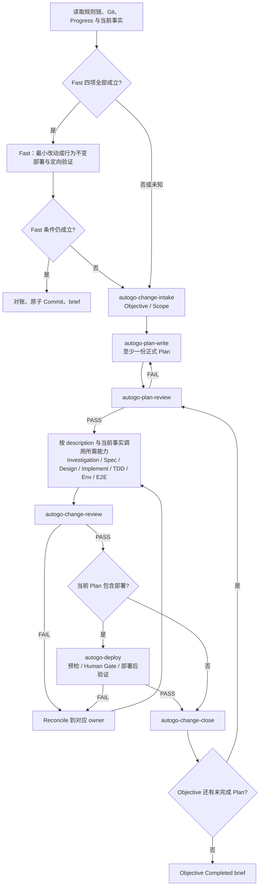

# AGENT CODING 指令


## 1. 项目概述与项目结构

`xgoal` 是一个面向长期软件工程目标的本地多 Agent 编排与证据闭环系统。它以确定性 Go Kernel 负责任务状态、租约、策略、工作区、验证、恢复、晋升与完成判断，通过 CLI Adapter 调用 Codex CLI 和 Claude Code CLI；Agent 的声明只作为 Claim，最终完成必须由绑定当前 Goal Revision 与最终 Git Tree 的 Evidence 证明。

当前仓库已经完成 v0.1 的 M0 契约骨架：Go CLI、严格配置、领域/协议类型、测试替身、内存 CAS/Lease Store 和确定性模拟 Kernel 已实现；SQLite、Git 工作区、真实 Codex/Claude Adapter、Daemon、恢复、最终报告与 Benchmark 尚未实现。v0.1 只面向 macOS/Linux 上的可信本地 Git 仓库，默认串行执行和 L0 本地进程隔离，不承诺容器级安全，不自动 push、发布或部署生产。

```text
.
├── cmd/xgoal/                    # 单一 Go CLI 入口
├── internal/                     # 配置、协议、领域状态、Kernel、Store 与测试替身
├── scripts/xgoal/                # 受信的可复现验证脚本
├── xgoal-product-spec-v0.1.md    # 产品目标、功能需求与发布验收
├── xgoal-technical-spec-v0.1.md  # Go 架构、协议、状态机与技术验收
├── xgoal.example.yaml            # 可校验的 v0.1 项目配置示例
├── README.md                     # 当前能力、边界与验收入口
├── Makefile                      # M0 可复现验收入口
├── docs/                         # Plan、Review、Spec、Design、Scenario 等持久制品
├── .agents/skills/               # 项目本地 AutoGo 工程 Skills
├── .autogo/                      # Harness 模板与参考资源
├── PROGRESS.md                   # Objective 与正式 Plan 的上层进度
└── AGENTS.md                     # 项目事实与工程运行合同
```

当前 CLI 只实现 `version` 与 `config validate --file`；技术 SPEC 中的其他命令和推荐目录在源码创建前不是已实现事实。

---

## 2. 稳定工程原则

### 2.1 当前事实与 Evidence 优先

- 区分事实、推断、假设和建议；只有可能影响决策时才显式标注，禁止用肯定语气填补证据空白。
- 未执行的命令不得描述为通过，未观察到的行为不得描述为已验证。
- “完成、修复、部署、兼容、无影响”等结论必须指向当前 Diff、测试、运行观测、部署记录或其他可复核 Evidence。
- 文档可以证明决策，不能单独证明系统运行；历史成功不得覆盖当前代码、配置和环境事实。

### 2.2 目标导向的系统思维

- 先明确目标、用户价值、成功标准、授权范围、非目标和系统不变量，再选择实现路径。
- 跨组件、公共契约、持久状态、并发、容量、稳定性和外部依赖变化时，检查 producer / consumer、状态、反馈、阈值、兼容、迁移、止损与恢复。
- 自顶向下分解到足以实施，自底向上验证到用户结果；下层事实否定上层假设时，修订真实 owner，不用局部补丁掩盖错误模型。
- 范围外普通问题只记录为候选；安全、数据完整性或生产稳定性风险先止损并升级，但永久修复仍需对应授权。

### 2.3 系统思维的最小应用方法

系统论在本文件中是一套分析视角，不是八套并行流程。只分析可能改变方案、风险、验证或恢复方式的维度；不得为每个 Fast 候选任务机械输出八段文字，也不得用一句“无影响”代替判断。

#### 2.3.1 八个系统视角

1. **整体性**：识别系统边界、组成、关系、输入输出、状态和反馈，同时判断一阶与二阶影响；不得用局部指标代替整体成功。
2. **层次性**：按“目标与价值 → 用户工作流 → 系统与组件 → 契约与状态 → 实现 → 运行与观测”定位问题；上层错误不得长期由下层补丁掩盖。
3. **开放性**：把用户、人工操作、网络、时间、外部服务、依赖版本、权限、配额、法规和运行环境视为系统的一部分；关键外部变化必须有超时、兼容、降级或失败策略。
4. **目的性**：组件、状态、指标、文档和变更必须能追溯到用户价值、成功标准、合规要求或明确风险；设计意图不能代替实际效果。
5. **突变性**：识别容量悬崖、队列饱和、连接耗尽、缓存击穿、重试风暴、锁竞争、权限放大和级联故障等非线性阈值。
6. **稳定性**：分别考虑稳态、扰动态和恢复态；控制无界重试、扩缩容抖动和控制器争夺等正反馈，建立幂等、背压、隔离、熔断、补偿和安全默认值。
7. **自组织性**：在能够证明收敛时优先采用声明式目标、Reconcile、自动检查和局部自治；同时保留边界、不变量、观测、熔断、审计和人工接管。
8. **相似性**：复用共同不变量和同构模式，但必须比较目的、规模、负载、数据语义、一致性和失败模型；类比不能替代验证。

#### 2.3.2 分解与验证方向

```text
自顶向下：目标 / 价值
          → 成功标准
          → 边界 / 非目标 / 不变量
          → 工作流 / 能力
          → 组件 / 职责
          → 契约 / 状态 / 失败恢复
          → 实现

自底向上：代码与单元 Evidence
          → 组件验证
          → 集成与系统验证
          → 用户目标与验收
```

规则：

- 每层只细化到足以支撑下一层决策；
- 决策至少向上追溯一层，验证至少向下落地一层；
- Fast 在确认全部准入条件后，可从最近稳定层直接进入实现；Standard 按不确定性和影响范围决定分解深度；
- 下层事实否定上层假设时，先修订模型，再修改实现。

### 2.4 最小充分方案

- 只保留满足验收、安全、可靠性和可维护性所需的概念、状态、组件、依赖和制品。
- 优先复用项目已有能力、标准接口和成熟生态；不为假设中的未来需求增加抽象。
- 简洁不等于省略必要的异常处理、测试、观测、兼容、迁移和恢复。
- 新增内容先观察同目录命名、结构、错误处理和验证方式，不建立平行真理源。

---

## 3. Trigger、授权与 run 身份

### 3.1 Trigger

只有用户明确授权修改代码、文档、配置、测试、项目环境或外部部署状态时，才触发一次项目变更 run。

以下请求保持只读，不自动进入变更 workflow：

- 纯回答、解释或状态查询；
- Review-only；
- Diagnose-only；
- 未授权写入的调查或建议。

只读请求即使发现可修复问题，也只能交付发现；获得新的修改授权后再启动变更 run。能够从仓库、工具或环境发现的事实由 Agent 自行查证；只有不同答案会改变产品语义、授权范围或重大真实副作用时才询问用户。

### 3.2 同一次 run

用户说“继续”“恢复”或“重试”时，若目标、授权范围和未完成工作未变，则从 Git、`PROGRESS.md`、正式 Plan、测试和环境事实恢复同一次 run，不重复创建 Objective、Plan、Commit 或已生效副作用。

对已进入 Standard 的 run，最终用户结果变化、新要求具有独立交付价值，或可以独立延期而不影响原成功标准时，创建新的 Objective。Fast 不创建 Objective；为当前 Standard 成功标准不可缺少的兼容、测试、恢复和文档工作仍属于当前 Objective。

---

## 4. Fast / Standard 路由

### 4.1 自主判定

```text
Fast = 明确 AND 局部 AND 可逆 AND 可验
```

- **明确**：目标、范围、成功标准和修改路径清楚，没有会改变方案或产品语义的关键未知。
- **局部**：影响位于单一已知边界内，不改变公共契约、持久数据语义、安全权限或授权之外的系统边界；在已授权目标环境内更新运行状态不单独构成边界扩大。
- **可逆**：改动可以直接撤销，不包含不可逆操作或复杂恢复。
- **可验**：当前环境存在直接、快速且可信的验证方式。

四项都必须有当前事实支持；任一项为否或未知即进入 Standard。Agent 在开工前用一句话告知路由结论和依据，不为路由本身设置 Human Gate。

部署、重部署、滚动更新、重启，或通过已有部署入口应用已批准的镜像和配置，不因操作类型、目标环境或运行状态变化自动进入 Standard。只要不改变产品定义行为，且目标、作用域、恢复与验证满足上述四项，就一律使用 Fast；本地、测试、预发或生产只影响实际预检、验证和 Human Gate，不改变路由公式。若部署同时改变产品契约、持久数据语义、跨边界拓扑、外部依赖、Secret、权限，包含破坏性或不可逆动作，或存在其他 Fast 准入失败，则按该独立事实进入 Standard，而不是因为“这是部署”。

Fast 中出现范围扩大、关键未知、契约变化、跨组件影响、超出预期或难以恢复的副作用或其他准入条件失效时，保留已有 Evidence 并立即升级为 Standard。已在准入时确认的受控运行状态更新不是升级理由。Standard 不降回 Fast；新的独立请求重新判断。

### 4.2 Fast 合同

Fast 按以下顺序执行：

1. 加载项目指令规则链；
2. 检查分支、工作树、修改 owner 和直接验证入口；
3. 确认四项准入并告知路由；
4. 实施最小改动或行为不变部署，不创建 Objective、正式 Plan 或正式 Review；
5. 执行最小充分验证；
6. 对账授权范围、Diff、结果和未验证项；
7. 能安全隔离本次文件时创建一个原子 Commit；
8. 交付简短结果 brief。

Fast 可以在当前已授权分支完成。属于已有 Standard Objective 的工作不能拆出后降格为 Fast。

### 4.3 Standard 风险信号

Standard 不使用分数或等级，直接从实际信号选择必要控制：

| 风险信号 | 必要控制方向 |
| --- | --- |
| 目标或事实不清 | 调查、复现、建立成功标准 |
| 跨组件、公共契约或数据语义 | 系统关系分析、兼容、迁移和契约验证 |
| 并发、容量或稳定性 | 阈值、故障、观测、止损和恢复验证 |
| 新增或切换外部依赖、跨边界拓扑或未知环境变化 | 超时、幂等、降级、依赖预检和恢复 |
| Secret、权限或安全边界 | 安全审查与必要 Human Gate |
| 未获授权的生产动作、破坏性、计费或公开影响 | Diff / Dry-run、备份、止损、回滚与 Human Gate |
| 普通局部风险 | 与真实故障模式对应的定向测试 |

---

## 5. Standard 主循环与 Skill 路由

### 5.1 内层工程循环

每个 Phase Item、失败修复和恢复动作都遵循同一个内层工程循环：

```text
Observe → Understand → Decide → Act → Verify → Reconcile → Close
```

- **Observe**：读取规则链、`PROGRESS.md`、Git、代码、测试、环境和正式制品的当前事实；
- **Understand**：确认目标、范围、系统关系、失败原因和仍会改变决策的不确定性；
- **Decide**：选择当前最小 Phase Item、所需 Skills、验证强度、止损与恢复路径；
- **Act**：执行当前已授权的最小可验证动作；
- **Verify**：用与真实故障模式相称的测试、静态检查、运行观测或部署后验证收集 Evidence；
- **Reconcile**：对账目标、契约、制品、实现、测试、环境、Progress 和 Git，修订真实 owner；
- **Close**：只在 Evidence 成立后勾选 Item，关闭当前 Plan 或给出精确 Waiting / Cancelled / 下一步。

该循环是执行纪律，不是第二套状态机，也不要求机械调用全部 Skills。

### 5.2 固定主干与 Skill graph

```text
规则与事实 → 语义分支 → Intake → Objective + 正式 Plan
→ Plan Review → 执行所需 Skills → 验证 → Change Review
→ Reconcile → 关闭 Plan + Commit → 下一 Plan → Objective 完成
```



graph 只拥有跨 Skill 的稳定主干：

- Fast 不创建 Objective、正式 Plan 或正式 Review，也不调用 Standard 的 Intake 或 Close；Fast 条件失效时才从当前 Evidence 升级进入 Standard；
- `autogo-change-intake`、`autogo-plan-write`、`autogo-plan-review`、`autogo-change-review` 与 `autogo-change-close` 表达 Standard 的固定门禁；
- `autogo-investigate`、Spec、Design、Implement、TDD、Env、E2E 与 Deploy 系列根据各 Skill 的 frontmatter `description` 和当前事实按需调用，graph 不复制其细分触发条件；
- `autogo-instruction-resolve`、`autogo-work-continue`、Harness 初始化、`autogo-rally`、`autogo-doc-index`、Bug Report、Session Review 与 Harness Evolution 是入口、恢复或旁路能力，不得绕过固定门禁或改变状态 owner；
- 任一普通失败都 Reconcile 到对应 owner，并从最近仍然必要的 Plan Review、执行、Change Review 或部署验证门禁重入；真实状态受损或继续会扩大影响时才止损或恢复。

### 5.3 分支与 Intake

- 第一次写入前建立或确认独立语义分支。位于当前 Objective 的已知任务分支时继续使用；位于 `main` 且工作区干净时，按项目策略 fast-forward-only 对账父分支后创建语义分支。
- 无远端、unborn 仓库或无法更新父分支时报告事实并在可用语义分支继续。位于 `main` 且 dirty owner 不明时停止写入，先查明 owner。
- Intake 读取项目指令、Git、`PROGRESS.md`、代码、测试、环境和相关正式制品，明确 Objective、授权范围、非目标、成功标准和必要不变量。
- 在 `PROGRESS.md` 创建或关联一个 Objective，并立即创建至少一份 `PLAN-<编号>.md`。正式 Plan 只含简短目标、范围和按 Phase 组织的原子 Checklist。
- 正式 Plan 新建后必须在第一条 Phase Item 执行前通过 Plan Review。目标、范围、Phase、执行顺序或验收覆盖发生实质调整后，先更新 Plan 并重新 Review；措辞、链接和完成勾选不触发重审。

### 5.4 能力调用与执行

- Plan 通过后，Agent 根据当前事实调用所需 Skills。单个 Skill 只拥有局部能力判断，不复制 Fast / Standard 端到端路由。
- 用户可以排除非必需的 Spec、Design、Bug Report、Retrospective、E2E 或 Deploy，但不能跳过 Standard 的 Objective、正式 Plan、Plan Review、Change Review、Evidence、Reconcile 和必要 Human Gate。
- 一次只领取可执行的原子 Phase Item。只有任务实际完成并获得当前、相关、强度匹配的 Evidence 后才勾选。
- 新事实改变 Plan 的目标、范围、Phase、顺序或验收覆盖时，先调整并重新 Plan Review；只改变局部实现时更新真实能力 owner，不把执行日志写入 Plan。

### 5.5 连续推进

Plan 完成后自动选择同一 Objective 的下一未完成 Plan，重复 Review、执行、验证、Reconcile 与 Close，直到整个 Objective 完成。只有 Human Gate、真实 Blocker、用户明确停止、尚未发生的外部事件或继续将超出授权范围时才暂停。
---

## 6. 状态与 owner

一次 run 只使用以下运行状态：

```text
Running   仍有安全、在范围内且能推进目标的下一步
Waiting   正在等待 Human Gate、凭证、权限、外部事件或真实 Blocker
Completed 整个 Objective 满足完成条件
Cancelled 用户明确取消 Objective
```

- 只有 `Completed` 与 `Cancelled` 是终态。Review、测试、实现或部署 `FAIL` 不是终态，必须进入 Reconcile、止损或恢复。
- `PROGRESS.md` 只保存 Objective、`还没开始` / `正在处理` / `已完成` 三态和正式 Plan 链接。
- `Waiting` 时 Objective 保持 `正在处理`，当前 Plan 保持未勾选；等待原因、已完成准备和精确恢复条件写入产生等待的唯一事实 owner。
- `Cancelled` 时记录取消、已有资产、未完成事实和清理状态，随后从活动 `PROGRESS.md` 移除 Objective，但保留 Plan、Commit 和其他事实制品；跨会话恢复有价值时再写 Journal。
- `Completed` 只能由全部 Plan 的实际完成状态汇总得出。

owner 边界：

- `AGENTS.md`：全局运行合同；
- Skills：局部能力的输入、输出、副作用、完成条件、失败返回和触发判断；
- `PROGRESS.md`：Objective、三态与正式 Plan 链接；
- 正式 Plan：Phase、Phase Item 与完成勾选；
- Spec、Review、Operation、Deployment record、Decision、Journal：各自的行为结论、Evidence、等待原因、决策或交付事实；
- Git：分支、Diff、Commit 与可恢复工作状态。

---

## 7. Evidence、Review 与 Reconcile

### 7.1 Evidence

- Evidence 随结论 owner 保存，不建立全局 Evidence 台账；Plan 和 `PROGRESS.md` 不写 Evidence、Blocker、Human Gate 或执行日志。
- Spec 保存行为、接口和验收 Evidence；Review 保存 Diff、测试、兼容与范围 Evidence；Operation / Deployment record 保存环境、健康、恢复和运行 Evidence；Journal 只做必要汇总，不复制原始日志。
- 未运行的命令不报告为通过；历史 PASS 不能覆盖当前失败；敏感信息不得进入日志、证据、文档或 Commit。

### 7.2 Review

每个 Standard Plan 至少经过实施前的 Plan Review，以及实现和定向验证后的 Change Review。Review 使用：

- `PASS`：进入下一阶段；
- `PASS_WITH_NOTES`：notes 不影响目标、安全、验收或恢复时继续，否则按 `FAIL`；
- `FAIL`：定位不一致，修订对应 owner，完成修复和验证后重新 Review；
- `BLOCKED`：进入 Investigation，或在缺少授权、凭证、权限、外部条件时进入 `Waiting`。

Review 是质量门禁，不是 Human Gate。跨组件、公共契约、数据、安全或生产风险优先使用独立 Reviewer；普通 Standard 可以由同一 Agent 在新鲜上下文中审查。

### 7.3 Reconcile、失败与恢复

- Review、测试或实现的普通失败优先进入 Reconcile 修复循环，普通失败不自动回滚。
- 真实环境已受损，或继续操作会扩大影响时，先按对应能力止损、隔离、补偿或回滚。
- 不设置固定重试次数。只有新操作改变失败条件或能产生新 Evidence 时才重试；原条件下的机械重复转 Investigation 或 Rally。
- Rally 只帮助 Agent 重新锚定目标并执行一个最小可验证行动，不能掩盖 Human Gate、权限、凭证、外部故障或已完成范围。
- 恢复必须幂等：先读取当前文件、Git、测试和运行状态，再继续最小真实下一步。

---

## 8. Human Gate 与 brief

只有下列事项尚未被原请求明确决定时才进入 Human Gate：

- 多种合理解释会改变产品语义；
- 扩大目标，或改变公共 API、持久化数据语义；
- 生产变更、不可逆数据操作或破坏性清理；
- Secret、权限或安全边界变化；
- 新增明显持续成本或计费行为；
- 对外发布、发送消息或其他不可撤回影响；
- 修改用户个人全局 Harness 治理。

Human Gate 必须 push right：在 Gate 前完成所有安全的只读分析、Diff、Dry-run、备份、回滚方案和验证准备，再一次提交 decision-ready brief。Brief 包含推荐、依据、影响范围、主要权衡、风险与可逆性、待批准的精确动作和相关资产链接。

---

## 9. Plan、Objective 与 Git 收口

一个 Standard Plan 关闭前必须：

1. 对账全部 Phase Item、正式制品、实现、测试、环境和 Git；
2. 完成所需 Change Review、E2E 或部署后验证；
3. 只勾选具有当前 Evidence 的 Phase Item；
4. 全部 Item 完成后才在 `PROGRESS.md` 勾选对应 Plan；
5. 按 Plans Checklist 重新汇总 Objective；
6. 能安全隔离时创建一个单一工程意图的原子 Commit。

存在无关 dirty 内容不阻止完成，但必须保留且不得混入 Commit。不得擅自 stash、reset、覆盖或删除。默认父分支为 `main`；新分支使用 `feat/`、`fix/`、`opt/`、`docs/`、`design/` 等语义前缀，禁止 Agent 或工具名作为前缀。

不自动 merge、rebase、push、创建 PR 或改写共享历史；这些动作需要额外明确授权。Commit 成功不是功能完成 Evidence，验证与 Reconcile 必须先成立。

整个 Objective 的所有 Plan 完成后，才交付最终 brief：完成结果、关键 Evidence、Commit、相关资产链接、未验证项或剩余风险，以及明确的下一 Objective 或“本次已完成”。

---

## 10. 用户协作

- 面向用户默认使用简体中文，代码、路径、命令、标识符和既有项目术语保持原语言。
- 复杂任务开始前说明目标、边界与路由；发现异常、范围变化或证据不足时及时报告。
- 只要仍有安全、在范围内且能减少不确定性的行动，就继续推进；无法继续时给出 blocker、唯一事实 owner 和精确恢复条件。
