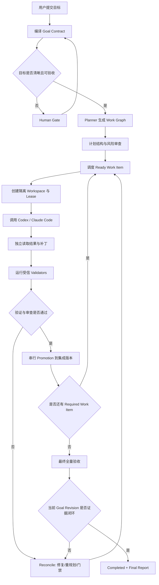

# xgoal 产品设计 SPEC

> **副标题**：Evidence-Closed Multi-Agent Coding Orchestrator  
> **中文主张**：把目标交给多个原生 Agent，把“完成”交给证据。  
> **版本**：v0.1 Draft  
> **日期**：2026-08-26  
> **作者**：monshunter  
> **状态**：产品定义完成，待按技术 SPEC 实施与基准验证

---

## 0. 文档目的

本文定义 `xgoal` 的产品定位、边界、用户体验、核心概念、功能需求、验收口径、风险与版本路线。技术组件、数据模型、状态机、Agent 适配协议、并发与恢复算法见《xgoal 技术 SPEC》。

`xgoal` 基于两个已有方向继续演进：

- **AutoGo**：为 Codex、Claude Code 等原生 Agent 安装治理规则、Skills、模板和工程工作流，解决“Agent 应该怎样工作”。
- **LoopX**：将长期目标、待办、证据、门禁、配额、交接等做成持久控制状态，解决“长期任务怎样跨轮次持续推进”。
- **xgoal**：面向软件工程场景，直接启动和编排 Codex、Claude Code 等原生 Agent，管理隔离环境、任务租约、补丁晋升、独立验证、失败恢复与最终验收，解决“由谁、在什么环境、针对哪个有界任务执行，以及结果何时才可以被接受”。

本项目不复制 LoopX 的代码或把 AutoGo 改造成第二套 Agent；推荐采用独立仓库、概念借鉴、清洁实现（clean-room implementation）的方式建设。

---

## 1. 执行摘要

### 1.1 一句话定义

`xgoal` 是一个**面向长期软件工程目标的本地多 Agent 编排与证据闭环系统**：用户只需要提交目标，系统把目标编译为可验收的 Goal Contract 和有依赖关系的 Work Graph，将有界任务分派给 Codex、Claude Code 等原生 Agent，在隔离工作区内执行，并通过 Git、构建、测试、运行探针和独立审查形成证据，只有最终集成版本满足全部验收条件时才进入 `Completed`。

### 1.2 产品核心

`xgoal` 不以“再造一个更聪明的 Agent”为目标，而是把 Agent 外部最难、最容易失控的工程责任做成确定性系统：

1. **目标持久化**：目标不是一段会随对话漂移的 Prompt，而是带版本、范围、约束和验收标准的持久对象。
2. **执行有界化**：每个 Agent 每次只处理一个可验证的 Work Item，不把整个项目和无限自主权一次性交给模型。
3. **环境隔离化**：每次尝试使用独立 Git worktree、分支和运行目录，不允许多个 Agent 共享可写工作区。
4. **验收外部化**：Agent 的“已完成”只是声明；Git diff、测试结果、运行探针和用户决策才是证据。
5. **失败可恢复**：进程退出、上下文中断、配额耗尽、测试失败和合并冲突都被记录为状态转换，而不是丢失在聊天历史中。
6. **高风险受控**：网络、密钥、破坏性操作、发布、生产变更、范围扩张等必须经过 Human Gate。

### 1.3 不承诺绝对正确

任何通用软件系统都无法仅凭多 Agent 互相审查保证“代码绝对正确”。`xgoal` 的可兑现承诺是：

> **不把 Agent 的自述当作完成；不在缺少当前版本证据时宣称完成；所有完成状态都能追溯到明确目标、最终代码版本、验证命令、输出结果和必要的人类决策。**

---

## 2. 背景与问题

### 2.1 当前 Coding Agent 的长期任务问题

Codex、Claude Code 等原生 Coding Agent 已能完成复杂的单轮或短周期编码工作，但当任务跨越多个小时、多个上下文窗口、多个 Agent 或多个环境时，常见问题包括：

- 目标、范围和验收标准在多轮交互中逐渐漂移。
- Agent 把“代码已修改”误判为“目标已完成”。
- 一个 Agent 编码、另一个 Agent 审查，但二者可能共享同样的错误假设。
- 多个 Agent 在同一工作目录修改代码，产生覆盖、污染和不可归因的结果。
- Agent 进程退出后，下一轮无法准确恢复做到哪里、为什么失败、下一步是什么。
- 测试命令由 Agent 临时决定，可能被弱化、跳过或替换成更容易通过的检查。
- 失败后机械重试，消耗大量 token，却没有代码、证据或状态上的实质进展。
- 环境依赖、工具链、缓存、服务和配置没有形成可复现快照。
- 需要网络、密钥、付费资源或生产权限时，没有可靠的人类门禁。

### 2.2 现有两个项目的责任边界

| 项目 | 主要责任 | 优势 | 对 xgoal 而言仍缺少的能力 |
|---|---|---|---|
| AutoGo | 安装治理规则、Skills、模板和工程协作约定 | Native Agent First、证据优先、Fast/Standard 流程、Human Gate | 不拥有运行时任务、Agent 进程、租约、隔离工作区和长期状态 |
| LoopX | 持久目标、待办、证据、门禁、配额、交接和恢复 | 长期控制状态、Agent 对等协作、跨轮次恢复 | 不聚焦软件工程的工作区、补丁、测试、构建、集成和最终代码晋升 |
| xgoal | 软件工程专用的多 Agent 执行与验收编排 | 原生 Agent 适配、Git worktree、环境快照、验证证据、补丁晋升、恢复 | v0.1 聚焦本地可信仓库，不覆盖分布式执行和生产自治 |

### 2.3 产品机会

AutoGo 已回答“Agent 怎样遵守工程治理”，LoopX 展示了“长期目标怎样成为持久控制对象”。`xgoal` 可以在两者之间形成一个明确的新产品层：

> **Native Agent Execution, External Orchestration**  
> 原生 Agent 保留单次执行中的推理、工具调用和编码能力；`xgoal` 成为唯一的跨 Agent、跨轮次、跨工作区编排与生命周期控制面。

---

## 3. 产品定位

### 3.1 产品类别

- 本地优先的开发者工具。
- 软件工程专用 Multi-Agent Orchestrator。
- Agent Harness 的运行时补充，而非新 Agent 框架。
- 目标驱动、证据闭环、可恢复的 Coding Control Plane。

### 3.2 目标用户

首要用户：

- 重度使用 Codex、Claude Code 等 Coding Agent 的个人开发者。
- 希望一个人稳定推进数小时到数天工程任务的基础设施、后端、AI Infra 工程师。
- 需要审计、恢复、隔离和验收能力的小型工程团队。
- 正在构建 Agent Harness、Coding Agent 平台或自治研发系统的工程人员。

非首要用户：

- 只需要一次性代码补全的轻量用户。
- 希望系统无门禁地直接操作生产环境的用户。
- 需要大规模云端分布式 Agent 集群的企业；该能力属于后续版本。

### 3.3 典型场景

1. **复杂功能开发**：拆分设计、实现、测试、文档和最终集成，由不同 Agent 分工完成。
2. **疑难 Bug 修复**：一个 Agent 定位和修复，另一个 Agent 从失败模式与回归风险角度审查，系统运行复现与回归测试。
3. **跨模块重构**：以 Work Graph 管理依赖和写入范围，避免并发 Agent 相互覆盖。
4. **工程环境建设**：创建开发环境、依赖配置、容器或测试服务，并通过可复现命令验收。
5. **长期任务恢复**：终端关闭、Agent 配额耗尽或进程中断后，从持久状态和证据继续，而不是重新解释全部上下文。
6. **高风险变更治理**：涉及网络、密钥、外部资源、发布和生产时暂停，并生成明确的 Human Gate。

---

## 4. 产品目标与非目标

### 4.1 v0.1 产品目标

| ID | 目标 |
|---|---|
| G-001 | 用户可以用自然语言提交工程目标，并得到结构化、可版本化、可验收的 Goal Contract。 |
| G-002 | 系统可以把目标分解为有依赖关系、范围明确、可独立验证的 Work Graph。 |
| G-003 | 直接编排至少 Codex CLI 与 Claude Code CLI，不实现自有模型、推理循环或工具调用框架。 |
| G-004 | 每次 Agent 尝试都运行在独立工作区，并能准确归因到目标、任务、Agent、输入和代码差异。 |
| G-005 | 使用受信验证器独立执行构建、测试、静态检查和运行探针，并将结果绑定到具体代码树。 |
| G-006 | 支持 Planner、Implementer、Reviewer 的最小多 Agent 协作，同时避免角色和拓扑过度设计。 |
| G-007 | 支持暂停、继续、取消、重试、重规划、Human Gate 和崩溃恢复。 |
| G-008 | 只有最终集成版本满足当前 Goal Revision 的全部门禁与验证要求时才能完成。 |
| G-009 | 输出可审计、可复现的最终报告，包含代码版本、验证证据、决策、限制和资源消耗。 |
| G-010 | 可选复用 AutoGo 治理与 Skills，但不复制其 24 个 Skills 或建立第二份治理真相。 |

### 4.2 非目标

- 不开发新的基础模型、Coding Agent 或通用 Agent SDK。
- 不替代 Codex、Claude Code 的原生推理、上下文管理和工具调用。
- 不保证任意需求、任意代码和任意环境下的绝对正确性。
- v0.1 不自动推送远端仓库、不发布制品、不部署生产环境。
- v0.1 不面向不可信第三方仓库提供强隔离安全承诺。
- v0.1 不实现多机分布式调度、远程 Worker、Kubernetes 执行集群和组织级权限系统。
- 不把 Reviewer Agent 的文字结论作为唯一或最高等级验收依据。
- 不同时把 SQLite、`PROGRESS.md` 和 Agent 会话都设为可写的运行状态真相。
- 不为了“Multi-Agent”而固定创建大量角色；角色只在能够形成独立责任或证据时存在。

---

## 5. 产品原则与不变量

### P-001 原生 Agent 执行，外部系统编排

Agent 负责一个有界执行回合中的理解、推理、工具使用和代码修改；`xgoal` 负责跨回合和跨 Agent 的状态、调度、租约、权限、环境、验证、集成与恢复。

### P-002 单一运行状态真相

`xgoal` 的运行数据库是 Goal、Work Item、Attempt、Gate、Evidence 和 Lease 的唯一权威状态。Agent 对话、日志、`PROGRESS.md` 和报告都只是输入、证据或投影，不可反向覆盖核心状态。

### P-003 目标先于计划，证据先于结论

固定追溯链：

```text
Goal → Goal Revision → Acceptance Criteria → Work Item
     → Attempt → Code/Artifact → Validator Run → Evidence → Final Decision
```

任何 `Completed` 都必须能沿该链路追溯。

### P-004 Agent 声明不是证据

Agent 输出的“完成”“测试通过”“没有问题”一律按 Claim 保存。`xgoal` 必须独立读取文件、计算 Git diff、执行验证命令并记录实际结果。

### P-005 不允许自我认证

Implementer 可以提供首轮自检，但不能批准自己的最终 Review；Reviewer 可以提出阻塞项，但不能单独证明系统正确；最终裁决由 Goal Contract、受信验证器、当前代码版本、未关闭阻塞项和 Human Gate 共同决定。

### P-006 每次工作必须有界

每个 Work Item 必须包含目标、输入范围、允许写入范围、依赖、验收条件、验证器和停止条件。无法形成有界工作项时，应进入 Goal 澄清或 Human Gate，而不是给 Agent 无限自由。

### P-007 写空间隔离，集成串行化

任何两个 Agent 不共享可写工作区。并发尝试只发生在独立 worktree 中，所有补丁进入最终分支前必须串行重放、重新验证和晋升。

### P-008 失败不是伪终态

单次 Attempt 可以失败、超时或中断；Goal 不因单次失败直接结束。系统必须进入修复、重规划、等待门禁或取消，避免“失败即丢失上下文”。

### P-009 没有实质增量就不是进展

只有以下变化之一才算实质进展：

- 产生被接受的新代码或制品差异。
- 验证结果发生可解释变化。
- 关闭一个 Gate、Review Finding 或阻塞项。
- 更新并批准新的 Goal Revision 或 Work Graph。
- 产生能够改变下一决策的新环境事实或证据。

Agent 生成更多文字、重复相同失败、重新描述计划不算进展。

### P-010 高风险默认关闭

网络、密钥、付费资源、破坏性命令、远端推送、发布、生产环境和范围扩张默认禁止，只有显式策略或 Human Gate 才能开启。

### P-011 当前版本证据

验证结果必须绑定 Goal Revision、配置哈希和代码 Tree/Commit。代码发生变化后，旧证据自动过期；不得使用旧测试结果证明新代码已通过。

### P-012 奥卡姆剃刀

MVP 只保留形成闭环所需的最小角色、状态和组件：Planner、Implementer、Reviewer 是逻辑角色；环境管理器和 Validator 是确定性服务，不包装成 Agent。

---

## 6. 核心概念

| 概念 | 定义 |
|---|---|
| Project | 被 `xgoal` 管理的本地 Git 项目及其配置。 |
| Goal | 用户希望系统达成的长期工程目标。 |
| Goal Revision | 一次冻结的目标、范围、约束和验收标准；任何重大变更都会生成新版本。 |
| Goal Contract | Goal Revision 的结构化表达，是计划、执行和验收的共同合同。 |
| Work Graph | 由 Work Item 和依赖组成的有向无环图；简单任务可退化为单节点。 |
| Work Item | 一个范围有界、可独立执行和验证的工作单元。 |
| Attempt | 某 Agent 对某 Work Item 的一次具体执行。 |
| Agent Profile | Codex、Claude Code 等 Agent 运行时及其能力、角色和策略配置。 |
| Lease | 对 Work Item 的有期限排他认领，防止重复执行。 |
| Workspace | 为 Attempt 创建的独立 worktree、分支、运行目录和环境快照。 |
| Validator | 从受信配置加载并由 `xgoal` 独立执行的确定性验证器。 |
| Evidence | 与具体目标版本和代码树绑定的命令结果、Git 事实、运行探针、审查结论或人类决策。 |
| Review Finding | Reviewer 产生的结构化问题，具有严重级别、证据位置和解决状态。 |
| Gate | 必须由人或确定性条件满足后才能继续的阻塞状态。 |
| Promotion | 将经过验证的 Attempt 补丁重新应用到当前集成版本、复验并提交的过程。 |
| Reconcile | 根据失败、证据和当前状态决定重试、修复、重规划、等待或取消。 |

---

## 7. 产品运行模型

### 7.1 三层责任模型

```text
┌──────────────────────────────────────────────────────────┐
│ Human                                                    │
│ 目标、边界、风险授权、关键取舍、最终业务责任             │
└───────────────────────────┬──────────────────────────────┘
                            │ Goal / Gate Decision
┌───────────────────────────▼──────────────────────────────┐
│ xgoal Orchestration Kernel                               │
│ Goal Contract、Work Graph、Scheduler、Lease、Workspace、 │
│ Policy、Validator、Evidence、Reconcile、Promotion、Report│
└───────────────┬───────────────────────────┬──────────────┘
                │ bounded work packet       │ independent checks
┌───────────────▼────────────────┐   ┌──────▼───────────────┐
│ Native Coding Agents           │   │ Deterministic Systems│
│ Codex / Claude Code / others   │   │ Git / Build / Tests  │
│ 推理、工具调用、编码、审查     │   │ Runtime probes / CI   │
└────────────────────────────────┘   └──────────────────────┘
```

### 7.2 标准闭环



### 7.3 Fast 与 Standard

| 模式 | 适用条件 | 执行方式 | 不可省略项 |
|---|---|---|---|
| Fast | 目标清晰、局部、可逆、可快速验证，且无高风险权限 | 单 Work Item；通常一个 Implementer；按需省略独立 Reviewer | Goal Contract、隔离工作区、实际 diff、受信验证、证据和最终版本绑定 |
| Standard | 长期任务、多模块、环境复杂、难以逆转、需要多 Agent 或存在风险 | Planner → Work Graph → Implementer → Reviewer → Reconcile → Promotion → Final Validation | 全部阶段；高风险必须 Human Gate |

只要无法同时确认“清晰、局部、可逆、可验证”，默认进入 Standard。

---

## 8. Goal Contract

### 8.1 必备字段

```yaml
goal_revision:
  id: goalrev-...
  summary: "实现一个可恢复的本地任务编排器"
  rationale: "解决 Coding Agent 长任务状态漂移和伪完成"
  in_scope:
    - "本地 Git 仓库"
    - "Codex CLI 和 Claude Code CLI"
  out_of_scope:
    - "生产部署"
    - "远程分布式 Worker"
  constraints:
    - "不开发自有 Agent"
    - "默认无网络、无密钥、无远端推送"
  acceptance_criteria:
    - id: AC-001
      statement: "进程重启后可恢复 Goal、Work Item 和 Attempt 状态"
      validators: [recovery-integration-test]
  quality_attributes:
    - "状态一致性"
    - "可审计性"
    - "幂等恢复"
  human_gates:
    - "扩大写入范围"
    - "启用网络或密钥"
  completion_policy:
    require_all_required_items: true
    require_no_blocking_findings: true
    require_final_validation: true
```

### 8.2 Goal Revision 规则

- Goal Contract 一经进入执行即冻结。
- 文案澄清但不改变语义时可以补充注释；范围、约束、验收或风险发生变化时必须创建新 Revision。
- 新 Revision 会使依赖旧语义的计划、证据和部分 Attempt 失效，并触发影响分析。
- Agent 不能自行放宽 Acceptance Criteria；只能提出变更建议。

---

## 9. Work Graph 与角色模型

### 9.1 Work Item 最小合同

每个 Work Item 至少包含：

- 唯一 ID、标题和目标。
- 所属 Goal Revision。
- 前置依赖和可开始条件。
- 允许读取范围、允许写入范围和明确排除范围。
- 输入事实、相关设计/失败证据和环境快照。
- 验收标准与必须运行的 Validator。
- 推荐角色和 Agent 能力要求。
- 超时、尝试上限和停止条件。
- 完成后可解锁的后续节点。

### 9.2 最小角色

| 角色 | 责任 | 默认权限 | 禁止事项 |
|---|---|---|---|
| Planner | 把 Goal Contract 转换为 Work Graph；识别依赖、风险和验证需求 | 只读项目；输出结构化计划 | 不直接修改业务代码；不自行放宽目标；不把临时命令直接注册为受信验证器 |
| Implementer | 在一个 Work Item 范围内修改代码并提供实现说明 | 指定 worktree 可写；受策略限制的命令 | 不写入范围外文件；不推送远端；不批准自己的最终 Review |
| Reviewer | 从正确性、回归、范围和验收缺口角度审查补丁 | 只读代码、diff、证据；输出结构化 Finding | 不直接重写实现，除非系统创建独立 Fix Work Item；不把“看起来没问题”作为完成证据 |

说明：同一个底层 Agent Runtime 可以承担不同角色，但 Standard 模式下 Implementer 与 Reviewer 应使用独立会话；高风险项目可配置不同供应商以降低相关性错误。

### 9.3 不把确定性组件包装成 Agent

以下组件是系统服务，而不是 Agent 角色：

- Scheduler
- Lease Manager
- Workspace/Environment Manager
- Validator Runner
- Evidence Store
- Policy Engine
- Reconcile Engine
- Promotion Manager

这样可以避免把确定性状态转换交给概率模型。

---

## 10. 功能需求

### 10.1 项目初始化与诊断

#### FR-001：初始化

`xgoal init` 必须能够：

- 检查 Git 仓库、基础分支和工作目录。
- 创建 `xgoal.yaml`、本地运行目录和忽略规则。
- 选择 Agent Profile、默认模式和验证器。
- 可选检查或安装 AutoGo；不得复制 AutoGo 内部 Skills。
- 不修改用户未授权的远端配置或生产资源。

#### FR-002：环境诊断

`xgoal doctor` 必须输出：

- Git、操作系统、架构和必要工具版本。
- Codex/Claude CLI 是否可用及其已探测能力。
- 当前隔离等级、网络策略和权限风险。
- Validator 命令、依赖文件和所需服务是否存在。
- 不能满足的能力以及是否需要 Human Gate。

### 10.2 目标录入与计划

#### FR-010：目标编译

- 接收自然语言、文件或标准输入中的目标。
- 由 Planner Agent 提议结构化 Goal Contract。
- 由 `xgoal` 对 Schema、完整性、冲突和可验证性做确定性检查。
- 对无法安全推断的重要缺口生成 Human Gate。
- 保存原始目标、结构化版本、配置哈希和创建者。

#### FR-011：计划生成

- Planner 根据冻结 Goal Revision 生成 Work Graph。
- 系统检查环路、缺失依赖、写入范围冲突、无验证节点和过大的工作项。
- 简单目标允许生成单节点计划，不强制制造多 Agent。
- 计划变更必须记录原因、影响和版本。

### 10.3 Agent 适配与调度

#### FR-020：Agent Profile

每个 Profile 包含：

- Agent 类型与 CLI 路径。
- 支持的角色和能力。
- 结构化输出、事件流、恢复会话和权限模式能力。
- 默认模型/配置、超时和环境变量白名单。
- 当前可用状态与探测时间。

#### FR-021：有界分派

- 每次 Invocation 只对应一个 Attempt 和一个 Work Item。
- 输入使用 Fresh Work Packet，不依赖不可审计的长期聊天历史。
- Work Packet 包含 Goal Revision、任务边界、验收、环境事实、既有证据、失败摘要和输出 Schema。
- 系统必须能够取消、超时和回收 Agent 子进程。

#### FR-022：租约与去重

- 同一 Work Item 同一时刻最多一个有效 Lease。
- Lease 具有 TTL、持有者、Generation 和心跳。
- 调度、启动、回收和结果写回必须支持幂等键。
- 崩溃后能识别过期 Lease 和未知子进程状态。

### 10.4 工作区与环境管理

#### FR-030：隔离工作区

- 每个 Attempt 使用独立 Git worktree 和运行目录。
- 保存基础 Commit/Tree、配置哈希、工具版本和环境快照。
- 不允许 Agent 直接修改主工作区或集成分支。
- Attempt 结束后由系统独立计算 tracked/untracked 文件变化。
- 超出允许写入范围的差异直接进入 Quarantine。

#### FR-031：环境准备

- 支持项目定义的受信 bootstrap、build、test 和 service 命令。
- v0.1 支持本地进程环境；后续支持 Dev Container/OCI Container。
- 缓存必须有明确作用域和并发策略，不能把工作区可变文件当成共享缓存。
- 环境准备失败应形成结构化 Evidence，而不是让 Agent 猜测已成功。

### 10.5 验证与证据

#### FR-040：受信 Validator Registry

- Validator 只从受版本管理的 `xgoal.yaml` 或受信脚本注册。
- Agent 可以建议新增 Validator，但不能直接使其成为受信命令。
- 每个 Validator 定义命令、工作目录、环境、超时、适用范围、成功条件和证据保留规则。
- 禁止通过 Agent 输出拼接任意 shell 字符串后直接执行。

#### FR-041：独立验证

- xgoal 在 Agent 退出后独立执行 Scope Check、Build、Test、Lint、Integration/E2E、Runtime Probe 等验证。
- 所有结果包含开始/结束时间、退出码、输出摘要、完整日志位置、命令哈希、环境哈希和代码 Tree。
- 明确标记 Flaky Validator；重跑不得覆盖失败记录。
- 最终验收必须在最终集成代码树上重新运行，不能复用 Attempt 工作区中的旧结论。

#### FR-042：证据等级

冲突时按以下顺序处理：

1. 当前 Goal Contract 与显式 Human Decision。
2. 当前代码树上实际执行的确定性验证与运行观测。
3. Git、文件、依赖锁和制品的可读取事实。
4. Reviewer 的结构化分析。
5. Implementer 或其他 Agent 的文字声明。

低等级信息不能覆盖高等级事实。

### 10.6 Review 与 Reconcile

#### FR-050：独立 Review

- Standard 模式默认在实现验证后创建 Reviewer Attempt。
- Reviewer 输入包含 Goal、Work Item、实际 diff、Validator Evidence 和已知风险。
- Finding 必须包含严重度、位置、依据、影响、建议和是否阻塞。
- 阻塞 Finding 必须被修复、被新证据反驳或由 Human Gate 明确豁免。

#### FR-051：失败归因

系统至少识别：

- Agent 启动/协议错误。
- 环境或依赖错误。
- 写入范围违规。
- 编译、测试、静态检查或运行验证失败。
- Reviewer 阻塞。
- 补丁冲突或过期。
- 重复失败且无实质进展。
- Goal/验收歧义。
- 权限或预算阻塞。

#### FR-052：防机械重试

- 为失败计算 Fingerprint：Validator/错误类别、归一化输出哈希、基础 Tree、结果 Tree 和相关配置。
- 相同 Fingerprint 且无实质增量时，不得再次用相同策略机械重试。
- 系统改为选择诊断、重规划、拆分 Fix Work Item、切换 Agent/策略或 Human Gate。

### 10.7 补丁晋升与最终验收

#### FR-060：补丁捕获

- 不信任 Agent 自己创建的 Commit 作为晋升单元。
- 系统从基础版本和工作区事实生成可审计 Patch/Tree Snapshot。
- 校验 Git 历史、子模块、软链接、生成文件和超出范围的变化。

#### FR-061：串行 Promotion

- 在干净的验证工作区把 Patch 应用到最新集成版本。
- 冲突时创建 Reconcile 状态，不让 Agent 直接覆盖集成分支。
- 重新运行受影响 Validator。
- 验证通过后由 `xgoal` 创建带 Goal/Work Item/Attempt 元数据的 Commit。
- Promotion 全局串行，确保最终顺序和证据可解释。

#### FR-062：最终完成条件

某一 Goal Revision 只能在以下条件全部成立时进入 `Completed`：

```text
Required Work Items 全部 Completed
AND 最终集成 Tree 明确且不可变
AND 所有 Required Validators 在该 Tree 上通过
AND 没有未关闭的 Blocking Finding
AND 没有未解决 Human Gate
AND Scope/Policy 检查通过
AND Evidence 未过期且绑定当前 Goal Revision、Config Hash 和 Final Tree
AND Final Report 已生成
AND（如配置要求）用户完成最终业务验收
```

Agent 输出中的 `status: done` 不参与该布尔判定。

### 10.8 Human Gate

#### FR-070：触发条件

以下场景默认创建 Gate：

- 目标、范围或验收存在实质歧义。
- 需要扩大写入范围或修改冻结 Goal Revision。
- 需要网络访问、密钥、身份、付费资源或外部系统写入。
- 需要删除数据、重写历史、推送远端、发布或部署生产。
- 受信 Validator 缺失、失效或被建议弱化。
- 多次无进展、预算即将耗尽或不同证据冲突。
- Reviewer Blocker 无法通过确定性证据解决。

#### FR-071：Gate 内容

每个 Gate 必须包含：

- 阻塞原因和对应 Goal/Work Item。
- 已确认事实与不确定项。
- 2–3 个可选决策及影响。
- 系统推荐项与理由。
- 授权范围、有效期和恢复条件。

### 10.9 恢复与生命周期

#### FR-080：生命周期操作

支持：

- `pause`：停止新调度，允许当前 Attempt 按策略结束或取消。
- `resume`：读取当前状态并继续，而不是重建 Goal。
- `cancel`：取消 Goal 或 Work Item，保留全部证据和原因。
- `retry`：按新 Attempt 记录，不能覆盖失败历史。
- `replan`：创建新 Plan Revision 并执行影响分析。

#### FR-081：崩溃恢复

- 进程重启后核对 Lease、PID、worktree、Git Tree、子进程日志和未完成事务。
- Agent 退出码为 0 不等于成功；必须重新读取结果并运行验证。
- 能安全恢复同一会话时可以使用 Agent Session ID；否则使用 Fresh Work Packet 创建新会话。
- 所有未知状态默认进入校验或等待，不猜测成功。

### 10.10 可观测性与报告

#### FR-090：状态视图

`xgoal status` 至少显示：

- Goal Revision、当前状态和开始时间。
- Work Graph 完成度、Ready/Running/Waiting 节点。
- 当前 Agent、Lease、Workspace 和最近一次实质进展。
- 打开的 Gate、阻塞 Finding 和失败 Fingerprint。
- 已消耗 Attempt、时长、token/费用（如 Agent 提供）和预算余量。
- 最终或最近代码 Tree 与验证摘要。

#### FR-091：最终报告

Final Report 包含：

- 原始 Goal 与最终 Goal Revision。
- 完成的 Work Item、Agent 分工和 Attempt 历史。
- 最终代码 Commit/Tree、变更范围和关键设计决策。
- 每条 Acceptance Criterion 对应的 Evidence。
- 所有 Validator 的实际命令、结果和复现方式。
- Human Gate 决策、Reviewer Finding 及处理结果。
- 已知限制、未覆盖风险和被取消的范围。
- 时长、次数、token/费用等资源数据；缺失时明确标记未知。

---

## 11. 用户体验与 CLI

### 11.1 核心命令

```text
xgoal init                 初始化项目
xgoal doctor               检查 Agent、Git、环境、验证器和隔离能力
xgoal run                  创建并启动 Goal
xgoal status               查看目标、任务、Agent、证据和阻塞
xgoal logs                 查看 Goal/Work Item/Attempt 的结构化日志
xgoal gates                列出待处理 Human Gate
xgoal approve              对 Gate 做有限授权或选择
xgoal pause                暂停新调度
xgoal resume               从持久状态继续
xgoal cancel               取消 Goal 或 Work Item
xgoal report               生成/查看最终验收报告
xgoal clean                清理可安全删除的 worktree、缓存和旧运行目录
```

高级命令可按资源分组：

```text
xgoal goal get|revise|replan
xgoal work list|get|retry|cancel
xgoal agent list|probe
xgoal env list|inspect|clean
xgoal evidence list|show|verify
```

### 11.2 示例

```bash
xgoal run \
  --mode standard \
  --goal-file docs/xgoal-v0.1-goal.md

xgoal status --watch

xgoal gates
xgoal approve gate-018 --option allow-network-once \
  --expires 30m \
  --reason "下载锁文件中已固定校验和的依赖"

xgoal report --format markdown
```

### 11.3 状态输出原则

状态界面必须区分：

- **Fact**：Git Tree、命令退出码、文件哈希、运行探针。
- **Claim**：Agent 声称完成或测试通过。
- **Inference**：Reviewer 或 Planner 的分析。
- **Decision**：Kernel 或 Human Gate 的状态转换。

不得把四类信息混成一句“任务进展顺利”。

---

## 12. 产品成功指标

### 12.1 北极星指标

**Evidence-Closed Goal Completion Rate**：在固定基准任务中，最终版本满足全部 Acceptance Criteria，且证据绑定最终代码树的 Goal 比例。

### 12.2 指标体系

| 维度 | 指标 |
|---|---|
| 正确性 | 最终验收通过率、回归失败率、False Completed 数量、未覆盖 Acceptance Criterion 数量 |
| 稳定性 | 崩溃恢复成功率、重复认领次数、孤儿工作区数量、状态不一致数量、无进展 Attempt 占比 |
| 人效 | 每个 Goal 的 Human Gate 次数、人工诊断次数、人工修改代码比例、平均交接次数 |
| 效率 | 完成时长、Agent Turn/Attempt 数、token/费用、验证时长、缓存命中率 |
| 可审计性 | Evidence 完整率、最终 Tree 绑定率、可复现命令比例、决策可追溯率 |

### 12.3 基准方法

使用同一任务集比较三组：

1. 原生单 Agent CLI。
2. AutoGo 治理下的单 Agent。
3. xgoal 多 Agent 证据闭环。

任务集至少覆盖：Bug 修复、新功能、跨模块重构、环境搭建、端到端验收。每个任务使用同一初始 Commit、同一验收脚本和资源上限。

v0.1 发布硬门槛：

- 基准中 `False Completed = 0`。
- 所有 `Completed` Goal 的证据均绑定当前 Goal Revision 和最终 Tree。
- 并发/恢复测试中不存在重复有效 Lease。
- 故障注入后能够得到确定的恢复、等待或取消状态，不出现“状态显示完成但代码未晋升”。
- 对比基准的提升必须使用实际数据，不在简历或 README 中预填虚构百分比。

---

## 13. MVP 范围

### 13.1 v0.1 P0

- macOS、Linux，本地可信 Git 仓库。
- 单一 Go 二进制和本地持久状态。
- Codex CLI、Claude Code CLI 两个适配器。
- Goal Contract、单节点/顺序 Work Graph。
- Planner、Implementer、Reviewer 三种逻辑角色。
- Git worktree 隔离、补丁捕获、干净环境复验和串行 Promotion。
- 配置化 Validator、Evidence、Finding 和 Human Gate。
- SQLite 状态、追加事件、Lease、幂等写回和崩溃恢复。
- 默认 `max_parallel = 1`，先证明闭环正确性。
- CLI 状态、日志、报告和清理。
- Fake Agent Adapter 与故障注入测试。
- 可选 AutoGo 集成。

### 13.2 v0.2

- 基于写入范围和依赖的安全并行 DAG。
- Dev Container/OCI Container 环境 Provider，实现更强网络和文件隔离。
- 本地 Web/TUI 状态界面。
- CI 运行模式和远端只读报告。
- 更细粒度缓存、服务依赖和运行探针。
- Reviewer 策略矩阵与多供应商交叉审查。

### 13.3 v0.3 / v1

- 稳定的 Agent Adapter SDK。
- 远程 Worker、分布式 Lease 和组织级策略。
- Kubernetes/沙箱运行环境。
- 多项目目标和跨仓库变更。
- 团队 RBAC、审批和审计导出。
- 与 GitHub/GitLab PR、CI 和 Issue 系统集成。

---

## 14. 关键产品决策

### D-001：独立项目，不直接 Fork LoopX

**选项**：

1. Fork LoopX 并加入编码能力。
2. 在 AutoGo 内加入运行时。
3. 独立建设 xgoal，通过协议复用 AutoGo、借鉴 LoopX。

**决定**：选择 3。

**理由**：

- AutoGo 的价值在安装期治理，加入持久运行时会破坏其极简边界。
- LoopX 是通用长期控制平面，xgoal 的差异点是 Coding Agent 进程、Git worktree、验证器、补丁晋升和最终代码验收。
- 独立项目更容易建立明确状态所有权、技术栈和许可证边界。

### D-002：确定性 Kernel，不设置 Manager LLM

**决定**：调度、租约、状态转换、权限、验证和完成判断由代码实现；Planner/Reviewer 只是可替换 Agent 角色。

**理由**：Manager LLM 会把最需要一致性的控制面重新变成概率系统，并引入“谁审查管理 Agent”的递归问题。

### D-003：默认串行，逐步开放并行

**决定**：v0.1 默认一个活动 Implementer；v0.2 只有依赖满足且写入范围不冲突时才并行，Promotion 始终串行。

**理由**：长期任务首先需要正确恢复和验收，并行只是吞吐优化，不能先于状态与隔离正确性。

### D-004：Reviewer 是风险发现者，不是最终法官

**决定**：Reviewer 可以生成阻塞 Finding，但最终完成由证据闭环规则判断；人类可对 Reviewer 误报做有记录的豁免。

### D-005：SQLite 是运行真相，Markdown 是导出投影

**决定**：不双写 `PROGRESS.md` 作为权威运行状态。AutoGo 的 Spec、Plan、ADR 等仍是工程内容来源；xgoal 可以生成只读状态快照或报告。

### D-006：可信仓库优先，安全能力如实标级

**决定**：v0.1 本地进程 Provider 只承诺在可信仓库中的工作区隔离和 Agent 原生权限限制，不声称提供容器级强隔离；不可信仓库推迟到容器 Provider。

---

## 15. 风险与缓解

| 风险 | 表现 | 缓解 |
|---|---|---|
| 多 Agent 相关性错误 | Implementer 与 Reviewer 共享错误假设 | 以独立验证为高等级证据；独立会话；高风险可跨供应商；保留 Human Gate |
| 验证器不足 | 全部测试通过但业务目标仍未满足 | Goal Contract 强制 Criteria→Validator 映射；Reviewer 专门查验收缺口；允许人工业务验收 |
| 验证器被弱化 | Agent 修改测试或命令以通过 | Validator Registry 受信；变更验证器需 Gate；记录测试 diff 和配置哈希 |
| Flaky 测试 | 反复重试造成假阳性 | 显式 flaky 策略；保留所有重跑结果；最终报告披露不稳定性 |
| 并发污染 | 多 Agent 覆盖文件或产生不可解释结果 | 独立 worktree、范围锁、串行 Promotion、最终树复验 |
| 长任务循环 | 重复相同错误、成本失控 | Failure Fingerprint、实质进展规则、预算、诊断/重规划/Human Gate |
| Agent CLI 漂移 | 参数、JSON 事件或会话协议变化 | 启动时 Probe；能力协商；协议版本测试；不支持时 Fail Closed |
| 本地安全边界不足 | Agent 读取用户凭据或访问网络 | 环境变量白名单、原生 sandbox、日志脱敏；v0.1 限可信仓库；容器 Provider 提供强隔离 |
| 状态双真相 | DB、Markdown、聊天记录相互冲突 | SQLite 单一权威；其他内容只读投影；所有写操作经 Kernel |
| 成本和时延增加 | 多 Agent 与复验消耗更多资源 | Fast/Standard 分流；最小角色；按风险选择 Reviewer；预算可见；基准衡量收益 |
| 项目命名碰撞 | `xgoal` 在其他领域已有使用 | 使用完整副标题、检查包名/域名/商标；发布前确定唯一 CLI 与仓库标识 |

---

## 16. 许可证与归属建议

- AutoGo 当前采用 MIT License。
- LoopX 当前主许可证为 Apache License 2.0，并保留早期版本 MIT 的历史说明。
- 推荐 xgoal 使用独立仓库和清洁实现，仅复用公开思想与接口模式，并在 `ACKNOWLEDGEMENTS.md` 中说明启发来源。
- 未复制 LoopX 代码时，可独立选择许可证；若直接复制当前 LoopX 代码，必须遵守其 Apache-2.0、NOTICE 和归属要求。
- 从社区协作、专利条款和基础设施项目属性考虑，可优先评估 Apache-2.0；最终选择应由项目作者确认。本段不是法律意见。

---

## 17. v0.1 发布验收清单

### 产品闭环

- [ ] 用户能创建、暂停、恢复、取消一个 Goal。
- [ ] Goal Contract 可版本化，重大变更不会静默覆盖旧版本。
- [ ] 至少能完成一个 Codex 实现 + Claude Review 的 Standard 流程，也能反向配置角色。
- [ ] Agent 的文字声明不会直接触发 `Completed`。
- [ ] 所有 Attempt 都具有唯一 Agent、Work Item、Workspace、输入、输出和 Evidence。
- [ ] 最终验收在最终集成 Tree 上执行。
- [ ] 打开的 Gate、Blocker 或过期 Evidence 会阻止完成。

### 稳定性

- [ ] 在 Agent 启动前、执行中、补丁捕获后、验证后、Promotion 前后注入崩溃，重启后均能得到确定状态。
- [ ] 不出现重复有效 Lease、重复 Promotion 或部分状态写回。
- [ ] 同一失败无实质进展时不会无限重试。
- [ ] `clean` 不会删除仍被引用的 Workspace 或 Evidence。

### 安全与透明度

- [ ] 默认禁止远端推送、生产部署、密钥和未授权网络。
- [ ] 状态输出明确展示当前隔离等级和安全限制。
- [ ] 日志不保存未脱敏的密钥和完整敏感环境变量。
- [ ] Final Report 明确列出未验证项和已知限制。

### 基准与文档

- [ ] 提供固定 Commit 的公开 Benchmark Suite。
- [ ] 对比原生单 Agent、AutoGo 单 Agent 与 xgoal。
- [ ] README 中的性能和正确性结论均能追溯到真实运行数据。
- [ ] 提供架构、配置、威胁模型、恢复与 Agent Adapter 文档。

---

## 18. 产品摘要

`xgoal` 的本质不是让多个 Agent 互相投票，而是把长期软件工程任务变成一个可持续推进、可中断恢复、可独立验收的状态系统：

```text
用户负责目标与风险边界
原生 Agent 负责有界推理与编码
xgoal 负责跨 Agent 编排和生命周期
Git / Test / Runtime 负责事实
Evidence Closure 负责“何时可以说完成”
```

这使 `xgoal` 与一般 Multi-Agent Demo 的关键区别不在 Agent 数量，而在：**单一状态真相、隔离执行、确定性验证、串行晋升、失败恢复和最终证据闭环。**

---

## 19. 参考基线

- AutoGo：`https://github.com/monshunter/autogo`
- LoopX：`https://github.com/huangruiteng/loopx`
- OpenAI Codex CLI：非交互执行、JSONL 事件、结构化输出、会话恢复和 sandbox 能力。
- Anthropic Claude Code CLI：Print Mode、JSON/Stream JSON、JSON Schema、会话恢复、工具白名单与权限模式。

> 外部 CLI 的参数和输出协议可能演进；技术实现必须通过版本探测和契约测试确认，不把本文中的示例参数当作永久 ABI。
