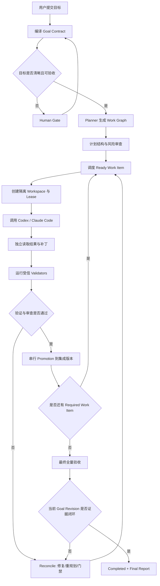

# xgoal 产品设计 SPEC

> **副标题**：Evidence-Closed Multi-Agent Coding Orchestrator  
> **中文主张**：把目标交给多个原生 Agent，把“完成”交给证据。  
> **版本**：v0.1
> **日期**：2026-08-26  
> **作者**：monshunter  
> **状态**：v0.1 基线已验收；OBJ-004 运行时 Harness 增量正在实施，见第 20 节；真实三组 Provider Benchmark 待显式运行

---

## 0. 文档目的

本文定义 `xgoal` 的产品定位、边界、用户体验、核心概念、功能需求、验收口径、风险与版本路线。技术组件、数据模型、状态机、Agent 适配协议、并发与恢复算法见《xgoal 技术 SPEC》。

`xgoal` 独立承担长期软件工程目标的执行与验收编排，与工程治理工具的职责如下：

- **AutoGo**：为 Codex、Claude Code 等原生 Agent 安装治理规则、Skills、模板和工程工作流，解决“Agent 应该怎样工作”。
- **xgoal**：面向软件工程场景，直接启动和编排 Codex、Claude Code 等原生 Agent，管理隔离环境、任务租约、补丁晋升、独立验证、失败恢复与最终验收，解决“由谁、在什么环境、针对哪个有界任务执行，以及结果何时才可以被接受”。

本项目采用独立仓库和独立 Go 实现，通过协议衔接工程治理规则与运行时编排。

---

## 1. 执行摘要

### 1.1 一句话定义

`xgoal` 是一个**面向长期软件工程目标的本地多 Agent 编排与证据闭环系统**：用户只需要提交目标，系统把目标编译为可验收的 Goal Contract 和有依赖关系的 Work Graph，将有界任务分派给 Codex、Claude Code 等原生 Agent，在当前 Git 主工作目录中串行执行，并通过 Git、构建、测试、运行探针和独立审查形成证据，只有最终集成版本满足全部验收条件时才进入 `Completed`。

### 1.2 产品核心

`xgoal` 不以“再造一个更聪明的 Agent”为目标，而是把 Agent 外部最难、最容易失控的工程责任做成确定性系统：

1. **目标持久化**：目标不是一段会随对话漂移的 Prompt，而是带版本、范围、约束和验收标准的持久对象。
2. **执行有界化**：每个 Agent 每次只处理一个可验证的 Work Item，不把整个项目和无限自主权一次性交给模型。
3. **执行归属明确**：一个 Git 项目只有一个 xgoal 实例，全部角色在当前主工作目录串行执行；不创建 Git worktree，快照与元数据保存于独立运行目录。
4. **验收外部化**：Agent 的“已完成”只是声明；Git diff、测试结果、运行探针和用户决策才是证据。
5. **失败可恢复**：进程退出、上下文中断、外部服务不可用、测试失败和合并冲突都被记录为状态转换，而不是丢失在聊天历史中。
6. **高风险受控**：除受信 Agent Profile 必需的模型 Provider Transport 与 CLI 自有登录态外，项目/工具网络、额外密钥、破坏性操作、发布、生产变更、范围扩张等必须经过 Human Gate。

### 1.3 不承诺绝对正确

任何通用软件系统都无法仅凭多 Agent 互相审查保证“代码绝对正确”。`xgoal` 的可兑现承诺是：

> **不把 Agent 的自述当作完成；不在缺少当前版本证据时宣称完成；所有完成状态都能追溯到明确目标、最终代码版本、验证命令、输出结果和必要的人类决策。**

---

## 2. 背景与问题

### 2.1 当前 Coding Agent 的长期任务问题

Codex、Claude Code 等原生 Coding Agent 已能完成复杂的单轮或短周期编码工作，但当任务跨越多个小时、多个上下文窗口、多个 Agent 或多个环境时，常见问题包括：

- 目标、范围和验收标准在多轮交互中逐渐漂移。
- Agent 把“代码已修改”误判为“目标已完成”。
- 一个 Agent 编码、另一个 Agent 审查，但二者可能共享同样的错误假设。
- 多个 Agent 在同一工作目录修改代码，产生覆盖、污染和不可归因的结果。
- Agent 进程退出后，下一轮无法准确恢复做到哪里、为什么失败、下一步是什么。
- 测试命令由 Agent 临时决定，可能被弱化、跳过或替换成更容易通过的检查。
- 失败后机械重试，却没有代码、证据或状态上的实质进展。
- 环境依赖、工具链、缓存、服务和配置没有形成可复现快照。
- 需要项目/工具网络、额外密钥、付费资源或生产权限时，没有可靠的人类门禁。

### 2.2 工程治理与运行时编排的责任边界

| 项目 | 主要责任 | 优势 | 对 xgoal 而言仍缺少的能力 |
|---|---|---|---|
| AutoGo | 安装治理规则、Skills、模板和工程协作约定 | Native Agent First、证据优先、Fast/Standard 流程、Human Gate | 不拥有运行时任务、Agent 进程、租约、隔离工作区和长期状态 |
| xgoal | 软件工程专用的多 Agent 执行与验收编排 | 原生 Agent 适配、当前目录快照、环境观测、验证证据、补丁晋升、恢复 | v0.1 聚焦本地可信仓库，不覆盖分布式执行和生产自治 |

### 2.3 产品机会

`xgoal` 将长期目标、执行状态和验收证据纳入持久控制，负责原生 Agent 之外的工程编排：

> **Native Agent Execution, External Orchestration**  
> 原生 Agent 保留单次执行中的推理、工具调用和编码能力；`xgoal` 成为唯一的跨 Agent、跨轮次、跨工作区编排与生命周期控制面。

---

## 3. 产品定位

### 3.1 产品类别

- 本地优先的开发者工具。
- 软件工程专用 Multi-Agent Orchestrator。
- Agent Harness 的运行时补充，而非新 Agent 框架。
- 目标驱动、证据闭环、可恢复的 Coding Control Plane。

### 3.2 目标用户

首要用户：

- 重度使用 Codex、Claude Code 等 Coding Agent 的个人开发者。
- 希望一个人稳定推进数小时到数天工程任务的基础设施、后端、AI Infra 工程师。
- 需要审计、恢复、隔离和验收能力的小型工程团队。
- 正在构建 Agent Harness、Coding Agent 平台或自治研发系统的工程人员。

非首要用户：

- 只需要一次性代码补全的轻量用户。
- 希望系统无门禁地直接操作生产环境的用户。
- 需要大规模云端分布式 Agent 集群的企业；该能力属于后续版本。

### 3.3 典型场景

1. **复杂功能开发**：拆分设计、实现、测试、文档和最终集成，由不同 Agent 分工完成。
2. **疑难 Bug 修复**：一个 Agent 定位和修复，另一个 Agent 从失败模式与回归风险角度审查，系统运行复现与回归测试。
3. **跨模块重构**：以 Work Graph 管理依赖和写入范围，避免并发 Agent 相互覆盖。
4. **工程环境建设**：创建开发环境、依赖配置、容器或测试服务，并通过可复现命令验收。
5. **长期任务恢复**：终端关闭、Agent Provider 暂时不可用或进程中断后，从持久状态和证据继续，而不是重新解释全部上下文。
6. **高风险变更治理**：涉及项目/工具网络、额外密钥、外部资源、发布和生产时暂停，并生成明确的 Human Gate。

---

## 4. 产品目标与非目标

### 4.1 v0.1 产品目标

| ID | 目标 |
|---|---|
| G-001 | 用户可以用自然语言提交工程目标，并得到结构化、可版本化、可验收的 Goal Contract。 |
| G-002 | 系统可以把目标分解为有依赖关系、范围明确、可独立验证的 Work Graph。 |
| G-003 | 直接编排至少 Codex CLI 与 Claude Code CLI，不实现自有模型、推理循环或工具调用框架。 |
| G-004 | 每次 Agent 尝试独占当前工作目录，并能通过不可变快照准确归因到目标、任务、Agent、输入和代码差异。 |
| G-005 | 使用受信验证器独立执行构建、测试、静态检查和运行探针，并将结果绑定到具体代码树。 |
| G-006 | 支持 Planner、Implementer、Reviewer 的最小多 Agent 协作，同时避免角色和拓扑过度设计。 |
| G-007 | 支持暂停、继续、取消、重试、重规划、Human Gate 和崩溃恢复。 |
| G-008 | 只有最终集成版本满足当前 Goal Revision 的全部门禁与验证要求时才能完成。 |
| G-009 | 输出可审计、可复现的最终报告，包含代码版本、验证证据、决策、限制和资源消耗。 |
| G-010 | 可选复用 AutoGo 治理与 Skills，但不复制其 24 个 Skills 或建立第二份治理真相。 |

### 4.2 非目标

- 不开发新的基础模型、Coding Agent 或通用 Agent SDK。
- 不替代 Codex、Claude Code 的原生推理、上下文管理和工具调用。
- 不保证任意需求、任意代码和任意环境下的绝对正确性。
- v0.1 不自动推送远端仓库、不发布制品、不部署生产环境。
- v0.1 不面向不可信第三方仓库提供强隔离安全承诺。
- v0.1 不实现多机分布式调度、远程 Worker、Kubernetes 执行集群和组织级权限系统。
- 不把 Reviewer Agent 的文字结论作为唯一或最高等级验收依据。
- 不同时把 SQLite、`PROGRESS.md` 和 Agent 会话都设为可写的运行状态真相。
- 不为了“Multi-Agent”而固定创建大量角色；角色只在能够形成独立责任或证据时存在。

---

## 5. 产品原则与不变量

### P-001 原生 Agent 执行，外部系统编排

Agent 负责一个有界执行回合中的理解、推理、工具使用和代码修改；`xgoal` 负责跨回合和跨 Agent 的状态、调度、租约、权限、环境、验证、集成与恢复。

### P-002 单一运行状态真相

`xgoal` 的运行数据库是 Goal、Work Item、Attempt、Gate、Evidence 和 Lease 的唯一权威状态。Agent 对话、日志、`PROGRESS.md` 和报告都只是输入、证据或投影，不可反向覆盖核心状态。

### P-003 目标先于计划，证据先于结论

固定追溯链：

```text
Goal → Goal Revision → Acceptance Criteria → Work Item
     → Attempt → Code/Artifact → Validator Run → Evidence → Final Decision
```

任何 `Completed` 都必须能沿该链路追溯。

### P-004 Agent 声明不是证据

Agent 输出的“完成”“测试通过”“没有问题”一律按 Claim 保存。`xgoal` 必须独立读取文件、计算 Git diff、执行验证命令并记录实际结果。

### P-005 不允许自我认证

Implementer 可以提供首轮自检，但不能批准自己的最终 Review；Reviewer 可以提出阻塞项，但不能单独证明系统正确；最终裁决由 Goal Contract、受信验证器、当前代码版本、未关闭阻塞项和 Human Gate 共同决定。

### P-006 每次工作必须有界

每个 Work Item 必须包含目标、输入范围、允许写入范围、依赖、验收条件、验证器和停止条件。无法形成有界工作项时，应进入 Goal 澄清或 Human Gate，而不是给 Agent 无限自由。

### P-007 写空间隔离，集成串行化

同一项目不并发运行 Agent。一个验证阶段内的受管服务可为探针保持运行，禁止并发改源码并在阶段结束前回收。Planner、Implementer、Reviewer 与验证命令在当前主工作目录串行运行；不同项目可并行。Patch 通过 Git 对象重建候选 Tree，并与当前目录核对后验证和晋升；不创建第二份可执行代码目录。

### P-008 失败不是伪终态

单次 Attempt 可以失败、超时或中断；Goal 不因单次失败直接结束。系统必须进入修复、重规划、等待门禁或取消，避免“失败即丢失上下文”。

### P-009 没有实质增量就不是进展

只有以下变化之一才算实质进展：

- 产生被接受的新代码或制品差异。
- 验证结果发生可解释变化。
- 关闭一个 Gate、Review Finding 或阻塞项。
- 更新并批准新的 Goal Revision 或 Work Graph。
- 产生能够改变下一决策的新环境事实或证据。

Agent 生成更多文字、重复相同失败、重新描述计划不算进展。

### P-010 高风险默认关闭

项目命令或 Agent 工具访问网络、读取项目密钥、使用额外付费资源、执行破坏性命令、远端推送、发布、生产环境和范围扩张默认禁止，只有显式策略或 Human Gate 才能开启。

Codex/Claude CLI 访问其模型供应商的控制面连接是 xgoal 核心执行通道，不等同于项目网络权限。它只能由受信 Agent Profile 开启并使用 CLI 自有登录态；Provider Credential 不得进入 Work Packet、项目命令环境、Validator 环境或未脱敏日志。状态和报告必须分别展示 Provider Transport 与 Project/Tool Network，不能用“网络已禁止”掩盖模型连接事实。

### P-011 当前版本证据

验证结果必须绑定 Goal Revision、配置哈希和代码 Tree/Commit。代码发生变化后，旧证据自动过期；不得使用旧测试结果证明新代码已通过。

### P-012 奥卡姆剃刀

默认只保留形成闭环所需的 Planner、Implementer、Reviewer 三个逻辑角色；环境管理器和 Validator 是确定性服务，不包装成 Agent。需要根据运行反馈交互操作时，可显式启用 Acceptance 会话；它只辅助执行场景、提出问题和采集事实，不能认证完成。具体边界见第 20 节。

---

## 6. 核心概念

| 概念 | 定义 |
|---|---|
| Project | 被 `xgoal` 管理的本地 Git 项目及其配置。 |
| Goal | 用户希望系统达成的长期工程目标。 |
| Goal Revision | 一次冻结的目标、范围、约束和验收标准；任何重大变更都会生成新版本。 |
| Goal Contract | Goal Revision 的结构化表达，是计划、执行和验收的共同合同。 |
| Work Graph | 由 Work Item 和依赖组成的有向无环图；简单任务可退化为单节点。 |
| Work Item | 一个范围有界、可独立执行和验证的工作单元。 |
| Attempt | 某 Agent 对某 Work Item 的一次具体执行。 |
| Agent Profile | Codex、Claude Code 等 Agent 运行时及其能力、角色和策略配置。 |
| Lease | 对 Work Item 的有期限排他认领，防止重复执行。 |
| Workspace | 当前主工作目录的独占执行会话及其不可变基线、结果快照、运行目录和环境观测。 |
| Validator | 从受信配置加载并由 `xgoal` 独立执行的确定性验证器。 |
| Evidence | 与具体目标版本和代码树绑定的命令结果、Git 事实、运行探针、审查结论或人类决策。 |
| Review Finding | Reviewer 产生的结构化问题，具有严重级别、证据位置和解决状态。 |
| Gate | 必须由人或确定性条件满足后才能继续的阻塞状态。 |
| Promotion | 将经过验证的 Attempt 补丁重新应用到当前集成版本、复验并提交的过程。 |
| Reconcile | 根据失败、证据和当前状态决定重试、修复、重规划、等待或取消。 |

---

## 7. 产品运行模型

### 7.1 三层责任模型

```text
┌──────────────────────────────────────────────────────────┐
│ Human                                                    │
│ 目标、边界、风险授权、关键取舍、最终业务责任             │
└───────────────────────────┬──────────────────────────────┘
                            │ Goal / Gate Decision
┌───────────────────────────▼──────────────────────────────┐
│ xgoal Orchestration Kernel                               │
│ Goal Contract、Work Graph、Scheduler、Lease、Workspace、 │
│ Policy、Validator、Evidence、Reconcile、Promotion、Report│
└───────────────┬───────────────────────────┬──────────────┘
                │ bounded work packet       │ independent checks
┌───────────────▼────────────────┐   ┌──────▼───────────────┐
│ Native Coding Agents           │   │ Deterministic Systems│
│ Codex / Claude Code / others   │   │ Git / Build / Tests  │
│ 推理、工具调用、编码、审查     │   │ Runtime probes / CI   │
└────────────────────────────────┘   └──────────────────────┘
```

### 7.2 标准闭环



### 7.3 Fast 与 Standard

| 模式 | 适用条件 | 执行方式 | 不可省略项 |
|---|---|---|---|
| Fast | 目标清晰、局部、可逆、可快速验证，且无高风险权限 | 单 Work Item；通常一个 Implementer；按需省略独立 Reviewer | Goal Contract、当前目录独占与快照、实际 diff、受信验证、证据和最终版本绑定 |
| Standard | 长期任务、多模块、环境复杂、难以逆转、需要多 Agent 或存在风险 | Planner → Work Graph → Implementer → Reviewer → Reconcile → Promotion → Final Validation | 全部阶段；高风险必须 Human Gate |

只要无法同时确认“清晰、局部、可逆、可验证”，默认进入 Standard。

---

## 8. Goal Contract

### 8.1 必备字段

```yaml
goal_revision:
  id: goalrev-...
  summary: "实现一个可恢复的本地任务编排器"
  rationale: "解决 Coding Agent 长任务状态漂移和伪完成"
  in_scope:
    - "本地 Git 仓库"
    - "Codex CLI 和 Claude Code CLI"
  out_of_scope:
    - "生产部署"
    - "远程分布式 Worker"
  constraints:
    - "不开发自有 Agent"
    - "默认无网络、无密钥、无远端推送"
  acceptance_criteria:
    - id: AC-GOAL-001
      statement: "进程重启后可恢复 Goal、Work Item 和 Attempt 状态"
      validators: [recovery-integration-test]
  quality_attributes:
    - "状态一致性"
    - "可审计性"
    - "幂等恢复"
  human_gates:
    - "扩大写入范围"
    - "启用网络或密钥"
  completion_policy:
    require_all_required_items: true
    require_no_blocking_findings: true
    require_final_validation: true
```

### 8.2 Goal Revision 规则

- Goal Contract 一经进入执行即冻结。
- 文案澄清但不改变语义时可以补充注释；范围、约束、验收或风险发生变化时必须创建新 Revision。
- 新 Revision 会使依赖旧语义的计划、证据和部分 Attempt 失效，并触发影响分析。
- Agent 不能自行放宽 Acceptance Criteria；只能提出变更建议。

---

## 9. Work Graph 与角色模型

### 9.1 Work Item 最小合同

每个 Work Item 至少包含：

- 唯一 ID、标题和目标。
- 所属 Goal Revision。
- 前置依赖和可开始条件。
- 允许读取范围、允许写入范围和明确排除范围。
- 输入事实、相关设计/失败证据和环境快照。
- 验收标准与必须运行的 Validator。
- 推荐角色和 Agent 能力要求。
- 超时、尝试上限和停止条件。
- 完成后可解锁的后续节点。

### 9.2 最小角色

| 角色 | 责任 | 默认权限 | 禁止事项 |
|---|---|---|---|
| Planner | 把 Goal Contract 转换为 Work Graph；识别依赖、风险和验证需求 | 只读项目；输出结构化计划 | 不直接修改业务代码；不自行放宽目标；不把临时命令直接注册为受信验证器 |
| Implementer | 在一个 Work Item 范围内修改代码并提供实现说明 | 当前项目目录在 Scope 内可写；受策略限制的命令 | 不写入范围外文件；不推送远端；不批准自己的最终 Review |
| Reviewer | 从正确性、回归、范围和验收缺口角度审查补丁 | 只读代码、diff、证据；输出结构化 Finding | 不直接重写实现，除非系统创建独立 Fix Work Item；不把“看起来没问题”作为完成证据 |
| Acceptance（可选） | 根据受信场景与实时反馈操作测试环境，报告观察、阻塞与制品引用 | 源码只读；仅使用显式配置的测试工具和环境 | 不修改实现或受信断言，不晋升代码，不以自身 Claim 生成通过 Evidence |

说明：同一个底层 Agent Runtime 可以承担不同角色，但 Standard 模式下 Implementer 与 Reviewer 应使用独立会话；高风险项目可配置不同供应商以降低相关性错误。

### 9.3 不把确定性组件包装成 Agent

以下组件是系统服务，而不是 Agent 角色：

- Scheduler
- Lease Manager
- Workspace/Environment Manager
- Validator Runner
- Evidence Store
- Policy Engine
- Reconcile Engine
- Promotion Manager

这样可以避免把确定性状态转换交给概率模型。

---

## 10. 功能需求

### 10.1 项目初始化与诊断

#### FR-001：初始化

`xgoal init` 必须能够：

- 检查 Git 仓库、基础分支和工作目录。
- 创建 `xgoal.yaml`、本地运行目录和忽略规则。
- 对尚无 HEAD 提交的命名主工作目录，在初始化成功时自动创建一次本地首次提交，仅包含 `xgoal.yaml`、`.xgoalignore` 和 `.gitignore` 三个完整文件；已有配置及忽略规则保留原内容后随文件纳入。不提交业务文件、`.xgoal/` 或其他暂存内容，原有无关 dirty 拒绝规则保持。
- 已有 HEAD 时不自动提交；重复初始化不增加提交。JSON 仅在本次创建提交时增加 `initial_commit`（Commit ID）。首次提交使用已有 Git 身份，禁用 hooks 和自动签名；身份、锁或其他 Git 错误应明确报错，保留文件和可能已登记的初始化路径以便修正后重跑，不自动清理、回滚或修改全局 Git 配置。
- 选择 Agent Profile、默认模式和验证器。
- 可选检查或安装 AutoGo；不得复制 AutoGo 内部 Skills。
- 不修改用户未授权的远端配置或生产资源。

#### FR-002：环境诊断

`xgoal doctor` 必须输出：

- Git、操作系统、架构和必要工具版本。
- Codex/Claude CLI 是否可用及其已探测能力。
- 当前隔离等级、网络策略和权限风险。
- Validator 命令、依赖文件和所需服务是否存在。
- 不能满足的能力以及是否需要 Human Gate。
- 默认只执行本地被动探测；真实最小 Agent 回合属于显式主动探测，必须展示 Provider Transport、认证和超时边界并生成独立 Evidence。

### 10.2 目标录入与计划

#### FR-010：目标编译

- 接收自然语言、文件或标准输入中的目标。
- 由 Planner Agent 提议结构化 Goal Contract。
- 由 `xgoal` 对 Schema、完整性、冲突和可验证性做确定性检查。
- 对无法安全推断的重要缺口生成 Human Gate。
- 保存原始目标、结构化版本、配置哈希和创建者。

#### FR-011：计划生成

- 初始 Planner 在同一 Proposal 中提议 Goal Contract 与 Work Graph；Kernel 校验后原子冻结 Goal Revision 并发布有效图。已有目标的 replan 基于当前冻结 Revision 生成新图。
- 系统检查环路、缺失依赖、写入范围冲突、无验证节点和过大的工作项。
- 简单目标允许生成单节点计划，不强制制造多 Agent。
- 计划变更必须记录原因、影响和版本。

### 10.3 Agent 适配与调度

#### FR-020：Agent Profile

每个 Profile 包含：

- Agent 类型与 CLI 路径。
- 支持的角色和能力。
- 结构化输出、事件流、恢复会话和权限模式能力。
- 默认模型/配置、超时和环境变量白名单。
- 当前可用状态与探测时间。
- Provider Transport 与认证来源；v0.1 默认复用 CLI 自有登录态，不把凭据暴露给 Work Packet 或项目工具。
- 被动能力探测与显式主动 Contract Probe 的支持状态。

#### FR-021：有界分派

- 每次 Invocation 只有一个持久 owner：规划请求、Work Attempt 或最终验收。初始 Planner 绑定 Goal ID、不可变规划请求/配置哈希、输入 Tree 与 generation；生成合同并校验后才冻结 Goal Revision。其余调用绑定已存在的 Goal Revision，所有调用具有唯一 Invocation 身份。
- 输入使用对应 owner 的不可变 Packet，不依赖不可审计的长期聊天历史。
- Packet 包含 owner 输入身份、任务边界、验收、环境事实、既有证据、失败摘要和输出 Schema；Revision 尚未产生时使用规划请求身份。
- 系统必须能够取消、超时和回收 Agent 子进程。

#### FR-022：租约与去重

- 同一 Work Item 同一时刻最多一个有效 Lease。
- Lease 具有 TTL、持有者、Generation 和心跳。
- 调度、启动、回收和结果写回必须支持幂等键。
- 崩溃后能识别过期 Lease 和未知子进程状态。

### 10.4 工作区与环境管理

#### FR-030：当前工作目录执行

- 一个 Git 项目只有一个活动 xgoal 实例，全部 Attempt、验证与审查在用户当前主工作目录中串行执行；不创建、切换或删除 Git worktree。linked worktree 入口明确拒绝。
- 首个基线来自当前 HEAD；只接管干净目录，或与 xgoal 已记录的上次验收结果完全相同且 HEAD/index 未变的目录。其他预存修改保留并拒绝自动接管。
- 保存基础 Commit/Tree、用户 HEAD/分支/index 身份、配置哈希和环境观测。所有系统快照使用独立临时 index，不改用户暂存区。
- Attempt 结束后独立计算 tracked 与非忽略 untracked 的内容、mode、rename、symlink 和 delete；Git 元数据及 xgoal 状态不进入业务 Patch。
- 超出 Scope、HEAD/index 漂移或无法归属的修改保留现场并进入 Quarantine/可操作等待；停止或取消不自动 reset、clean、stash 或回滚代码。

#### FR-031：环境准备

- 支持项目定义的受信 bootstrap、build、test 和 service 命令。
- v0.1 支持本地进程环境；后续支持 Dev Container/OCI Container。
- 缓存必须有明确作用域和并发策略，不能把工作区可变文件当成共享缓存。
- 环境准备失败应形成结构化 Evidence，而不是让 Agent 猜测已成功。

### 10.5 验证与证据

#### FR-040：受信 Validator Registry

- Validator 只从受版本管理的 `xgoal.yaml` 或受信脚本注册。
- Agent 可以建议新增 Validator，但不能直接使其成为受信命令。
- 每个 Validator 定义命令、工作目录、环境、超时、适用范围、成功条件和证据保留规则。
- 禁止通过 Agent 输出拼接任意 shell 字符串后直接执行。

#### FR-041：独立验证

- xgoal 在 Agent 退出后独立执行 Scope Check、Build、Test、Lint、Integration/E2E、Runtime Probe 等验证。
- 所有结果包含开始/结束时间、退出码、输出摘要、完整日志位置、命令哈希、环境哈希和代码 Tree。
- 明确标记 Flaky Validator；重跑不得覆盖失败记录。
- 最终验收必须在最终集成代码树上重新运行，不能复用 Attempt 工作区中的旧结论。

#### FR-042：证据等级

冲突时按以下顺序处理：

1. 当前 Goal Contract 与显式 Human Decision。
2. 当前代码树上实际执行的确定性验证与运行观测。
3. Git、文件、依赖锁和制品的可读取事实。
4. Reviewer 的结构化分析。
5. Implementer 或其他 Agent 的文字声明。

低等级信息不能覆盖高等级事实。

### 10.6 Review 与 Reconcile

#### FR-050：独立 Review

- Standard 模式默认在实现验证后创建 Reviewer Attempt。
- Reviewer 输入包含 Goal、Work Item、实际 diff、Validator Evidence 和已知风险。
- Finding 必须包含严重度、位置、依据、影响、建议和是否阻塞。
- 阻塞 Finding 必须被修复、被新证据反驳或由 Human Gate 明确豁免。

#### FR-051：失败归因

系统至少识别：

- Agent 启动/协议错误。
- 环境或依赖错误。
- 写入范围违规。
- 编译、测试、静态检查或运行验证失败。
- Reviewer 阻塞。
- 补丁冲突或过期。
- 重复失败且无实质进展。
- Goal/验收歧义。
- 权限、策略或外部环境阻塞。

#### FR-052：防机械重试

- 为失败计算 Fingerprint：Validator/错误类别、归一化输出哈希、基础 Tree、结果 Tree 和相关配置。
- 相同 Fingerprint 且无实质增量时，不得再次用相同策略机械重试。
- 系统改为选择诊断、重规划、拆分 Fix Work Item、切换 Agent/策略或 Human Gate。

### 10.7 补丁晋升与最终验收

#### FR-060：补丁捕获

- 不信任 Agent 自己创建的 Commit 作为晋升单元。
- 系统从基础版本和工作区事实生成可审计 Patch/Tree Snapshot。
- 校验 Git 历史、子模块、软链接、生成文件和超出范围的变化。

#### FR-061：串行 Promotion

- 在 Git 对象层按 before mode/hash 严格应用 Patch 到最新集成 Tree，并核对结果与当前工作目录 Tree 相同；不重放到另一工作目录。
- 冲突时创建 Reconcile 状态，不让 Agent 直接覆盖集成分支。
- 重新运行受影响 Validator；Validator 与 Reviewer 前后必须核对当前 Tree 和 HEAD/index，不把验证期间漂移后的退出 0 归为原候选 Tree 的有效证据。
- 验证通过后由 `xgoal` 用 commit-tree 创建带 Goal/Work Item/Attempt 元数据的审计 Commit，以 CAS 更新私有 refs/xgoal/goals/<goal-id>/integration。结果文件留在当前目录，用户 HEAD、分支与 index 保持不变。
- Promotion 在项目内串行，确保最终顺序和证据可解释。

#### FR-062：最终完成条件

某一 Goal Revision 只能在以下条件全部成立时进入 `Completed`：

```text
Required Work Items 全部 Completed
AND 最终集成 Tree 明确且不可变
AND 所有 Required Validators 在该 Tree 上通过
AND 没有未关闭的 Blocking Finding
AND 没有未解决 Human Gate
AND Scope/Policy 检查通过
AND Evidence 未过期且绑定当前 Goal Revision、Config Hash 和 Final Tree
AND Final Report 已生成
AND（如配置要求）用户完成最终业务验收
```

Agent 输出中的 `status: done` 不参与该布尔判定。

### 10.8 Human Gate

#### FR-070：触发条件

以下场景默认创建 Gate：

- 目标、范围或验收存在实质歧义。
- 需要扩大写入范围或修改冻结 Goal Revision。
- 需要项目/工具网络访问、额外密钥、身份、付费资源或外部系统写入；受信 Profile 已声明的 Provider Transport 和 CLI 自有登录态除外。
- 需要删除数据、重写历史、推送远端、发布或部署生产。
- 受信 Validator 缺失、失效或被建议弱化。
- 多次无进展或不同证据冲突。
- Reviewer Blocker 无法通过确定性证据解决。

#### FR-071：Gate 内容

每个 Gate 必须包含：

- 阻塞原因和对应 Goal/Work Item。
- 已确认事实与不确定项。
- 2–3 个可选决策及影响。
- 系统推荐项与理由。
- 授权范围、有效期和恢复条件。

### 10.9 恢复与生命周期

#### FR-080：生命周期操作

支持：

- `pause`：停止新调度，允许当前 Attempt 按策略结束或取消。
- `resume`：读取当前状态并继续，而不是重建 Goal。
- `cancel`：取消 Goal 或 Work Item，保留全部证据和原因。
- `retry`：按新 Attempt 记录，不能覆盖失败历史。
- `replan`：创建新 Plan Revision 并执行影响分析。

#### FR-081：崩溃恢复

- 进程重启后核对 Lease、PID、当前目录快照、HEAD/index、Git Tree、子进程日志和未完成事务；未知目录变化保留并等待。
- Agent 退出码为 0 不等于成功；必须重新读取结果并运行验证。
- 能安全恢复同一会话时可以使用 Agent Session ID；否则使用 Fresh Work Packet 创建新会话。
- 所有未知状态默认进入校验或等待，不猜测成功。

### 10.10 可观测性与报告

#### FR-090：状态视图

`xgoal status` 至少显示：

- Goal Revision、当前状态和开始时间。
- Work Graph 完成度、Ready/Running/Waiting 节点。
- 当前 Agent、Lease、Workspace 和最近一次实质进展。
- 打开的 Gate、阻塞 Finding 和失败 Fingerprint。
- 已执行 Attempt、运行时长和最近实质进展时间。
- 最终或最近代码 Tree 与验证摘要。

#### FR-091：最终报告

Final Report 包含：

- 原始 Goal 与最终 Goal Revision。
- 完成的 Work Item、Agent 分工和 Attempt 历史。
- 最终代码 Commit/Tree、变更范围和关键设计决策。
- 每条 Acceptance Criterion 对应的 Evidence。
- 所有 Validator 的实际命令、结果和复现方式。
- Human Gate 决策、Reviewer Finding 及处理结果。
- 已知限制、未覆盖风险和被取消的范围。
- 时长、Attempt 次数和 Human Gate 次数等执行数据。


### 10.11 项目隔离与持久后台执行

本节由 OBJ-003 更新，澄清 FR-001、FR-080/081 与本地 daemon 的运行边界；替代将每个工作目录或用户级全局服务视作项目运行身份的旧假设。

- **FR-100 项目身份**：当前 Git 主工作目录、子目录和路径别名定位同一 Project、daemon 与状态库；linked worktree、bare 和不支持的嵌套 Git 入口明确拒绝。一个 Git Common Directory 仅有一个活动 owner，独立 clone 独立。显式状态目录/socket 覆盖不能绕过身份核对。
- **FR-101 状态归属**：数据库绑定 Project ID、Git Common Directory 和执行根目录。错误绑定、多个历史状态库、无法证明归属的外部旧库拒绝启动并给出恢复指引；不自动合并、移动或删除历史。既有默认 `.xgoal` 数据在验证归属后原位采用，迁移前备份。
- **FR-102 生命周期**：项目独占所有权覆盖数据库打开、迁移、恢复、任务运行和最终关闭。启动失败不留下执行者；stop 成功前所属执行和请求结束、数据库关闭，随后才释放所有权。停一个项目不直接停止另一个项目。
- **FR-103 后台入口**：`daemon serve` 前台运行；`daemon start` 显式启动独立后台进程并等待真实身份/readiness；`daemon status` 无写入查询；`daemon stop` 通过当前 instance 身份请求停止并等待退出，不从旧 PID 文件盲目发送信号。普通 CLI 不隐式启动 daemon。
- **FR-104 可发现性**：CLI 与 daemon 统一 flags > 环境变量 > 已绑定项目定位 > 默认值的解析；socket 路径不依赖仓库路径长度。help/version/completion 与被动 doctor 无需 daemon，不打开或迁移状态库，不启动模型回合。主动 doctor 仍显式授权且受项目执行槽约束。
- **FR-105 持久接受**：创建请求在一个事务中登记原始 Goal、规划意图和可重放的接受响应，立即返回 Goal ID。Planner 与后续工作由 daemon 拥有；CLI wait/watch 退出仅停止观察，已接受 Goal 继续。相同幂等键/请求回放原响应，不重复创建 Goal。
- **FR-106 规划恢复**：Planner 结果经确定性检查后原子发布 Goal Revision、Plan、Work Graph 与规划完成记录。中断规划可恢复；已有可靠结果只读回提交，不重复调用 Provider。超时、无效输出、歧义或配置漂移进入可操作等待。规划期间支持 pause/resume/cancel；提供带版本与理由的规划重试/修正 Proposal 入口。
- **FR-107 执行归属**：Planner、Implementer、Reviewer 和主动 Probe 的 Provider 调用受同一个项目串行槽约束；跨项目可以并行。Provider 执行前须可证明进程归属，崩溃后核对身份并回收旧执行者，旧结果不可推进已取消或新一代任务。恢复同时对账未决 Attempt/Lease/Work，不能留下永久无下一步的 DRAFT/RECONCILING/IN_PROGRESS。
- **FR-108 隔离披露**：每项目 daemon、状态和独立仓库目录不构成敌对多租户隔离；同一项目内的角色共享当前目录。主机 CPU/内存/磁盘、端口、外部服务和 Provider 登录态/配额仍可能共享。项目服务资源应使用项目作用域的名称和可配置端口；强隔离与全局调度不属于本次实现。
- **FR-109 原地交付与兼容**：workspace.provider 只接受 current-directory，新配置默认此值；旧 git-worktree 配置明确要求迁移，不静默改语义。成功结果留在当前目录，并绑定私有审计 Commit/Tree 和 Final Report。旧完成记录保留原版本可读，旧未完成 worktree 目标和未决外部副作用进入明确迁移等待，保留目录、Patch 和 Evidence，不自动续跑或删除。
- **FR-110 现场恢复**：可安全捕获的失败修改保存快照；同一 Goal/Work 的显式 retry 在确认目录仍匹配已观察结果及原 HEAD/index 后可继续修复。未知变化、Scope 违规或元数据变动保留并等待用户处理。恢复不创建第二套 restore 状态机，不自动覆盖文件。

---

## 11. 用户体验与 CLI

### 11.1 核心命令

```text
xgoal init                 初始化项目
xgoal doctor               检查 Agent、Git、环境、验证器和隔离能力
xgoal run                  创建并启动 Goal
xgoal status               查看目标、任务、Agent、证据和阻塞
xgoal logs                 查看 Goal/Work Item/Attempt 的结构化日志
xgoal gates                列出待处理 Human Gate
xgoal approve              对 Gate 做有限授权或选择
xgoal pause                暂停新调度
xgoal resume               从持久状态继续
xgoal cancel               取消 Goal 或 Work Item
xgoal report               生成/查看最终验收报告
xgoal clean                清理可安全删除的运行元数据与缓存；不删除当前目录或历史 Git worktree
```

高级命令可按资源分组：

```text
xgoal goal get|revise|replan
xgoal work list|get|retry|cancel
xgoal agent list|probe
xgoal env list|inspect|clean
xgoal evidence list|show|verify
```

### 11.2 示例

```bash
xgoal run \
  --mode standard \
  --goal-file docs/xgoal-v0.1-goal.md

xgoal status --watch

xgoal gates
xgoal approve gate-018 --option allow-network-once \
  --expires 30m \
  --reason "下载锁文件中已固定校验和的依赖"

xgoal report --format markdown
```

### 11.3 状态输出原则

状态界面必须区分：

- **Fact**：Git Tree、命令退出码、文件哈希、运行探针。
- **Claim**：Agent 声称完成或测试通过。
- **Inference**：Reviewer 或 Planner 的分析。
- **Decision**：Kernel 或 Human Gate 的状态转换。

不得把四类信息混成一句“任务进展顺利”。

---

## 12. 产品成功指标

### 12.1 北极星指标

**Evidence-Closed Goal Completion Rate**：在固定基准任务中，最终版本满足全部 Acceptance Criteria，且证据绑定最终代码树的 Goal 比例。

### 12.2 指标体系

| 维度 | 指标 |
|---|---|
| 正确性 | 最终验收通过率、回归失败率、False Completed 数量、未覆盖 Acceptance Criterion 数量 |
| 稳定性 | 崩溃恢复成功率、重复认领次数、孤儿工作区数量、状态不一致数量、无进展 Attempt 占比 |
| 人效 | 每个 Goal 的 Human Gate 次数、人工诊断次数、人工修改代码比例、平均交接次数 |
| 效率 | 完成时长、Agent Turn/Attempt 数、验证时长、缓存命中率 |
| 可审计性 | Evidence 完整率、最终 Tree 绑定率、可复现命令比例、决策可追溯率 |

### 12.3 基准方法

使用同一任务集比较三组：

1. 原生单 Agent CLI。
2. AutoGo 治理下的单 Agent。
3. xgoal 多 Agent 证据闭环。

任务集至少覆盖：Bug 修复、新功能、跨模块重构、环境搭建、端到端验收。每个任务使用同一初始 Commit、同一验收脚本和资源上限。

v0.1 发布硬门槛：

- 基准中 `False Completed = 0`。
- 所有 `Completed` Goal 的证据均绑定当前 Goal Revision 和最终 Tree。
- 并发/恢复测试中不存在重复有效 Lease。
- 故障注入后能够得到确定的恢复、等待或取消状态，不出现“状态显示完成但代码未晋升”。
- 对比基准的提升必须使用实际数据，不在简历或 README 中预填虚构百分比。

---

## 13. MVP 范围

### 13.1 v0.1 P0

- macOS、Linux，本地可信 Git 仓库。
- 单一 Go 二进制和本地持久状态。
- Codex CLI、Claude Code CLI 两个适配器。
- Goal Contract、单节点/顺序 Work Graph。
- Planner、Implementer、Reviewer 三种逻辑角色。
- 可显式配置独立 Acceptance 辅助会话，默认关闭；确定性 Validator 仍拥有验收事实。
- 当前目录独占、私有 index 快照、对象级 Patch 校验、原地复验和串行 Promotion。
- 配置化 Validator、Evidence、Finding 和 Human Gate。
- SQLite 状态、追加事件、Lease、幂等写回和崩溃恢复。
- 默认 `max_parallel = 1`，先证明闭环正确性。
- CLI 状态、日志、报告和清理。
- Fake Agent Adapter 与故障注入测试。
- 可选 AutoGo 运行时集成；发布 Benchmark 中的 AutoGo 对照组不使 xgoal 运行时依赖 AutoGo。

### 13.2 v0.2

- 基于写入范围和依赖的安全并行 DAG。
- Dev Container/OCI Container 环境 Provider，实现更强网络和文件隔离。
- 本地 Web/TUI 状态界面。
- CI 运行模式和远端只读报告。
- 更细粒度缓存、服务依赖和运行探针。
- Reviewer 策略矩阵与多供应商交叉审查。

### 13.3 v0.3 / v1

- 稳定的 Agent Adapter SDK。
- 远程 Worker、分布式 Lease 和组织级策略。
- Kubernetes/沙箱运行环境。
- 多项目目标和跨仓库变更。
- 团队 RBAC、审批和审计导出。
- 与 GitHub/GitLab PR、CI 和 Issue 系统集成。

---

## 14. 关键产品决策

### D-001：独立项目与运行时边界

**选项**：

1. 在 AutoGo 内加入运行时。
2. 独立建设 xgoal，通过协议复用 AutoGo。

**决定**：选择 2。

**理由**：

- AutoGo 的价值在安装期治理，加入持久运行时会破坏其极简边界。
- xgoal 独立管理 Coding Agent 进程、当前目录快照、验证器、补丁晋升和最终代码验收。
- 独立项目更容易建立明确状态所有权、技术栈和许可证边界。

### D-002：确定性 Kernel，不设置 Manager LLM

**决定**：调度、租约、状态转换、权限、验证和完成判断由代码实现；Planner/Reviewer 只是可替换 Agent 角色。

**理由**：Manager LLM 会把最需要一致性的控制面重新变成概率系统，并引入“谁审查管理 Agent”的递归问题。

### D-003：默认串行，逐步开放并行

**决定**：当前版本同一项目只有一个活动执行者，Planner、Implementer、Reviewer 与验证串行；未来并行方案需要重新设计执行隔离，不属于当前合同。Promotion 在项目内始终串行。

**理由**：长期任务首先需要正确恢复和验收，并行只是吞吐优化，不能先于状态与隔离正确性。

### D-004：Reviewer 是风险发现者，不是最终法官

**决定**：Reviewer 可以生成阻塞 Finding，但最终完成由证据闭环规则判断；人类可对 Reviewer 误报做有记录的豁免。

### D-005：SQLite 是运行真相，Markdown 是导出投影

**决定**：不双写 `PROGRESS.md` 作为权威运行状态。AutoGo 的 Spec、Plan、ADR 等仍是工程内容来源；xgoal 可以生成只读状态快照或报告。

### D-006：可信仓库优先，安全能力如实标级

**决定**：v0.1 本地进程 Provider 只承诺可信仓库中的串行执行、内容归属核对和 Agent 原生权限限制，不声称提供容器级强隔离；不可信仓库推迟到容器 Provider。

---

## 15. 风险与缓解

| 风险 | 表现 | 缓解 |
|---|---|---|
| 多 Agent 相关性错误 | Implementer 与 Reviewer 共享错误假设 | 以独立验证为高等级证据；独立会话；高风险可跨供应商；保留 Human Gate |
| 验证器不足 | 全部测试通过但业务目标仍未满足 | Goal Contract 强制 Criteria→Validator 映射；Reviewer 专门查验收缺口；允许人工业务验收 |
| 验证器被弱化 | Agent 修改测试或命令以通过 | Validator Registry 受信；变更验证器需 Gate；记录测试 diff 和配置哈希 |
| Flaky 测试 | 反复重试造成假阳性 | 显式 flaky 策略；保留所有重跑结果；最终报告披露不稳定性 |
| 并发污染 | 多 Agent 覆盖文件或产生不可解释结果 | 项目独占、范围检查、HEAD/index 和 Tree 核对、串行 Promotion、最终树复验 |
| 长任务循环 | 重复相同错误、执行失控 | Failure Fingerprint、实质进展规则、超时、诊断/重规划/Human Gate |
| Agent CLI 漂移 | 参数、JSON 事件或会话协议变化 | 启动时 Probe；能力协商；协议版本测试；不支持时 Fail Closed |
| 本地安全边界不足 | Agent 读取用户凭据或访问网络 | 环境变量白名单、原生 sandbox、日志脱敏；v0.1 限可信仓库；容器 Provider 提供强隔离 |
| 状态双真相 | DB、Markdown、聊天记录相互冲突 | SQLite 单一权威；其他内容只读投影；所有写操作经 Kernel |
| 编排时延增加 | 多 Agent 与复验拉长交付链路 | Fast/Standard 分流；最小角色；按风险选择 Reviewer；基准衡量收益 |
| 项目命名碰撞 | `xgoal` 在其他领域已有使用 | 使用完整副标题、检查包名/域名/商标；发布前确定唯一 CLI 与仓库标识 |

---

## 16. 许可证与归属建议

- AutoGo 当前采用 MIT License。
- 推荐 xgoal 使用独立仓库和清洁实现，仅复用公开思想与接口模式，并在 `ACKNOWLEDGEMENTS.md` 中说明启发来源。
- 从社区协作、专利条款和基础设施项目属性考虑，可优先评估 Apache-2.0；最终选择应由项目作者确认。本段不是法律意见。

---

## 17. v0.1 发布验收清单

本节是 xgoal v0.1 实现与 Final Report 的规范 AC 入口。`AC-FR-*` 与对应 Feature Requirement 一一绑定；`AC-NF-*` 覆盖跨功能发布不变量。AC ID 一经用于 Evidence 不得重编号，语义变化必须修订 SPEC 并使受影响 Evidence 过期。

### 17.1 Feature Requirement 验收

- [x] **AC-FR-001**：在已有 HEAD 的干净可信 Git 主工作目录或其子目录执行 init，生成严格配置、本地 Project ID 和受控运行目录；linked worktree 拒绝，Git worktree 列表、用户 HEAD/index 与远端不变。无 HEAD 初始化的提交例外由 AC-INIT-001 单独验收。
- [x] **AC-FR-002**：`xgoal doctor` 能报告 Git/OS/Arch/Agent/Validator/隔离与策略事实；默认被动探测不发起模型回合，显式 Active Probe 才使用 Provider Transport 与认证，并在受控超时内保存 Evidence。
- [x] **AC-FR-010**：自然语言、文件和 stdin 目标均能生成并校验 Goal Contract；原始输入、Config Hash 和创建者可追溯，关键缺口进入 Gate 而非被 Agent 猜测。
- [x] **AC-FR-011**：Planner 输出能形成版本化 Work Graph；环路、缺失依赖、写 Scope 冲突、缺失 Validator 和无界 Work Item 会被确定性拒绝或转入 Finding/Gate。
- [x] **AC-FR-020**：Codex 与 Claude Agent Profile 均能做版本与能力协商，分别展示 Provider Transport/认证来源、Project Network 和隔离限制；不兼容版本 Fail Closed。
- [x] **AC-FR-021**（历史 Work 执行基线）：Work Invocation 绑定一个 Attempt、Work Item 和不可变 Work Packet，Kernel 能监督事件、限制输出、超时、取消和回收进程。初始规划与最终验收的 owner 身份及增量续作改由 AC-HR-008/011 验收，本勾选不证明该增量已完成。
- [x] **AC-FR-022**：同一 Work Item 同时最多一个 Active Lease；获取、心跳、Generation、过期读回和幂等写回在竞争与重启测试中成立。
- [x] **AC-FR-030**：全部 Attempt 在当前目录串行执行且不创建 Git worktree；基础与结果 Tree 可归因，完整文件变化被捕获，用户 HEAD/index 不被系统快照改动，范围外或逃逸变化保留并进入 Quarantine。
- [x] **AC-FR-031**：受信 bootstrap、build、test、service 与健康探针可在 Local Provider 中准备、监督和清理；失败产生 Environment Evidence。
- [x] **AC-FR-040**：Validator 只从受版本管理的配置或受信脚本注册；Agent 输出不能注入或弱化 Required Validator，未知或缺失定义阻止完成。
- [x] **AC-FR-041**：Scope、Build、Test、Lint、Integration/E2E 和 Runtime Probe 按配置独立执行并生成 Command Receipt；最终 Required Validator 在最终 Integration Tree 上重跑。
- [x] **AC-FR-042**：事实冲突按 Goal/Human Decision、当前 Tree 确定性 Evidence、Git/文件事实、Reviewer、Agent Claim 的顺序裁决，低等级信息不能覆盖高等级事实。
- [x] **AC-FR-050**：Standard 流程使用独立 Reviewer 会话并生成结构化 Finding；Codex 实现/Claude Review 与 Claude 实现/Codex Review 两条真实路径均通过。
- [x] **AC-FR-051**：Agent、环境、Scope、Validator、Review、Patch、Goal 和 Policy 失败被归入稳定 Failure Class 并进入可解释 Reconcile。
- [x] **AC-FR-052**：相同 Failure Fingerprint 且无实质增量时不会用同一策略机械重试，而是诊断、拆分、切换、重规划或 Gate。
- [x] **AC-FR-060**：Kernel 不信任 Agent Commit；Patch Bundle 以不可变内容和 Manifest 捕获全部允许变化并可在干净 Tree 完整读回。
- [x] **AC-FR-061**：Patch 在最新 Integration Tree 上串行重放、复验并由 xgoal 创建带元数据 Trailer 的 Commit；冲突进入 Reconcile，崩溃恢复不重复 Promotion。
- [x] **AC-FR-062**：只有 Required Work、Criteria、Final Validator、Finding、Gate、Scope/Policy、Evidence、Report 和可选 Human Acceptance 全部满足时 Goal 才能 `Completed`；Agent `done` 或 exit 0 均不能绕过。
- [x] **AC-FR-070**：目标歧义、扩 Scope、项目网络、额外 Secret、破坏性或外部写入、Validator 弱化、无进展与 Evidence 冲突按策略打开 Gate。
- [x] **AC-FR-071**：每个 Gate 含事实、未知项、2–3 个选项、推荐、动作/资源 Scope、次数、期限和恢复条件；过期或越界授权不生效。
- [x] **AC-FR-080**：`pause`、`resume`、`cancel`、`retry` 和 `replan` 均保持历史，Resume 不重建 Goal，Retry 不覆盖 Attempt，Replan 不静默覆盖旧 Revision。
- [x] **AC-FR-081**：在 Agent 启动前、运行中、Patch 捕获后、Validator 后、Promotion 前后和报告落盘边界注入崩溃，重启均得到确定的继续、验证、等待或取消状态。
- [x] **AC-FR-090**：`status`、`logs`、`gates` 及高级查询能展示 Goal/Work/Attempt/Lease/Workspace、最近实质进展、失败和代码 Tree，并清楚区分 Fact、Claim、Inference、Decision。
- [x] **AC-FR-091**：Markdown/JSON Final Report 能逐条追溯 Goal Revision、Work/Attempt、最终 Commit/Tree、AC→Evidence、Validator 命令、Gate/Finding、执行统计、限制和复现方式。

### 17.2 跨功能发布验收

- [x] **AC-NF-001**：状态机、Completion Predicate、Store/CAS、Effect、Scope 和 Evidence Staleness 具有单元、属性/模型、集成与竞态测试；不存在重复有效 Lease、终态回退或迟到 Generation 推进状态。
- [x] **AC-NF-002**：默认禁止项目/Agent 工具的未授权网络、项目 Secret、远端 push、发布和生产操作；Provider Transport 与 CLI 自有认证单独受信，且不泄露到 Work Packet、项目命令、Validator 或日志。
- [x] **AC-NF-003**：`doctor`、`status` 和 `report` 展示实际 L0 隔离及限制；日志脱敏、Socket/DB/Packet/Patch/Report 权限符合合同，`clean` 不删除仍被 Workspace、Evidence 或 Report 引用的对象。
- [x] **AC-NF-004**：仓库内提供固定初始 Commit/fixture 与可复现 Benchmark Suite，对原生单 Agent、AutoGo 单 Agent 和 xgoal 使用同一验收与逐任务超时口径；没有外部发布授权时不自动公开或上传结果。
- [x] **AC-NF-005**：README 中的正确性和性能结论只引用实际运行数据；架构、配置、威胁模型、恢复、Agent Adapter、操作与已知限制文档齐全。

---


### 项目隔离与后台执行增量验收（OBJ-003）

- [x] **AC-ISO-001**：双独立仓库同时运行完整 Goal；数据库、目标、工作区和 daemon 独立，停 A 后 B 继续。
- [x] **AC-ISO-002**：主工作目录、子目录和 symlink 定位同一身份；linked worktree 入口明确拒绝；独立 clone 身份不同；不同 state-dir 不产生第二 owner。
- [x] **AC-ISO-003**：错误 socket/状态绑定、旧库归属冲突、协议不兼容在业务副作用前拒绝；默认旧状态可保留历史并迁移，重复启动/迁移幂等。
- [x] **AC-ISO-004**：持锁期间第二实例不能建库/迁移；长仓库路径可运行；存活异项目 socket 不被删除；启动失败不残留执行者。
- [x] **AC-ISO-005**：start 并发调用只有一个实例；status 无副作用；stop 等待所属进程、请求与数据库关闭；旧 instance stop 不影响新实例。
- [x] **AC-ISO-006**：flags/env 在所有入口一致；被动 doctor 在无 daemon/无库/损坏库时可用且不写项目；help/version/completion 无副作用。
- [x] **AC-BG-001**：慢 Planner 的 Goal 接受立即返回；客户端断开不取消已接受目标；接受前失败无部分状态，同 key 回放无重复。
- [x] **AC-BG-002**：规划 queued/executing/result-persisted/commit 窗口中断后恢复；Revision/Plan/Work 原子一致，已落盘结果不重复模型执行。
- [x] **AC-BG-003**：规划 pause/resume/cancel、失败等待、修正 Proposal/重试可操作；配置漂移拒绝默默执行；迟到结果不能冻结取消目标。
- [x] **AC-BG-004**：所有 Provider 角色/主动 Probe 共享项目槽；停止/崩溃后旧进程和不响应 TERM 的子孙被回收或明确阻止新执行；未知 PID 不被误杀。
- [x] **AC-BG-005**：历史 IN_PROGRESS、半冻结 Goal、未决 Attempt/Lease/Work 经保守恢复得到确定结果/等待，不无限停留，重复恢复不重复副作用。
- [x] **AC-BG-006**：真实 CLI→daemon→Provider→Git→Validator→Report 通过；固定 Provider fixture 的确定性故障测试与真实 Provider smoke 分别标注；全量门禁及 macOS/Linux 平台证据可复核。
- [x] **AC-CWD-001**：实际 Planner/Implementer/Reviewer CWD 为当前主目录，Validator 与 bootstrap CWD 为其内部受信的相对目录，完整 Goal 前后 Git worktree 列表不变；代码结果直接可见。
- [x] **AC-CWD-002**：未归属的 staged/unstaged/untracked 修改拒绝接管且字节不变；Goal 执行期间系统操作保留用户 HEAD、符号分支和 index；两个连续 Goal 可采纳完全匹配的已验收结果。
- [x] **AC-CWD-003**：私有 index/Object Tree 正确覆盖 tracked/非忽略 untracked/binary/rename/mode/symlink/delete，忽略构建产物，拒绝元数据、Scope 越界和路径逃逸；不执行 Agent 的 Git filters/hooks。
- [x] **AC-CWD-004**：Validator/Reviewer 期间源 Tree 或 HEAD/index 漂移使 Evidence 无效；最终当前目录、私有集成 Tree、Evidence 和 Report 必须一致。
- [x] **AC-CWD-005**：失败/暂停/取消/daemon 中断保留文件，已观察现场可显式 retry；未知漂移得到可操作等待而非覆盖、删除或无限自动重试。
- [x] **AC-CWD-006**：旧配置给出迁移诊断；旧完成 Report/Evidence 保留可读，旧未完成目标不继续 worktree 执行；clean 不删除当前目录或历史 worktree。

Evidence 由当前 Operation/Change Review 保存；未取得当前 Evidence 前保持未勾选。

## 18. 产品摘要

`xgoal` 的本质不是让多个 Agent 互相投票，而是把长期软件工程任务变成一个可持续推进、可中断恢复、可独立验收的状态系统：

```text
用户负责目标与风险边界
原生 Agent 负责有界推理与编码
xgoal 负责跨 Agent 编排和生命周期
Git / Test / Runtime 负责事实
Evidence Closure 负责“何时可以说完成”
```

这使 `xgoal` 与一般 Multi-Agent Demo 的关键区别不在 Agent 数量，而在：**单一状态真相、隔离执行、确定性验证、串行晋升、失败恢复和最终证据闭环。**

---

## 19. 参考基线

- AutoGo：`https://github.com/monshunter/autogo`
- OpenAI Codex CLI：非交互执行、JSONL 事件、结构化输出、会话恢复和 sandbox 能力。
- Anthropic Claude Code CLI：Print Mode、JSON/Stream JSON、JSON Schema、会话恢复、工具白名单与权限模式。

---

## 20. 运行时 Harness 增量合同（OBJ-004）

本节补充并细化第 9–11 节，服务于五项问题：验收角色、Agent 配置、运行框架稳定性、状态存储和用户观测。这里定义目标行为；下方未勾选验收项不代表已经实现。对应技术边界见技术 SPEC 第 35 节与 `docs/architecture/DESIGN-007-runtime-harness.md`。

### 20.1 最小角色与验收链

默认三角色足够承担计划、实现和独立审查。自动启动/回收环境、readiness、执行断言、绑定 Evidence、决定完成均由 Kernel 负责。新增可选 `acceptance` 逻辑角色只解决动态场景中需要阅读反馈并继续操作的任务，不新增管理 Agent 或第二套调度器。

Acceptance 使用独立 Profile/会话，读取冻结场景、最终 Tree、环境端点和已有证据，源码前后必须保持相同身份。它可操作明确授权的测试服务；不能修改受信验收入口、扩大网络/工具权限或自行将 Criterion 标为通过。`completed` 只表示会话结束，系统仍执行同一最终 Tree 的受信业务断言；断言失败、缺失或过期都阻止完成。未配置 Acceptance 时，原有三角色流程保持可用。独立 Reviewer 与可选 Acceptance 职责不同，互不替代。

受信 Validator 需说明验证能力、适用场景和局限；Planner 只能从这些能力选择覆盖 Criterion 的验证器，不能将 `git diff --check` 当作业务行为证明。无可证明覆盖的 Criterion 保持 Unknown 或进入 Gate。场景可以关联环境依赖、客户端断言及日志/截图/报告等制品。服务已启动、HTTP 200 和 Agent 自述均不能单独替代业务断言。

### 20.2 五个配置维度与有效身份

| 维度 | Owner 与行为 |
| --- | --- |
| xgoal 编排模式 | Goal 的 Fast/Standard 决定审查与交付流程。 |
| 逻辑角色 | 定义职责、输出协议和权限上限；调度可显式绑定 Profile ID。 |
| Provider 交互方式 | 有界非交互执行；原生 plan/auto/交互提问模式不能等同于 xgoal 模式。需要用户决定时形成持久 Gate。 |
| 模型与思考深度 | Agent Profile 声明可选模型和 Provider 支持的 effort；未声明时如实记录继承原生配置，不捏造实际值。 |
| 权限与工具 | Profile 请求与角色上限共同决定有效权限，不能因选了某个模型或模式扩大权限。 |

Profile 是同一原生运行时的一组可复用执行参数，角色通过 Profile ID 选择配置，不为每个 Work 复制整套 Provider 配置。显式角色绑定优先；未绑定保留既有选择策略并显示实际选择及来源。未知模型能力、不支持的 effort、无人值守下需要交互的权限组合和冲突的 sandbox/tools 必须得到可操作诊断，不能静默忽略已填写字段。

Planner、Implementer、Reviewer、Acceptance 的实际调用均使用相同配置解析规则。Invocation 保存请求模型/effort、权限、工具、配置来源、CLI 版本和可观测实际模型；不可观测的实际模型明确为 unknown。恢复会话必须匹配这组有效身份以及 FR-021 定义的 owner 输入身份、Tree、Packet 和 Schema；配置变化使用新会话。被动 doctor 不发起模型请求；实际支持程度通过显式主动探测和真实调用确认。

### 20.3 项目知识与运行时 Harness

xgoal 开发仓库自身的 Skills、docs 和 tests 属于开发治理；不会因此自动成为所有目标项目的内置资产。运行时 Harness 由冻结任务输入、受控执行、验证、Review、Gate/Reconcile、恢复和 Completion Predicate 构成。

目标项目已有 AGENTS.md、Skills、Spec/Design、场景和测试继续拥有项目知识。xgoal 发现配置声明的 Harness 并检查必要文件、Provider 适配和受托执行兼容性。`required` 且缺失/不兼容时在启动 Agent 前拒绝；可选缺失时显示事实和准备步骤。检测到文件不等于 Agent 读过文件：记录规则路径/摘要作为输入事实，只有可观测读取或协议回执才能标识观察到加载，仍不能证明模型理解。

xgoal 给原生 Agent 的委派合同明确：只完成当前有界职责，不自行管理上层 Goal、创建竞争 Objective/Plan、提交/切换分支或推送。目标项目业务规则仍有效；冲突不能靠伪造已加载或复制另一份可写状态绕过。初始化不覆盖用户规则，不安装或修改用户全局 Harness。

### 20.4 验收入口的信任与环境生命周期

Validator 的直接脚本、解释器脚本入口及操作者显式列出的依赖在受信配置基线冻结路径、文件模式和内容身份。执行前后核对这些身份，候选 Tree 修改它们时阻断，不能让实现顺便弱化验收。对于 Make/npm/内联 shell 等无法可靠推断依赖的入口，操作者必须显式声明受信文件；系统不承诺自动发现任意程序的全部传递依赖。业务源码和允许开发的测试不因“被读取”而全部冻结。

更新受信入口需先审阅并提交新的配置/入口基线，再从该基线建立新 Goal；普通 replan 只改变当前冻结 Revision 的工作图，不能重新信任入口。旧 Evidence 不随 Gate 批准自动变为有效。提示必须给出该恢复路径。即使策略允许变更，也不能将旧定义下修改过的脚本认定为旧受信入口。

项目配置声明有界 bootstrap、服务、依赖顺序、readiness 和 Validator 使用的服务集合。Kernel 先准备环境、按依赖启动、等待探针成功，再执行场景；失败/超时/取消按逆序停止自己启动的服务，保留脱敏日志。服务进程与 Goal/Attempt 归属持久化，崩溃后核对身份再回收。退出无法确认时保持等待及执行槽，不能并发启动下一个写入者。只清理本次拥有的资源，不删除用户数据库、共享卷或未知进程。Local Process 的端口、缓存及同 UID 访问仍可能共享，不声明容器级隔离。

### 20.5 合法阻塞、执行失败与有限恢复

合法结构化 `blocked` 表示需要决定或外部条件，`failed` 表示 Agent 未完成执行，缺失/不合法输出才是协议错误。保留摘要、具体 blockers、建议动作和 Invocation 引用，生成可回答、可定位的 Gate；不等待原生 CLI 的无限 stdin 交互。

Gate 决定与继续执行分开持久化，以当前 Gate 及其 owner 的版本和范围做 CAS。用户可以一次提交决定并请求续作；只有全部必要 Gate 解决、进程已停止、现场身份仍匹配时才继续。初始规划从原规划请求创建下一 generation，绑定请求/配置哈希及输入 Tree，成功后原子冻结 Revision；Work 创建新 Attempt；最终验收重入同一 Goal Revision/最终 Tree 的验证生命周期并创建新 Invocation。对应 Packet 带上实际失败反馈和用户决定；拒绝、过期、取消或现场外部修改不会被批准动作覆盖。重启后仍可从同一等待点恢复，不伪造不存在的 Work 或提前冻结规划 Revision。

有限自动修复默认关闭，可由项目配置显式授权正数上限。它只处理可恢复执行/验证失败：同一 Goal/Work、相同配置、已确认停止全部写入者、当前现场与记录一致、无未解决必要 Gate、无未完成 Promotion。第一次可根据新失败反馈修复；相同失败/策略且无实质变化时停止。总重试次数有上限，不因错误文本或 Fingerprint 改变而无限重试。`blocked`、权限/范围/信任变更、外部编辑和进程归属不明不能自动放行。每次自动决策与人工决策分别记录 actor，失败历史不可覆盖。

### 20.6 实时观测与使用体验

用户可从 Goal 找到各角色的 Invocation、有效配置、输入 Packet/上下文、公开可观测消息、工具事件和结果，按 role/invocation 跟随日志并用稳定游标断线续读。原生 Agent 的私有推理不可获得时不承诺展示。日志采集有单条/总体上限和明确截断记录，经过脱敏；慢读者与磁盘故障不能阻塞心跳、取消和进程回收。日志缺失如实报告，不伪装成会话无输出。

CLI 保持现有默认 JSON、退出码和脚本契约；显式 human 输出提供任务摘要、当前位置、最近事件和可复制下一条操作。`run --wait` 能给出等待反馈，分别标识进程存活、最近输出和可证明的实质进展，避免把 heartbeat 解释为进展。状态观测不改变 Goal 生命周期。

Goal/Work/Gate/Invocation 定位、补全和版本查询减少手工复制内部 ID；有歧义时列候选并拒绝变更，短 ID 不削弱 CAS。初始化根据可观察项目文件建议已有测试入口，未知项目清楚说明当前验证覆盖和准备步骤；不执行猜测出来的安装脚本，不把格式检查描述为完整验收。

### 20.7 SQLite、Git 与可读制品

SQLite 保留事务状态、CAS、Lease、Gate、事件、进程归属和恢复索引的唯一写入权威；Git 保存代码内容与 Tree 身份；文件保存不可变 Packet、日志、报告和运行制品。结构化目录替换数据库需要重建跨对象原子提交、并发控制、索引、迁移与崩溃恢复，当前无足够用户收益，因此不增加第二个 Store 后端。

用户可导出指定 Goal 的结构化状态和关联文件，带版本、数据库快照时间/事件边界和内容校验清单。导出从一致数据库快照读取，逐一验证文件引用，失败时不产生“完整”标记；运行中不能直接复制存在 WAL 的数据库主文件冒充备份。导出只读，不作为另一份可写运行真相；修改导出不会改变 Goal。不承诺跨机器恢复当前进程或自动重放外部副作用。新增可选配置保持旧缺省/有效安全配置的行为与历史身份可读取；过去被忽略的冲突权限配置、缺少必要受信依赖声明的入口需明确诊断迁移后执行，不能静默放宽或裁剪。新状态迁移保持旧失败、Gate 和事件关系。旧注册键因新信任绑定产生身份冲突时，提供明确迁移诊断；操作者显式声明受信文件、审阅提交配置并创建新 Goal，不能原地改写历史验收权威。

### 20.8 增量验收

以下各项均须指向当前代码和运行 Evidence 后才能勾选；完整发布 Benchmark 与本次实际 Provider 功能验收分开记录。

- [x] **AC-HR-001**：默认三角色流程完成；可选 Acceptance 独立运行动态反馈场景，源码保持不变，错误 Claim 被真实业务断言拒绝。
- [x] **AC-HR-002**：场景/Validator 能力进入规划输入，缺失行为覆盖无法以格式检查代替通过；Evidence 绑定最终 Tree 与场景制品。
- [x] **AC-HR-003**：解释器入口、直接脚本及显式依赖在候选 Tree 被篡改时均拒绝；旧 Goal 的 Gate/普通 replan 不接受新入口，仅新 Goal 接纳审阅后的新基线，旧 Evidence 不复活。
- [x] **AC-HR-004**：服务依赖/readiness/场景从真实配置和 CLI/daemon 贯通；业务错误、探针超时、bootstrap 失败均阻止完成并保留诊断。
- [x] **AC-HR-005**：服务取消/失败/崩溃后仅回收有证明归属的资源；未知或未确认退出的进程阻止下一写入者。
- [x] **AC-HR-006**：四种角色共享 Profile 解析与显式绑定；旧缺省/有效安全配置继续可用，旧冲突权限或缺少必要信任声明的配置获得迁移诊断，冲突和不支持字段在执行前拒绝。
- [x] **AC-HR-007**：Codex/Claude 的模型、effort、权限实际进入调用；真实双 Provider Evidence 对照请求与可观测有效配置，未知实际值不伪造。
- [x] **AC-HR-008**：改变有效 Profile 配置不能复用旧绑定会话，原配置在安全前提下仍可恢复；初始 Planner 的请求/generation/输入 Tree 身份和其余角色的 Revision 身份均可查，不能要求初始调用具备尚不存在的 Revision。
- [x] **AC-HR-009**：必需 Harness 缺失/不兼容在调用前拒绝；可选缺失有准备说明；规则输入与加载观察区分，委派职责不创建竞争运行状态。
- [x] **AC-HR-010**：合法 blocked、failed、协议错误分别持久化；Gate 保存 blockers/建议及上下文，跨重启可见。
- [x] **AC-HR-011**：初始规划、Work 和最终验收的决定并续作从用户入口完成，分别由下一规划 generation、新 Attempt、同一最终 Tree 的新验收 Invocation 消费实际决定；拒绝/过期/陈旧版本/取消/外部编辑不能错误续作。
- [x] **AC-HR-012**：显式有界自动修复在安全现场成功恢复；默认关闭、重复无进展、总数耗尽和所有不安全边界均停止且保留现场。
- [x] **AC-HR-013**：各角色运行中可查询上下文并实时跟随公开事件，断线游标不遗漏已持久记录；输出限额、脱敏及慢客户端不破坏控制循环。
- [x] **AC-HR-014**：human 状态与 wait 反馈清楚区分存活/输出/进展；现有默认 JSON、退出码、help/version/completion 和取消语义保持。
- [x] **AC-HR-015**：目标/Work/Gate/Invocation 定位与补全可用，歧义和 CAS 冲突可诊断；初始化对已知/未知项目正确说明测试能力与准备步骤。
- [x] **AC-HR-016**：运行中一致导出包含结构化状态和全部关联文件校验，缺失/损坏被识别且无完成标记；导出编辑不影响运行状态。
- [x] **AC-HR-017**：新增数据库迁移保留历史失败/Gate/事件引用，旧配置/历史报告可读取；并发、崩溃和迟到写入不绕过现有完成谓词。
- [x] **AC-HR-018**：全仓发布门禁和当前双 Provider、CLI/daemon、服务真实验收通过；README/示例/操作记录与最终实现一致，未运行项明确保留。

### 20.9 当前增量 Evidence

2026-09-05，PLAN-012 入口保护实现的当前定向证据（尚未完成整个 OBJ-004，AC 保持待综合对账）：

- `TestFrozenInterpreterRejectsTamperedCandidateAndAcceptsNewBaseline` 修复前真实失败：候选 Tree 已包含篡改脚本，旧 Registry 仍产生 PASSED Receipt，且新旧 Definition hash 相同。修复后直接入口、解释器、两类 CWD、显式依赖与包装器声明共六组均通过；旧定义拒绝执行，新审阅基线生成不同身份并可运行。
- `TestRegistryRejectsUndeclaredControlAndUnsafeFiles` 通过：未声明内联/包/Make 控制入口、解释器选项、路径逃逸、缺失/链接/通配依赖均拒绝。
- `go test ./internal/config ./internal/validator ./internal/app -count=1` 通过；`go test ./internal/config ./internal/validator ./internal/orchestrator -count=1` 通过。修改后的 `TestEngineRejectsValidatorAndReviewerSourceMutations/trust` 再次通过：fixture Agent 修改可写范围内的受信客户端，Goal Waiting、无晋升、现场保留，人工批准 Gate 仍不能重绑定现场并续作。
- 上述引擎测试使用可注入故障的 CLI fixture；实际文件、Git、SQLite、进程监督和受信命令运行，但不作为真实 Codex/Claude 功能验收的替代。后续 Profile/环境/观测与综合验收仍未完成。
- `TestEnginePreservesLegalBlockedAndFailedResults` 修复前两组均被错误写成 AGENT_PROTOCOL_INVALID/INVALID_OUTPUT，并丢失 blockers；修复后通过，分别保存 AGENT_BLOCKED/AGENT_FAILED、结构化上下文及 Invocation 引用，重新打开 SQLite 后仍可读。`go test ./internal/reconcile ./internal/store/sqlite -count=1` 通过，包含从 schema 10 升级后保留旧失败/决策/事件、历史已移除类别、新类型写入和外键完整性的验证。有限自动恢复及 Work 决定后续作的当前证据见下列补充。

- `TestEngineAutomaticallyRepairsOnlyWithinConfiguredLimit` 通过：默认关闭路径要求人工重试，显式上限允许一次安全修复完成；每次改变错误文本的 fixture 仍在 Work 总数上限耗尽后 Waiting。Store 负例覆盖配置/版本/现场漂移、blocked、重复、上限、必要 Gate、取消和未确认进程；修复前未结束的 process INTENT 曾错误放行，修复后拒绝且不消耗次数。
- `TestRequiredGateDecisionAndExpiryFenceSchedulingAndCompletion` 修复前 DENIED/REVOKED/自然到期的 APPROVED 被调度放行，修复后统一阻断。人工重试也拒绝这些状态；已消费批准不因自然到期追溯失效。`TestEngineContinuesBlockedResultWithConsumedAnswerAfterRestart` 通过（44.807s）：持久 blocked → 关闭/重开 SQLite → 人工回答与一次消费 → fixture CLI 解析提示中的真实 Packet 路径并读取回答 → 两 Work、独立 Review、Final Report/Completed；三次 Attempt，原 HEAD/index 保持。
- `go test ./... -count=1` 通过，包含 CLI（159.364s）、Orchestrator（276.276s）和 SQLite（16.597s）。此后按独立 Review 修补的封闭命令、自然到期、历史规划 Gate 和旧注册迁移由定向回归覆盖：SQLite 5.444s、Validator 2.805s、Orchestrator 0.431s，均通过。历史规划 Gate 仅凭 Kernel 解决证明退休，人工规划/权限撤销保持屏障；原决定及事件不改写。
- `TestLegacyValidatorBindingRequiresReviewedConfiguration` 的直接/解释器两组通过：v10 注册升级后旧定义可读，同键获得明确 `TRUST_BINDING_MIGRATION_REQUIRED` 且旧注册不变；按提示在配置声明受信文件并审阅提交后，新基线成功注册和执行，Receipt 不复用旧定义身份。Work/最终验收迁移诊断均能形成可操作的 Waiting Gate。
- 示例 `config validate --file xgoal.example.yaml`、实际 CLI `approve/work retry --help` 与 `git diff --check` 已核对。真实双 Provider、完整 `make verify-m6`、其余三份 Plan 和整体 AC 审计留待本 Objective 后续阶段，未以本轮 fixture 回归代替。

> 外部 CLI 的参数和输出协议可能演进；技术实现必须通过版本探测和契约测试确认，不把本文中的示例参数当作永久 ABI。

- PLAN-012 最终并发检查：SQLite 与 Orchestrator 的迁移、规划发布、合法结果、重试、Gate、信任迁移及跨重启回答定向 `go test -race` 均通过（SQLite 39.947s、Orchestrator 154.242s）；独立 REVIEW-051 最终 PASS。

- PLAN-013 Phase 1：配置冲突负例先复现后修复；角色绑定、默认权限、双 Provider model/effort argv、三个角色 Invocation 身份与旧/变更会话拒绝测试通过。Adapter/Review/Planner/Config/Control/Doctor/ProjectInit 全包 PASS；Engine/App/CLI 全包 PASS（265.045s/27.565s/142.891s）。随后只读独立审查发现并修正 Bash 宽泛/花括号规则与可变配置指针，配置负例与 Adapter 配置冻结/Resume 定向 race PASS（Codex 26.112s、Claude 20.126s）；Reviewer 独立冻结 race 亦 PASS。
- PLAN-013 Phase 2：必需 Harness 缺失/Provider 不匹配/声明丢失/逃逸 symlink 的文件系统测试通过。Engine 缺失必需 Harness 在调用 Provider 前产生 Waiting Gate、没有 Attempt 或 Provider 执行且 Git 身份不变；双 Work/Review/Promotion/Final Report 原链路与新 Packet/原生委派 argv 回归通过（Engine 合并运行45.496s）。这些用例使用故障 fixture；真实 Provider 结果单独记录如下。required 安全读取失败统一保留 PROJECT_HARNESS_REQUIRED 分类；offline/API doctor 对两个 Provider 的缺失准备步骤一致性回归通过。

- PLAN-013 真实 Provider：隔离 CLI 版本 Codex 0.153.4、Claude Code 2.1.235，显式模型 gpt-6-astra/sonnet、effort low，以必需的 Provider 原生 Harness 从真实 CLI/daemon 完成 Planner→Implementer→独立 Reviewer→受信最终断言；核对三个 Invocation 配置及 Planner request/input Tree/generation、用户 HEAD/index/worktree 和最终 Evidence。Codex 测试 PASS 148.69s（Goal 2m26.785s），最终 Tree `7a65186e75d8b303dc4173955650ca943aa896b7`、`evidence_set_final_d6d638dbc162facda4c1298b`；Claude PASS 88.04s（Goal 1m25.747s），最终 Tree `fa89c749423e66dbfbdf322a7daefb9a3766a9db`、`evidence_set_final_31a848ae90e161835663962f`。成功夹具按测试合同清理；不声称实际模型别名解析或模型理解可从配置证明。
- Claude 实验中的两次失败分别是 Profile 未转发既有认证环境和 Planner 将 criterion 正文当作 ID；两次均停止于可见 Waiting Gate，没有伪造成功。测试显式列出认证环境名称（不写值、不改用户全局配置），Planner 明确引用示例后完成。合法原生 `is_error` 现在保留有界脱敏原因并归为 Provider 不可用，回归先红后绿；协议损坏仍单独分类。失败夹具保留在 `/private/tmp/xgoal-real-goal-1285040890` 与 `/private/tmp/xgoal-real-goal-873522969`，daemon 已停止。
- PLAN-013 最新定向回归：Config/Harness/Protocol/Adapter/Planner/Review/Control/Doctor/ProjectInit 全包与 Planner/Harness Engine 定向测试 PASS，`go vet ./...` PASS。服务/可选 Acceptance、实时上下文与一致导出仍由 PLAN-014/015 验证；本记录不代替尚未完成的增量 AC。

- PLAN-013 收口复核补充：哨兵回归复现 Provider Profile 环境会流入 bootstrap（测试 exit1），随后移除这条共享，使项目准备仅使用最小环境；Provider CLI 的显式认证配置仍独立保留。该修补及原 bootstrap 源码漂移回归 race PASS 17.611s，不用无 bootstrap 的真实夹具冒充其 Evidence。技术合同同步当前受信 Profile 的既有 CLI 认证环境授权边界；未实现的 secret-provider 来源先红后绿明确拒绝。

- PLAN-014 Phase 1.1：服务配置的缺失依赖、依赖环、重复项、路径、readiness/停止超时校验及选择依赖闭包测试通过；readiness 入口篡改先复现后修复，业务服务入口仍可修改。Validator 全包 PASS43.167s；新字段缺省不改变旧 bootstrap JSON 身份。服务控制绑定复用原 Validator 信任算法，但不作为 Planner 可选择的业务 Evidence。

- PLAN-014 Phase 1.2/1.3：真实 CLI/daemon+两个实际 HTTP 服务+真实客户端业务断言在两个 Goal 中通过（63.27s），每次 change/final 分配私有场景目录，4 组服务均按 api→db 逆序停止、端口关闭；全部进程记录结束，6 次 bootstrap 输出保留并验证环境白名单与 Provider 环境分离，服务日志脱敏。六类真实故障测试 PASS91.96s：bootstrap7.02s、startup14.15s、readiness超时13.96s、HTTP200但业务错误19.19s、取消19.78s、daemon SIGKILL后恢复17.24s；均未完成、保留源码及可归属进程回收。Provider 使用可重复注入的 CLI fixture，服务与客户端没有 mock，不用本条替代实际模型 Acceptance 验收。

- PLAN-014 Phase 1 独立审查发现并修复：Probe 命中旧端点时不能忽略本次服务已退出；崩溃恢复不能按随机进程 ID 清理。对应负例先失败后通过，独立 Reviewer 复核关闭；真实 cancel/crash 加入 api→db 停止顺序断言 PASS36.745s。六类失败新增 index 字节保持和失败日志回读后 PASS95.052s。

- PLAN-014 Phase 2.1：配置和 Planner Request/Packet 贯通声明覆盖、场景步骤及服务关联；编译拒绝遗漏业务断言、遗漏必需场景和将 final-only Validator 用于 Work。缺省覆盖明确为 unspecified。封存输出的缺失、symlink、逃逸、超限和内容损坏测试通过。Store 遗漏冻结场景负例先证实错误完成，再修复为拒绝且 Goal 保持 VERIFYING；独立 Reviewer 复核场景/阶段两项修补，无未解决阻断。最终配置/编译/场景/报告/SQLite 全包 PASS（0.295s/0.422s/1.018s/0.749s/13.658s）；真实双 Goal 服务+场景封存正向及最终缺失制品负向一起 PASS97.338s。可选模型 Acceptance Invocation 尚由 2.2/2.3 完成，未计入本条结果。
- Store Finalize 对未结束 process_invocations/worker_processes 的负例先红后绿；现有 Finalize 全组与 bootstrap/两 Work Engine 完整链路合并 PASS（SQLite2.042s、Engine49.442s）。显式环境清理在最终发布前完成，清理失败不再丢弃；日志测试覆盖跨 chunk 凭据、超长行及总量截断，Local/Supervisor 全包 PASS（6.278s/0.900s），环境变量按每条命令独立选择。

- PLAN-014 Phase 2.2/2.3：Acceptance 使用独立 Packet、Provider Accept 与现有 Effect，未引入 Work 或第二份状态表。专用 Store 事务绑定 Goal version/Revision/config/Tree/Attempt generation/invocation；同归属并发仅一个启动，精确请求重试不重复执行。Gate 消费与新 Effect 的触发器回滚、关闭重开、旧批准拒绝复用、迟到取消与历史结果不复活均通过。独立审查发现并修复 RECOVERING 新 Claim 未落盘和 Historical 可能重新变 current；三步负例和 Finalize 不允许省略已配置 Acceptance 的检查独立 PASS0.404s。
- Acceptance 的真实 CLI/daemon+双服务+客户端正向 PASS35.732s；业务调用之后仍执行独立最终断言并封存同一环境制品。三组边界用例合计 PASS106.089s：blocked 回答后新 Invocation 消费准确 Packet 回答（40.58s）、源码写入拒绝（30.68s）、Agent 声称完成但真实服务返回错误业务结果时拒绝完成（32.62s）。这些 Provider 为确定性 CLI fixture；实际模型 Evidence 另列。
- 真实 daemon SIGKILL 位于完整 blocked 事件已持久化、result.json 尚不存在且 Provider 仍挂起的窗口：重启保留 blocked 与 final Gate，replaySafe 不掩盖问题（PASS29.73s）；没有完整结果且显式安全重放的中断只新建一次调用并完成（PASS41.46s）。取消命令保持既有 exit4，Goal 保持 CANCELLED、旧进程回收且不重放（单独复跑 PASS32.155s）。恢复仅从匹配 Invocation 元数据的有界连续事件提取 Claim；Codex/Claude 的终态错误、缺结果、损坏事件不归类为可自动重放的中断，相关事件恢复负例通过并经独立复核。
- 真实 Claude Code 2.1.235 / sonnet / low 四角色 Standard Goal 通过（测试110.432s，运行1m48.007s）：Planner、Implementer、Reviewer 与 Acceptance 独立会话；Acceptance 通过受信脚本检查实际服务并按 readiness 继续客户端交互，脚本清除 Provider 环境后访问测试服务。最终 Tree 为 `9c1b8815d58315425745970577ade425ba385cd7`，最终 Evidence Set 为 `evidence_set_final_8360541179784451360a8d6f`，Acceptance session 为 `fe23093d-f5aa-415f-a697-3af8bbe4123d`。当前配置/编译/场景/报告/SQLite/Acceptance/Supervisor/Validator 全包通过；后续 Codex 与集成回归结果见下条，正式 Change Review 收口前不宣告整个 PLAN-014 关闭。

- 真实 Codex CLI 0.153.4 / gpt-6-astra / low 四角色 Standard Goal 通过（测试220.028s，运行3m37.575s）：只读 Acceptance 独立 session `01a071cd-34c6-7ec3-8d16-3bc4d1ee2a34`，场景 `output-inspection` 不声明文件制品，最终 Tree `2a54b5b88d98072acf457c8a4d12e9f95d02571d`、Evidence Set `evidence_set_final_802eaedc5121e4d9cdb18af9`。修正共享验收夹具错误假设后，按声明数量检查制品；模型继承/实际可观测值的展示仍由 PLAN-015 收口。
- PLAN-014 最后集成回归：完整 Acceptance CLI 正向/三类边界/持久 blocked 崩溃/安全中断重放/取消场景合计 PASS243.343s；七类服务故障矩阵 PASS127.636s（新增最终缺失制品31.82s，其他覆盖 bootstrap、启动、readiness、HTTP200业务错误、取消和 daemon SIGKILL）。Orchestrator 全包 PASS247.727s、Control12.143s、Codex Adapter5.983s、Claude Adapter4.063s、Recovery1.160s；配置/编译/场景/报告/SQLite/Acceptance/Supervisor/Validator 全包通过，`go vet ./...` 与示例配置校验通过。独立 Reviewer 的 Config/Environment/Scenario/GoalCompile/Report/Supervisor race 和 SQLite 定向 race 已通过；原生 Acceptance fixture 的1s预算在 race 下不足，仅将该测试调用预算改为10s并复跑，不修改生产超时。

- PLAN-015 Phase 1.1：migration 0012 新增纯观测 Invocation 索引，四角色在调用前登记 Packet 字节身份、有效配置和各自 owner；日志不进入 Goal 业务 events。CAS/单调游标/终态不复活/Store 重开不改变 Goal 的定向测试通过。Claude 带换行的超长单条事件和 ChecksClaimed 脱敏负例先失败后修复。
- 当前实际 CLI/daemon/服务四角色链路 PASS34.752s，逐角色核对索引 returned、持续事件游标、session、无 LogError；初始 Planner 使用 request/generation/input Tree，未要求尚不存在的 Goal Revision。双 Work 的 Review/Promotion/Final Report 与合法 blocked/failed Engine 回归 PASS49.763s。
- 分段独立审查发现并关闭：错误路径无界读取 SessionID、观测错误改变 Provider 结果、中间目录 symlink 写入逃逸和正常追加误报 gap。负例验证外部目录零新增、故障观测 Store 不改变原调用结果、ENOENT 后正常发布可续读。独立定向 race：Invocation1.220s、Orchestrator2.003s、SQLite2.189s。
- 两个实际 Provider CLI 子进程夹具在慢刷新、满通知队列下仍可读取运行中 stderr 并完成取消，定向 race PASS（Codex1.836s、Claude2.072s）；完整行脱敏、无换行长行、限额独立标记和 I/O 失败也有负例。该测试调用真实本地进程而非模型服务，不代替最终真实双 Provider 验收。最终 Invocation/SQLite/Codex Adapter/Claude Adapter/Acceptance 全包 PASS（0.346s/16.045s/6.002s/4.096s/2.246s）。用户 API/CLI 日志入口及在线一致导出仍由后续 Phase 验收。

- PLAN-015 Phase 1.2：`TestRealCLIInvocationContextsLiveFollowAndReconnect` 在真实 CLI/daemon/服务链路 PASS36.360s，覆盖 Planner 运行中上下文和 stdout/stderr 脱敏读取、Ctrl-C 仅取消读者、携带游标断线续读、HTTP200 后移走持久日志的错误帧与 CLI exit6、四角色终态元数据/结果读取，以及 Goal+role 定位。Planner generation 数字解码和错误 complete 边界的负例先红后绿；大于2^53的整数保持准确。独立增量 race：API1.625s、Invocation1.376s；此前 Control3.043s。本条 Provider 为可控 CLI fixture，实际模型仍由综合验收覆盖。

- PLAN-015 Phase 2.1：human 状态、等待流分离、格式校验的负例先红后绿；Activity 定向测试证明心跳/输出不刷新受信进展，重复验证结果及只改变采集 ID/时间的环境快照不刷新进展，相同 Contract hash 的另一 Goal 不串入。独立审查发现 stderr-only 输出不会更新状态索引，真实 Planner 持有进程的用例先因时间停滞失败；有界补扫后 `TestRealCLIHumanWaitAndObservation` PASS33.933s（真实 CLI/daemon/双服务，Provider为可控CLI fixture），覆盖 status 更新、human watch 中断不取消 Goal、run wait 的 stdout JSON/终态stderr，以及已发布 FinalReport 的受信进展。定向 race：CLI2.526s、Control3.464s、SQLite4.810s；`go vet ./...` PASS。
- Phase 2.1 增量独立复核无阻断：SQLite3.101s、CLI2.086s、Control2.523s 定向 race PASS，覆盖补扫、噪声去重及连接参数保留。Goal Revision 冻结时间亦从其权威记录读取；最终定向回归 PASS。

- PLAN-015 Phase 2.2 定位增量：真实 CLI/daemon 日志与上下文用例扩展为 Invocation 前缀、Goal 前缀 human 状态、ID 查询和动态补全，PASS37.932s；四角色结果读取、断线续读和中途日志错误仍通过。HTTP 歧义请求原先会预留幂等记录，负例复现后前置解析，且新增相似 ID 后原已完成请求仍重放；迁移诊断优先级的全包回归失败已修复并定向通过。后续 Gate 续作 Evidence 见下条。

- PLAN-015 Phase 2.2 续作增量：真实 CLI/daemon/双服务的 Planner→Work 两次 blocked/问题→approve --resume→最终完成 PASS40.585s；两个 Provider 子进程必须实际解析不可变 Packet 中的原问题和准确答案，否则测试不能完成。最终 Acceptance 外部编辑负例、决定保留/未消费、恢复原文件后 gate resume、新进程读取 Prior Claim 与答案、独立断言及完成 PASS42.123s。两条链路使用可控 Provider CLI，实际模型仍由综合验收覆盖。
- ID watch 固定选择和特殊字符路径/游标已完成 RED→GREEN，独立定向 race CLI3.695s、Control2.691s、API1.261s。Gate 续作新增 Planner 双版本/现场/必要权限 Gate/插入回滚/崩溃有限授权，以及 Acceptance pause 后 Historical Claim 仅进入人工授权的新调用的回归；定向 PASS0.462s。当前 Control/SQLite/Acceptance/Planner/API 全包 PASS11.746s/14.460s/1.801s/0.863s/1.331s。
- Phase 2.2 分段独立复核 PASS，无剩余阻断：新增 BeginPlanning 授权拒绝转 `planning_authorization_blocked` 的持久 Waiting，不再留在 QUEUED 重复尝试；最新独立 SQLite3.086s、CLI1.502s 定向 race 通过。主 Agent 定向 race SQLite4.462s、CLI4.270s、Control3.095s、API1.359s 通过。Plan Item 已据此完成，整个 PLAN-015 与 Objective 仍待初始化/导出和综合验收。

- PLAN-015 Phase 2.3：真实 CLI 初始化已知 Node/未知项目、离线 doctor 的测试发现/准备指引、未执行测试脚本、未扩大信任 PASS2.931s。独立 WAL-aware 只读快照在控制 Store 唯一连接被占用时仍成功，之后在线 Goal 变更不改变副本，副本拒绝写入；定向 PASS0.367s，后续 race SQLite2.216s。
- 实际 CLI/daemon/双服务完成后，一致导出覆盖 Packet/Patch/Receipt 日志/Review/场景/环境/报告/Invocation/Workspace；破坏 Validator 日志返回 EXPORT_INCOMPLETE，再用含 API_KEY 哨兵的损坏 Packet 验证公开错误和幂等响应均脱敏，PASS33.566s。实际双 Goal（第二个使用用户提供 Proposal）完整导出保留两个历史报告并明确标记没有 Provider Packet，PASS52.225s。
- 快照 owner 枚举包含整个项目；单元验证第二个 Goal 的引用也不能遗漏，新增但未索引日志不进入冻结边界，公开日志无私有推理。缺失/符号链接/内容变化、COMMITTED 报告丢失、已有空目录、项目内输出、取消均拒绝；PENDING_RENAME 仅用快照 blob，不改在线报告。clean 与导出共享可取消锁，但状态读取/CAS 取消继续成功。定向 race Exporter13.486s、Control2.169s、TestDiscovery1.518s、ProjectInit3.842s，Linux exporter 交叉编译通过。
- 分段独立审查发现并修复 Planner 预检/崩溃及 supplied Proposal 无 Packet 的合法生命周期、错误脱敏和旧 Planner Packet 冻结字段对账。旧未索引 Packet 校验全部已知 Request 字段并明确没有旧字节 hash；Validator 集合/模式篡改和已返回的旧输入丢失拒绝导出。当前 Exporter/Planner 全包 PASS1.410s/0.489s。Phase 2.3 完成；全仓发布门禁、当前真实模型、AC 总对账和正式 Change Review 尚未完成。

- PLAN-015 综合验收：`TestRealCLIExportsLiveWorkWhileLogsAndLeaseContinue` PASS10.091s。真实 Work 保持 RUNNING/ACTIVE lease 时导出，源日志游标与租约心跳随后继续推进；源 Goal 取消且进程回收后，副本仍为 RUNNING，未包含冻结边界外的下一条日志。独立复核关闭 AC-HR-016 的同链证据缺口。
- 首轮全仓门禁发现正常进程退出后，日志 fsync 超过 `exec.WaitDelay=250ms` 会被误报为 Provider 失败。`TestSuccessfulExitWaitsForDurableOutputDrain` 用 750ms 写入延迟先 RED，再以 5s 排空期限修复；重复三次 Supervisor/Codex ActiveProbe PASS2.866s/1.628s。未吞掉 I/O 错误，终止/未知进程屏障保持；最终 Control/Codex/Claude/Supervisor 全包 race PASS34.676s/32.098s/23.777s/13.827s。
- 首轮普通测试同时触及 Go 默认的单包 10 分钟总期限，当时正在执行的服务场景仅运行37s；按精确 binary/project/socket 正常停止遗留测试 daemon，保留 `/private/tmp/xgoal-cli-current-2077589481`。Makefile 将普通/race/shuffle 包级预算改为30m/45m/6h，保留完整测试范围、20次乱序及所有运行时超时。下一轮普通全包 PASS（CLI776.100s、Orchestrator261.654s、SQLite19.440s）；后因下面的真实入口发现中断刚开始的旧版本 shuffle，未计为完整发布门禁通过。
- 修补 Supervisor 后的真实 Codex 四角色 PASS158.400s，最终 Tree `2a54b5b88d98072acf457c8a4d12e9f95d02571d`，Evidence `evidence_set_final_81b2876fa206f0cf9cb33604`。随后真实运行又暴露两处提示歧义：首次 Work 被无条件要求读取不存在的 prior_attempt；Claude Acceptance 自行添加环境变量前缀，导致允许规则不匹配。两次均保留 blocked/Waiting。提示分别改为“有历史才读取”和“场景变量已经注入，原样执行受信客户端命令”，未改变权限。另一轮 Claude Reviewer 原生事件出现 `unexpected EOF`，明确失败并保留 `/private/tmp/xgoal-real-goal-1893109096`，没有忽略损坏输出或伪造通过。Codex 缺省历史负例保留 `/private/tmp/xgoal-real-goal-3359996322`；两者 daemon 均由测试停止。
- 从实际 Claude Waiting 现场执行手册时，`gate get`/`work get` 的成功结果被 `mapStoreError(nil)` 错误包装为500。真实 `TestRealCLIGateContinuationPlannerAndWork` 增加两个读取入口后 RED4.312s；映射 nil 后返回原成功，Work WAITING 仍保持 exit3。读取准确 Gate/owner 版本并完成两次决定续作、最终验收的回归 PASS42.072s。独立复核没有发现其他同类映射遗漏。
- 原 Claude Acceptance 阻塞现场 `/private/tmp/xgoal-real-goal-2535447384` 保留并以修补后二进制重启：CLI 获取版本、`approve --resume` 保存准确答案；新 Packet 的 Prior 仍为原 blocked，答案只消费一次，原 config hash 与最终 Tree 均不变。新 session `370104cb-9dda-4dad-a19a-6bb117dda2ba` 完成，独立最终 Evidence `evidence_set_final_96d7f9c15f8fd6e08e617293` 绑定 Tree `6df5a1e59ca6b6f349a3b99f21a5d94e8cb17e5f`；一致导出7282个文件后正常停止 daemon，未确认退出的归属进程为0。审计副本 `manual-completed-audit/manifest.json` SHA-256 为 `da2fdb1f05a9d5c82c96f9c07666588d8970af9058cb6e55f29ce60c3cd34b03`。这是实际模型提问、跨重启保留、用户入口回答与最终验收的 Evidence。
- 真实测试现在逐角色并列记录 requested model、effort、CLI version 与 observed model。当前 Claude Code 2.1.235 请求 `sonnet/low`，原生公开事件报告 `deepseek-v4-flash[1m]`；本次验证的是当前已配置 Claude Code 通道，不能把该结果描述为 Anthropic Sonnet 模型验收。Codex 不报告实际模型时保持 unknown。未修改用户登录、路由或全局模型配置。单 Goal 的受信服务断言收紧为精确 `accepted\n`，共享双 Goal 的追加行为夹具保持原合同。
- 上述修补后的最终真实双 Provider 四角色均通过，并逐角色在运行中读取 context/公开输出，在完成后实际导出全部引用。Codex0.153.4 请求 `gpt-6-astra/low`、四角色 observed model 均为 unknown；测试 PASS153.042s，Goal2m30.674s，Acceptance session `01a07404-f137-7441-b7e2-15e2cdc8a711`，最终 Tree `2a54b5b88d98072acf457c8a4d12e9f95d02571d`、Evidence `evidence_set_final_93e536cd101663d972bb62ab`。Claude Code2.1.235 请求 `sonnet/low`、四角色均报告 `deepseek-v4-flash[1m]`；测试 PASS153.459s，Goal2m30.483s，Acceptance session `8e51e56a-6420-440a-a01e-d5f2b92b8025`，最终 Tree `1daf47caaa0fbc6ea302ee1cf015f1e9b7cb4526`、Evidence `evidence_set_final_2c5bc5e82f12f7711ab18b6b`。准确字节、独立会话、HEAD/index、受信服务断言、场景制品及进程停止均由真实 CLI 测试核对；成功夹具按合同清理。Phase3.1 完成，完整发布门禁尚未完成。

- 用户报告主机 CPU 跑满后，确认热点属于全仓 shuffle×20 的并行测试，停止归属验收进程并正常回收其测试 daemon 后 CPU idle 从约0–2%恢复到74–78%。默认 Makefile 限制为一个 Go 包、每进程 GOMAXPROCS=2；SQLite 全包两轮 PASS28.182s，运行中 idle 79–83%。Engine blocked/failed/有限重试定向 PASS62.214s、Store 安全边界 PASS0.881s，独立审查未发现无等待无限循环。详见 [BUG-002](docs/bugs/BUG-002-verification-host-cpu-saturation.md)。
- 按用户的分钟级用例要求，REVIEW-055 批准调整 PLAN-015 Phase3：移除小时级门禁预算，完整 race 单轮覆盖全部真实场景，去掉发布入口重复聚合；20次乱序限定8个短合同包和11个逐个校验存在的 SQLite 用例，2分钟单包预算下全部通过，SQLite8.218s。完整 test/race 最终使用15/20分钟整包累计保护，单场景保留秒/分钟有界等待；30秒失败兜底替代两处进程测试 helper 的一小时等待设计。完整发布门禁与最终 AC-HR-018 仍待新鲜运行和 Change Review。

- 分层门禁的完整 race 单轮执行后，CLI741.599s、Orchestrator891.008s等45包通过，无 DATA RACE；Project 两个链接锁用例因 umask077 与0644初始权限假设冲突失败，诊断显示操作前后均0600。显式建立0644测试前置条件后，Project 全包在077/022下 race PASS5.421s/5.426s，生产锁实现未改。原整条命令仍记FAIL；其余包源码未变，复用当轮新鲜结果并按剩余门禁继续。race仅有约1%包级余量，独立审查后设置20分钟累计保护；15分钟内通过的结果仍为更严格证据，单场景3分钟与短shuffle2分钟不变。

- 最终分段发布门禁完整覆盖当前输入：初始45包 race 通过结果、修补后的 Project 全包双 umask race，以及 `make -o race verify-m6 GOFLAGS=-v` 的剩余门禁 exit0。fmt、短合同 shuffle20、vet、实际 CLI/config smoke、Benchmark 配置校验及 Linux/Darwin 编译全部通过；跨平台测试编译不计为原生运行。Reviewer 对账初始与最终清单，唯一 Go/SQL 变化为已重新验证的 Project 测试文件；原完整 make 失败记录保留，没有把第二条命令单独当作全仓通过。实测最慢叶场景155.24s，CLI/Orchestrator 的741.599s/891.008s为多用例整包累计。独立 [REVIEW-056](docs/reviews/REVIEW-056-runtime-observation-and-closure.md) 为 PASS，无剩余阻断；结合上面的当前双 Provider、跨重启回答、服务与导出 Evidence，AC-HR-001–018 全部成立。审查后只更新结果记录、完成勾选及索引，未再修改实现或测试；三组真实性能 Benchmark 继续 `NOT_RUN`、`upload=false`。

### 20.10 增量验收对账入口

本表索引可复核的实现与测试；实际运行结果由20.9和最终 Change Review 保存，勾选仍由20.8拥有。模型 smoke 与可注入故障的 Provider fixture 分开记录。

| 验收项 | 对账入口与关键检查 |
| --- | --- |
| AC-HR-001 | `TestEngineRunsTwoWorkItemsThroughReviewPromotionAndFinalReport` 保留默认三角色；两个真实 Acceptance smoke 及 `TestRealCLIAcceptanceBlockedAnswerAndFalseClaimsCannotComplete` 检查独立会话、源码不变、错误 Claim 被业务断言拒绝。 |
| AC-HR-002 | `goalcompile.TestCompileRequiresEveryScenarioBusinessAssertion`、`TestFinalizeCannotOmitFrozenScenarioMappingAndArtifacts` 与真实场景制品缺失负例；只验证声明的覆盖关系，不宣称证明任意测试语义完备。 |
| AC-HR-003 | `TestFrozenInterpreterRejectsTamperedCandidateAndAcceptsNewBaseline`、`TestRegistryRejectsUndeclaredControlAndUnsafeFiles`、Engine 源码变更负例和 `TestLegacyValidatorBindingRequiresReviewedConfiguration`；批准旧 Gate 不重绑定入口。 |
| AC-HR-004 | `TestRealCLIManagedServicesBusinessAssertionsAndCleanup`、`TestRealCLIServiceFailureAndInterruptionPreserveSafety`：实际双服务、readiness、业务错误与准备失败，保留命令诊断。 |
| AC-HR-005 | 同一真实服务故障矩阵、Acceptance 崩溃/取消矩阵、Supervisor/Recovery 及 Store process ownership 负例；只停止可归属进程，未知退出仍阻断。 |
| AC-HR-006 | `config` Profile/角色绑定负例、两个 Adapter 的 `TestExplicitExecutionConfigReachesProviderAndArtifacts`、四角色实际元数据与旧信任迁移；无效字段不静默丢弃。 |
| AC-HR-007 | 两个真实四角色 smoke 的 requested/effective/observed 对照，以及主动 Probe 契约；配置模型别名与原生报告模型分列。 |
| AC-HR-008 | 双 Provider Resume 精确绑定测试、`TestPlannerExecutionConfigAndInitialInputProvenance`、`TestMetadataCannotContradictRegisteredConfigurationOrTree`；未知继承配置不能证明会话兼容。 |
| AC-HR-009 | `harness` 必需/可选发现测试、`TestEngineStopsBeforeProviderWhenRequiredHarnessIsMissing` 与双 Provider 原生委派；发现路径不等于模型理解。 |
| AC-HR-010 | `TestEnginePreservesLegalBlockedAndFailedResults`、`TestAgentOutcomeMigrationPreservesFailureDecisionHistory` 和真实 Acceptance blocked/损坏输出；问题与 Invocation 归属持久可读。 |
| AC-HR-011 | `TestRealCLIGateContinuationPlannerAndWork`、最终 Acceptance 外部编辑后续作、Store 双版本/回滚/过期/历史 Claim 负例，以及20.9记录的真实 Claude 跨重启回答闭环。 |
| AC-HR-012 | `TestEngineAutomaticallyRepairsOnlyWithinConfiguredLimit`、`TestAutomaticRetryRejectsUnsafeOrUnapprovedScenes`；默认关闭、总数上限与重复无进展均不能放行。 |
| AC-HR-013 | `TestRealCLIInvocationContextsLiveFollowAndReconnect`、真实四角色运行中读取、Invocation 限额/完整行脱敏/慢通知回归、API 完整帧/EOF 负例；私有推理排除。 |
| AC-HR-014 | `TestRealCLIHumanWaitAndObservation`、Activity 去噪与跨 Goal 隔离、help/version/completion/JSON/exit 合同；心跳、输出与受信进展分列。 |
| AC-HR-015 | 真实 Gate/Work get 与续作版本回归、ID 前缀/补全/歧义/幂等回放、`TestRealCLIInitializationExplainsKnownAndUnknownTests`；不自动执行发现的脚本。 |
| AC-HR-016 | `TestRealCLIExportsLiveWorkWhileLogsAndLeaseContinue`、已完成双 Goal 导出、`TestRealCLIExportsCompletedServiceEvidenceAndRejectsCorruption`、快照/导出负例；WAL、完整引用闭包、不可覆盖及不完整标记均核验。 |
| AC-HR-017 | SQLite migration0011/0012、历史注册/报告、Effect/Gate CAS 和 process/Finalize 负例；Invocation 仅作观测，不能决定执行安全或完成。 |
| AC-HR-018 | 当前 `make verify-m6`、实际双 Provider 结果和独立 Change Review；README、操作手册、示例和设计对账。三组真实性能 Benchmark 继续 `NOT_RUN`、`upload=false`。 |

## 21. 无首次提交的仓库初始化（OBJ-005 / PLAN-016）

- [x] **AC-INIT-001**：只有 git init 的新仓库执行 xgoal init 后产生恰好一个包含三个初始化文件的 HEAD Commit，用户 index 与工作目录干净；重复执行不再提交。
- [x] **AC-INIT-002**：已有 HEAD、无关 staged/unstaged/untracked 文件、损坏引用、锁冲突与提交失败不造成业务文件混入或覆盖；失败保留可重试的初始化文件。
- [x] **AC-INIT-003**：真实 CLI/daemon 从无首次提交仓库初始化后进入 Planner 调用，验证不再因 HEAD 缺失而等待；Provider fixture 与真实 Provider Evidence 分开报告。

Evidence（2026-09-06）：projectinit 定向测试 PASS 5.562s，覆盖首次提交、幂等、Git 身份/锁失败重试、损坏引用、已有仓库、dirty 与运行数据保护。真实 CLI/daemon 用例 TestRealCLIUnbornInitRunsGoalWithoutManualCommit PASS 25.77s：无手工 commit，初始 Commit 9414a06cb6b14a70f1ce0d04bc3709688d07351b，只含三个初始化文件；Planner、Implementer、独立 Reviewer 与受信验证均运行，Goal Completed，最终 output.txt 为 accepted 换行，初始化 HEAD/index 未变化。Provider 为确定性可执行夹具，未调用真实模型或验收贪吃蛇游戏。已知/未知项目初始化 CLI 回归 PASS 2.85s。详情见 PLAN-016 Change Review。

## 22. 目标驱动的验收准备（OBJ-006 / PLAN-017）

用户默认只提供目标、硬约束和必要环境授权；无需先写验收标准、业务测试、项目骨架或 Harness。Planner 在范围内决定实现方案、可检验标准和缺失的验收脚本，实施 Agent 交付代码、项目测试及启动说明，Kernel 执行已冻结的验收并决定完成。缺少现有测试本身不构成澄清理由。

显式目标和硬约束、用户通过 `run --acceptance-file` 或 `planning.acceptanceFiles` 提供的仓库材料、既有 required Validators/Scenarios 是不可弱化的输入。材料可以是 Markdown 或脚本；Markdown 只是需求，不自动获得执行权限。Planner 优先复用已有断言，仅补足不足的覆盖；矛盾、不可推断的产品选择或额外权限才进入澄清。自动生成不把人工验收作为缺少测试时的默认替代。

生成的验收脚本限定当前 Goal，在规划发布前随 Contract 冻结；实施者不能改写这些标准或脚本，也不能覆盖用户 Validator。默认 `planning.generatedValidators: allow` 允许授权范围内的本地验收，`human-gate` 要求一次针对确切方案的确认，`deny` 禁止生成可执行验收。此策略不允许修改项目既有受信配置，不扩大网络、Secret、发布、生产或破坏性权限。生成验证器的执行遵循既有 L0 与进程归属、时限、输出和文件不变约束。 默认独立 Reviewer 在调用前使用被动预检排除明确缺少凭证或不可用的 Profile，按既有偏好从其余可信候选选择；同一 Provider 的新会话可以独立审查。显式 roleProfiles 绑定不自动替换，未知凭证状态不当作未登录；不在审查失败或拒绝后改换 Reviewer。

生成断言的确定性检查只证明结构和来源绑定；独立 Reviewer 必须结合原始目标、用户材料、冻结标准/脚本、实现与运行结果审查真实覆盖。空检查、只看文件存在、打印成功或跳过关键行为不能构成业务验收。报告区分用户提供和 Agent 生成的验收来源，不能把模型判断写成独立确定性证明。

存在生成验收脚本的 Goal 必须经过独立 Review，`fast` 或 `review.requiredInStandard: false` 不绕过该要求；没有合适 Reviewer 时给出明确等待原因。无生成脚本的旧模式行为保持。

复用现有规划 generation、Gate、Work 重试与最终 Evidence。新 init 配置启用有界自动修复，显式配置的旧重试限制保持；重复无进展、外部编辑、信任变更或进程退出不明仍停止。未冻结的 Goal 可补充材料/配置后原 ID 重试；已冻结的验收不因重启、普通 replan 或其他 Goal 改变。生成脚本错误不得通过悄悄放宽验收消除。

若冻结脚本本身错误，保留旧失败和源码，审查修正的提案后创建新 Goal；恢复提示必须说明如何查看脚本/日志、取消并保留现场、提交正常基线及用 `run --proposal-file` 重建，不能无限重试业务实现。此版本不自动改写已冻结的错误验收标准。

- [x] **AC-GA-001**：空仓库仅输入目标，真实 Planner 生成明确标准和业务断言，进入实施并产出可运行源码；无需用户编写标准或测试。
- [x] **AC-GA-002**：CLI 和配置验收材料进入冻结输入，缺失、越界、符号链接和不允许读取的材料给出明确失败；已有 required 断言和场景保持有效。
- [x] **AC-GA-003**：生成脚本在发布前受边界检查并冻结；未知运行时、超限、重复/覆盖 ID、未覆盖标准拒绝；不同 Goal 不互相污染验收定义。
- [x] **AC-GA-004**：allow 默认自主继续，human-gate 只批准确切方案一次，deny 不运行生成脚本；拒绝、过期、旧版本、内容/现场变化不能绕过 Gate。
- [x] **AC-GA-005**：Work、Review 和最终验证使用相同冻结标准/脚本及用户材料，生成脚本篡改、材料变化、失败或缺失 Evidence 不能完成；独立 Review 能阻止空洞断言。
- [x] **AC-GA-006**：重启与重试保留验收身份和历史；状态/doctor/报告说明验收来源、当前阶段与真实阻塞，新 init 有界修复不会无休止等待或重试。交互终端 `run --wait` 默认在 stderr 显示阶段进度，stdout 与显式 `--format json` 保持 JSON 契约。
- [x] **AC-GA-007**：真实新项目贪吃蛇完成移动、进食增长、碰撞、计分和重开交互验收，最终报告绑定当前 Tree；fixture 与真实 Provider 证据分开。

Evidence（2026-09-06）：[REVIEW-062](docs/reviews/REVIEW-062-goal-acceptance-change.md) 记录实现审查及回归；[真实交付记录](docs/operations/GOAL-DRIVEN-ACCEPTANCE.md) 记录 Provider、浏览器与最终 Tree。单项行为已获得以下证据；完整工程门禁及 Plan 收口状态以 REVIEW-062 为准。

| AC | 当前 Evidence |
| --- | --- |
| AC-GA-001、007 | 无业务代码/测试的新仓库真实 Goal `goal_df66a76ea52a642ec2222e86` 完成；自动产生 3 条标准、2 个业务脚本和 5 份游戏源码；实际浏览器验证移动、进食增长/计分、碰撞和重开。记录如实包含 Reviewer 可用性修复后的一次 Work retry。另原 demo5 Goal `goal_63dd18ee20824620553a2503` 重新规划后，单 Attempt 自主完成实施、独立 Review 和最终验收，5 份源码与最终 Tree 一致，另经真实浏览器验收。 |
| AC-GA-002 | Planner 材料冻结与 missing/symlink/deny 负例；真实 CLI 配置 Markdown 加命令行脚本贯穿 Work、Review 和 Final；既有 required Validators/Scenarios 沿原流程保留。 |
| AC-GA-003 | Generated 边界/碰撞/覆盖编译负例；同项目两个 Goal 的命名空间、真实执行和当前 Tree Evidence 集成验收。 |
| AC-GA-004 | allow/human-gate/deny、确切提案 hash、内容/计划/输入变化拒绝；真实 daemon 重启后一次批准续作且 Planner 不重调，重复消费拒绝；共享 Gate 的拒绝/过期/CAS/现场变化负向。 |
| AC-GA-005 | 材料篡改触发明确 `trusted_validator_change` 且无最终 Evidence；生成脚本强制独立 Review、空洞 `true` 被 Reviewer 拒绝后保持 WAITING；持久完成事务拒绝无 Review。 |
| AC-GA-006 | 跨重启审批、旧 Config/Request/Contract/Packet 的 7 份固定 hash 兼容样本、初始故障后同 Goal 重试；终端默认/显式 JSON/非终端/显式 human 四种反馈组合，旧自动重试与无进展边界回归。 |
