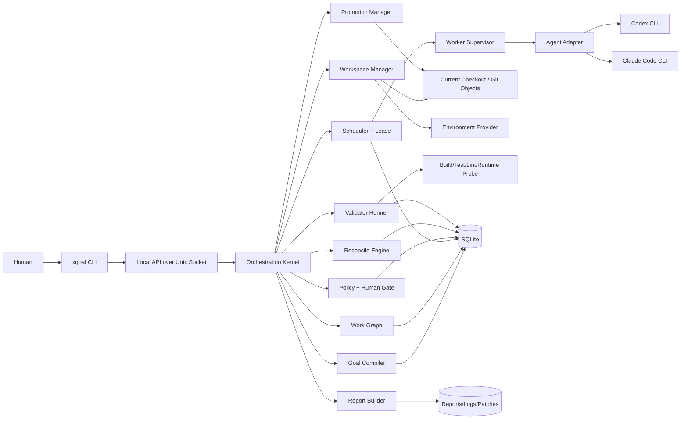
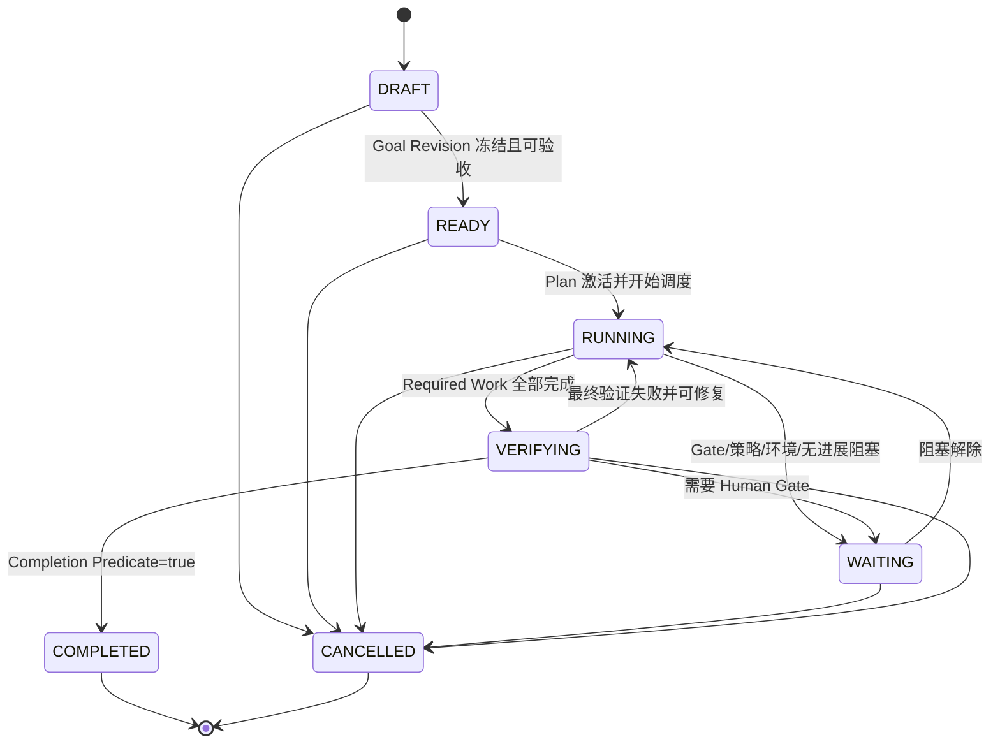
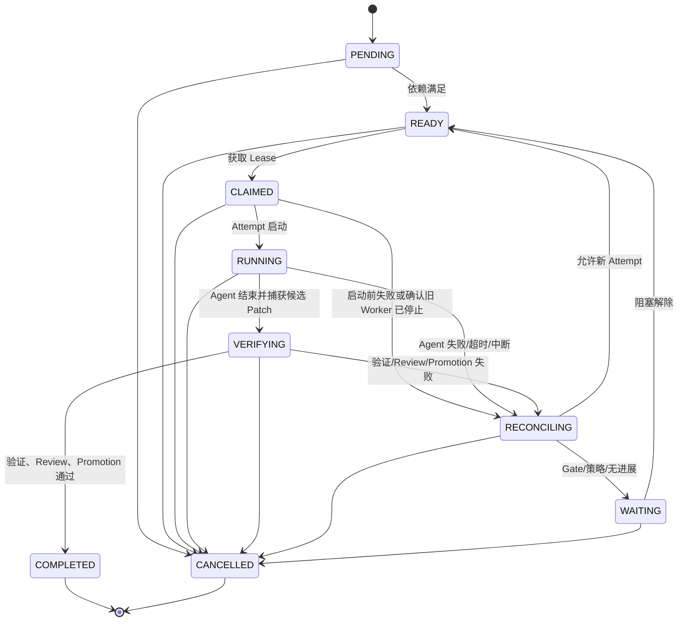

# xgoal 技术 SPEC

> **项目**：xgoal — Evidence-Closed Multi-Agent Coding Orchestrator  
> **版本**：v0.1
> **日期**：2026-08-26  
> **作者**：monshunter  
> **实现语言**：Go  
> **目标平台**：macOS、Linux  
> **配套文档**：《xgoal 产品设计 SPEC v0.1》
> **状态**：v0.1 技术基线已验收；OBJ-004 运行时 Harness 增量正在实施，见第 35 节；真实三组 Provider Benchmark 待显式运行

---

## 0. 文档定位

本文给出 `xgoal` v0.1 的可实施技术设计，包括责任边界、进程模型、组件、数据模型、状态机、Agent Adapter、Git 工作区、环境管理、验证与证据、调度与租约、失败恢复、权限策略、配置、测试和演进路径。

设计目标不是描述一个“理想 Multi-Agent Demo”，而是形成一套可以逐步编码、测试、故障注入和验收的工程合同。

---

## 1. 技术结论摘要

### 1.1 核心架构决策

1. **独立 Go 项目**，由 xgoal 自身管理运行时，通过协议衔接 AutoGo 工程治理。
2. 采用 **Native Agent Execution, External Orchestration**：Codex/Claude Code 负责有界回合中的推理和编码，xgoal 负责跨 Agent 生命周期。
3. 不实现 Manager LLM、模型路由推理链或自有工具调用循环；所有 Agent 均通过 CLI Adapter 启动。
4. 使用 **确定性 Orchestration Kernel** 管理 Goal、Work Graph、Lease、Gate、Evidence、Reconcile 和 Completion。
5. 使用 **SQLite 当前状态 + 同事务追加事件**；不是纯文件状态，也不是完整 Event Sourcing。
6. 一个项目独占当前主工作目录，全部角色串行执行，不创建 **Git worktree**；私有 index/Object Tree 捕获并重建 Patch，当前目录在验证前后必须匹配候选 Tree。
7. v0.1 默认 `max_parallel = 1`；状态、恢复和闭环正确后再开放安全并行。
8. Codex 通过非交互 `exec`、JSONL 和结构化输出接入；Claude Code 通过 Print Mode、JSON/Stream JSON 和 JSON Schema 接入。
9. Agent 结果是 **Claim**；xgoal 独立读取 Git/文件事实并运行受信 Validator。
10. Completion 是一个确定性谓词，只能在最终集成 Tree 上全部满足。
11. 外部副作用采用 **Request → Execute → Read Back → Observe** 模型，支持崩溃恢复和幂等重放。
12. v0.1 明确只支持**可信本地仓库**；本地进程 Provider 不声称具备容器级强隔离。
13. **Provider Control Plane 与 Project/Tool Network 分离**：Codex/Claude CLI 访问模型供应商是受信 Agent Profile 的执行通道；Agent 工具、项目命令、bootstrap、Validator 和服务的网络仍默认拒绝。Provider Credential 不进入 Work Packet 或项目执行环境。

### 1.2 MVP 最小拓扑

```text
Human
  │
  ▼
CLI ── Local API/Unix Socket ── xgoal Daemon/Kernel
                                      │
          ┌───────────────────────────┼──────────────────────────┐
          ▼                           ▼                          ▼
   Agent Adapter                Workspace/Env              Validator
 Codex / Claude CLI          Current checkout/process       Git/Test/Probe
          │                           │                          │
          └─────────────── Evidence + Events ──────────────────┘
                                      │
                                SQLite + Files
                                      │
                               Promotion/Report
```

---

## 2. 需求与质量属性

### 2.1 功能性要求

- 创建并版本化 Goal Contract。
- 生成、校验和执行 Work Graph。
- 编排 Codex CLI 与 Claude Code CLI。
- 对 Agent Invocation、日志、会话、输出和退出进行统一抽象。
- 取得当前目录会话、准备环境、捕获补丁、清理运行元数据；不删除代码目录。
- 独立运行受信 Validator 并生成可追溯 Evidence。
- 支持 Planner、Implementer、Reviewer 逻辑角色。
- 支持 Lease、暂停、恢复、取消、超时、重试、重规划和 Human Gate。
- 支持补丁在当前集成版本上的串行重放、复验和 Commit。
- 支持 Final Validation 和 Markdown/JSON 报告。

### 2.2 质量属性

| 属性 | 技术要求 |
|---|---|
| 一致性 | 一个项目同一时刻只有一个状态写入者；状态变更与事件追加同事务提交。 |
| 可恢复性 | 任一外部 Effect 前后崩溃，重启后都能通过状态和外部读回决定下一步。 |
| 幂等性 | 所有调度、Attempt、Validator Run、Promotion 和 Gate Decision 有幂等键。 |
| 可审计性 | 每次决策能追溯 Goal Revision、代码 Tree、输入包、Agent、命令和 Evidence。 |
| 安全性 | 默认最小权限；除受信 Agent Profile 的 Provider Transport/CLI 登录态外，项目网络与 Secret、远端写和生产操作默认禁止；能力不足时明确降级。 |
| 可替换性 | Kernel 不依赖 Codex/Claude 私有数据结构；通过规范化 Adapter 协议接入。 |
| 可测试性 | 核心状态机和 Effect Interpreter 可使用 Fake Adapter、Fake Clock、Fake Process 测试。 |
| 可观测性 | 结构化事件、日志、状态快照和最近实质进展均可查询。 |
| 简洁性 | v0.1 不引入分布式一致性、消息队列、Kubernetes、插件市场或复杂角色社会。 |

---

## 3. 责任边界

### 3.1 Human

- 定义目标、业务意图和不可自动推断的验收标准。
- 批准高风险权限、范围变化和业务取舍。
- 对生产、发布和最终业务责任保留所有权。

### 3.2 Native Agent

- 理解一个 Work Packet。
- 在给定范围和权限内探索、推理、修改代码或审查补丁。
- 输出符合 Schema 的结果声明和阻塞说明。
- 不拥有 Goal 状态、Work Item 状态、Lease、最终完成状态或 Promotion 权限。

### 3.3 xgoal Kernel

- 维护唯一持久状态。
- 编译并冻结 Goal Revision。
- 校验 Work Graph，选择 Ready Work Item。
- 分配 Lease、创建 Attempt 和 Workspace。
- 选择 Agent Profile，构建 Invocation 并监督进程。
- 读取外部事实、运行 Validator、记录 Evidence。
- 执行 Reconcile、Gate 和 Promotion。
- 根据确定性 Completion Predicate 结束 Goal。

### 3.4 Project Tooling

- Git 提供版本事实和 Patch/Tree。
- 编译器、测试、Lint、脚本和运行探针提供执行证据。
- CI 可在后续版本作为外部 Validator Provider。

### 3.5 AutoGo 集成边界

- AutoGo 的 AGENTS、Skills、Spec/Plan/ADR 等是 Agent 工作方式和工程内容输入。
- xgoal 可以调用 AutoGo 安装器或检查已安装 Harness。
- xgoal 不复制 AutoGo Skills，不维护另一份 AGENTS 规则树。
- xgoal 数据库是运行态权威；`PROGRESS.md` 最多作为只读导出或 Agent 可读快照。

---

## 4. 系统上下文与组件

### 4.1 上下文图



### 4.2 组件清单

| 组件 | 责任 | 是否可调用 LLM |
|---|---|---|
| CLI/API | 用户命令、参数校验、状态流展示 | 否 |
| Goal Compiler | 调用 Planner 生成 Goal Contract，再做 Schema/规则校验 | 仅通过 Agent Adapter |
| Work Graph Manager | Plan Revision、依赖、范围和 Ready 状态 | 否 |
| Scheduler | 选择任务、Agent 和并发槽；获取 Lease | 否 |
| Worker Supervisor | 子进程启动、事件流、超时、取消、进程组回收 | 否 |
| Agent Adapter | 供应商 CLI 参数、事件和结构化结果转换 | 否；只启动外部 Agent |
| Workspace Manager | 当前目录会话、快照身份、运行元数据和清理 | 否 |
| Environment Provider | 环境快照、bootstrap、服务生命周期、容器扩展点 | 否 |
| Validator Runner | 受信命令、文件断言、运行探针、Evidence | 否 |
| Review Coordinator | 创建 Reviewer Work Packet，保存 Finding | Reviewer 通过 Adapter |
| Reconcile Engine | 根据状态和证据决定修复、重试、重规划或 Gate | 否 |
| Policy/Gate Engine | 权限、风险、授权范围和过期控制 | 否 |
| Promotion Manager | 对象级 Patch 重建、原地复验、私有集成 Commit 和最终锁 | 否 |
| Evidence Store | Evidence 元数据、哈希、过期关系 | 否 |
| Report Builder | Goal→Criteria→Evidence 的最终报告 | 否，可选 Agent 仅润色非事实部分 |
| State/Event Store | 当前状态、事件、Effect、事务和查询 | 否 |

---

## 5. 进程与部署模型

### 5.1 每项目单一 owner

一个 Go 二进制提供 `daemon serve`（前台）和 `daemon start/stop/status`（后台管理）。CLI 经当前项目的 Unix Socket API 操作状态。仅当前 Git 主工作目录及其子目录/别名可作为入口；linked worktree 明确拒绝。一个 Git Common Directory 只有一个 Project ID、执行根、状态库和活动实例；独立 clone 独立运行。`run --wait` 是观察客户端，不承担 Kernel。开发调试直接使用前台 `daemon serve`，不维护第二套 `run --foreground` Kernel 入口。

OBJ-003 以本节和 [DESIGN-004](docs/architecture/DESIGN-004-m5-control-daemon.md) 替代原用户级 registry.db/global socket、XGOAL_HOME 与双 Kernel 运行方式的设计；这些旧设想未形成兼容的实现合同。

### 5.2 目录与项目解析

- `internal/project` 从当前目录/`--project` 定位 Git root、canonical Common Directory 和共享 Project ID；所有入口采用 flags > `XGOAL_STATE_DIR`/`XGOAL_SOCKET` > 已绑定项目定位 > 默认值。
- 默认状态保留在项目执行根的 `.xgoal/`；其中 state.db、backups、packets、patches、workspaces、environments、logs、reports 继续各司其职，不迁移旧数据到全局目录。
- Git Common Directory 中的 xgoal 定位信息只拥有 Project ID、执行根与唯一状态目录，不能复制 Goal/Work 等运行状态。主目录及子目录通过此定位同一 owner；linked worktree 不作为备用执行根，多个历史 `.xgoal/state.db` 必须诊断而非静默择一。
- socket 使用用户私有短 runtime 目录，按 canonical 仓库身份分区；目录 0700、socket 0600、核对 UID。可用 `XGOAL_RUNTIME_DIR` 覆盖 runtime 父目录，但超长、不安全或异项目存活 socket 必须在执行前拒绝。
- 仓库锁位于 Common Directory 的 xgoal 私有区域；同时持有状态目录锁，防止不同项目竞争同一状态。兼容锁覆盖旧版 `<state>/run/daemon.lock`。锁先于所有数据库写入，后于全部执行及数据库关闭释放。

### 5.3 状态绑定与兼容

初始化持久化共享 `xgoal.projectID`，不会提交到 Git。状态库 metadata 绑定 Project ID、canonical Common Directory 与执行根。绑定检查在迁移和恢复前完成；错误绑定 fail closed。未绑定的历史默认状态在检查现有工作区/Packet 归属且没有竞争历史库后原位绑定；任意外部非空旧库不自动采用。已有定位不能被 `--state-dir` 静默改写；迁移/复制/移动产生不一致时保留数据并报告准确路径，由显式恢复流程处理。

独立 clone 不复制 Git local config，生成独立身份。同一仓库改名后已保存身份不会被新随机值覆盖；不能证明新旧绝对路径对应时先停止并报告，不自动重写历史 workspace/报告路径。

---

## 6. 推荐 Go 工程结构

```text
xgoal/
├── cmd/xgoal/                  # main 与子命令入口
├── internal/
│   ├── app/                    # 依赖组装、生命周期
│   ├── api/                    # Unix Socket HTTP/JSON API
│   ├── cli/                    # CLI 命令与展示
│   ├── kernel/                 # 顶层状态推进循环
│   ├── domain/                 # Goal/Work/Attempt/Gate/Evidence 类型
│   ├── store/                  # SQLite repository、事务、迁移
│   ├── event/                  # Append-only event 与订阅
│   ├── effect/                 # Effect Interpreter 与读回恢复
│   ├── goal/                   # Goal Contract 与 Revision
│   ├── workgraph/              # DAG、依赖、范围冲突
│   ├── scheduler/              # Ready 选择、能力匹配、并发槽
│   ├── lease/                  # TTL、心跳、CAS、回收
│   ├── adapter/
│   │   ├── protocol/           # 规范化 Invocation/Event/Result
│   │   ├── codex/              # Codex CLI Adapter
│   │   ├── claude/             # Claude Code CLI Adapter
│   │   └── fake/               # 测试 Adapter
│   ├── supervisor/             # 子进程、超时、取消、日志
│   ├── workspace/              # 当前目录快照、Patch、Manifest
│   ├── environment/            # 本地环境与未来容器 Provider
│   ├── validator/              # Validator Registry/Runner
│   ├── evidence/               # Evidence、哈希、过期
│   ├── review/                 # Review Packet/Finding
│   ├── reconcile/              # Failure Fingerprint/决策
│   ├── policy/                 # 权限、Scope、Gate
│   ├── promotion/              # 对象级 Patch 重建与串行集成
│   ├── report/                 # Markdown/JSON 报告
│   └── observability/          # slog、metrics、redaction
├── docs/
│   ├── adr/
│   ├── protocol/
│   └── threat-model.md
├── testdata/
│   ├── adapters/
│   ├── repositories/
│   └── events/
└── benchmarks/
```

实现优先使用 Go 标准库，包括 `context`、`os/exec`、`net/http`、`log/slog`、`encoding/json`、`crypto/sha256` 和 `syscall`/平台适配。必要外部依赖控制在 SQLite Driver、YAML Parser 和 JSON Schema Validator 等少数基础库，并固定版本与供应链校验。

Git 操作使用系统 `git` CLI，而不是在 v0.1 使用纯 Go Git 实现，以保持 Git 对象格式、ref CAS 和用户仓库读取行为的一致性；可信快照不运行 clean/smudge filter 或 hook。

---

## 7. 领域模型

### 7.1 主要实体

| 实体 | 关键字段 | 核心不变量 |
|---|---|---|
| Project | id, root, git_common_dir, config_hash, status | root 必须属于预期 Git Common Dir；配置变更可追溯 |
| Goal | id, project_id, state, active_revision_id, version | 一个 Goal 同时只有一个 Active Revision |
| GoalRevision | id, goal_id, revision, raw_goal, contract_json, hash, frozen_at | 执行后不可原地修改；语义变更创建新 Revision |
| PlanRevision | id, goal_revision_id, revision, graph_hash, status | 通过结构校验后才可激活 |
| WorkItem | id, plan_revision_id, state, objective, scope, required, version | 状态转换必须符合状态机；Required 节点决定 Goal 完成 |
| WorkDependency | from_id, to_id, type | 图必须无环；目标节点只有依赖完成后 Ready |
| Attempt | id, work_item_id, agent_profile_id, state, base_tree, result_tree, result_kind | 一次不可覆盖；失败重试创建新 Attempt |
| AgentProfile | id, adapter, roles, command, capability_json, probe_at | 调度前能力满足角色与策略 |
| Lease | id, work_item_id, holder, generation, expires_at, state | 同一 Work Item 最多一个 Active Lease |
| Workspace | id, attempt_id, path, base_tree, state, manifest_hash | 一个 Attempt 一份快照身份，当前代码目录始终相同 |
| ValidatorDefinition | id, config_hash, type, policy, required | 来自受信配置；版本变化会使旧运行失效 |
| ValidatorRun | id, validator_id, subject_type/id, tree_hash, state, result_hash | 结果必须绑定代码 Tree 和 Validator 版本 |
| Evidence | id, kind, subject, producer, authority, tree_hash, payload_hash, state | 不可静默覆盖；过期状态显式记录 |
| ReviewFinding | id, review_attempt_id, severity, status, location, evidence_ref | Blocker 未关闭时阻止 Promotion/Completion |
| Gate | id, scope, reason, state, options, decision, expires_at | 授权必须限制动作、对象和有效期 |
| Effect | id, key, type, state, request, observation | 同一 Effect Key 不重复产生不可控副作用 |
| Event | id, aggregate, sequence, type, actor, payload_hash, created_at | 追加写；同一 Aggregate Sequence 唯一 |

### 7.2 ID 与版本

- ID 使用不可预测、可排序的 Opaque ID，展示前缀如 `goal_`、`work_`、`att_`。
- 所有可并发修改的 Aggregate 包含整数 `version`，更新使用 Compare-And-Swap。
- API 写请求必须携带 `Idempotency-Key`；Daemon 将键、请求哈希和响应关联保存。

### 7.3 Canonical Encoding 与 Hash

所有跨进程、持久化或进入 Evidence 的 Canonical Hash 使用同一合同：

1. 输入先按对应版本化 Schema 严格解析；拒绝重复 Key、未知字段、非 UTF-8、非有限数字和 Schema 外隐式类型。
2. YAML 配置先转换为已验证的类型对象，再投影为 JSON 数据模型；不直接对 YAML 字节求哈希。
3. JSON 使用 RFC 8785 JSON Canonicalization Scheme（JCS）编码；协议对象不得依赖未定义的 map 顺序、浮点格式或本地时区。
4. Hash 输入带域分隔：

```text
canonical_hash = SHA256(
  "xgoal-canonical/v1\n" + object_kind + "\n" + schema_version + "\n" + jcs_bytes
)
```

5. 文件内容、命令输出和 Patch Object 对原始字节求 SHA-256；文本展示的换行或脱敏副本不能替代原始对象哈希。

同一对象在 macOS/Linux、不同进程和 map 插入顺序下必须产生相同 Golden Hash。Canonical 合同变化需要新版本，不能静默改变旧 Evidence 的含义。

---

## 8. 状态存储与事件

### 8.1 SQLite 策略

每个项目独立 `state.db`：

```text
PRAGMA journal_mode = WAL;
PRAGMA foreign_keys = ON;
PRAGMA synchronous = FULL;      # v0.1 优先正确性
PRAGMA busy_timeout = 5000;
```

原则：

- Daemon 是唯一写者；读请求同样经 API，避免 CLI 绕过业务规则。
- 每次领域状态变更与 Event 追加在同一事务中完成。
- Event 用于审计、状态订阅和恢复分析；当前状态表用于高效查询。
- 不要求通过 Event 从零重放全部状态，因此不是完整 Event Sourcing。
- 大型 stdout、stderr、Patch 和报告保存在权限受控的文件中；DB 保存路径、长度和哈希。

### 8.2 最小表约束示例

```sql
CREATE TABLE work_items (
    id              TEXT PRIMARY KEY,
    plan_revision_id TEXT NOT NULL,
    state           TEXT NOT NULL,
    required        INTEGER NOT NULL,
    version         INTEGER NOT NULL DEFAULT 1,
    objective_json  BLOB NOT NULL,
    scope_json      BLOB NOT NULL,
    created_at      TEXT NOT NULL,
    updated_at      TEXT NOT NULL
);

CREATE TABLE leases (
    id           TEXT PRIMARY KEY,
    work_item_id TEXT NOT NULL,
    holder       TEXT NOT NULL,
    generation   INTEGER NOT NULL,
    state        TEXT NOT NULL,
    expires_at   TEXT NOT NULL,
    heartbeat_at TEXT NOT NULL
);

CREATE UNIQUE INDEX one_active_lease_per_work
ON leases(work_item_id)
WHERE state = 'ACTIVE';

CREATE TABLE events (
    id             TEXT PRIMARY KEY,
    aggregate_type TEXT NOT NULL,
    aggregate_id   TEXT NOT NULL,
    sequence       INTEGER NOT NULL,
    event_type     TEXT NOT NULL,
    actor_type     TEXT NOT NULL,
    actor_id       TEXT,
    correlation_id TEXT,
    payload_json   BLOB NOT NULL,
    created_at     TEXT NOT NULL,
    UNIQUE(aggregate_type, aggregate_id, sequence)
);
```

完整迁移必须由二进制内嵌、单向编号的 Migration 执行；已有 DB 升级前在项目私有 `backups/` 使用 SQLite 一致快照能力生成并校验备份，备份完成后才迁移。迁移失败时不得启动写循环，已完成备份与中断残留不得静默删除。

---

## 9. 状态机

### 9.1 Goal 状态



约束：

- Goal 不使用 `FAILED` 作为一般终态。已冻结目标不可自动恢复的问题进入 `WAITING`，由用户修正或取消。
- `COMPLETED` 和 `CANCELLED` 是终态；已完成 Goal 的后续需求创建新 Goal 或新 Revision/Continuation，不原地篡改历史。

未冻结目标保持 DRAFT，并由持久规划控制与 Effect 投影 `planning_state=QUEUED/EXECUTING/OBSERVING/RECOVERING/PAUSED/WAITING`；成功或取消后分别投影 SUCCEEDED/CANCELLED。规划暂停/缺口时 wait 返回 3，resume 仅恢复规划意图，不把没有 Revision 的目标改成 RUNNING；cancel 可以将 DRAFT 终止。已冻结目标才使用 Goal WAITING→RUNNING 的既有恢复路径。初始 Revision/Graph 的发布在一个事务内完成，外部不会观察到无有效图的 READY 中间态。

### 9.2 Work Item 状态



`CLAIMED → RECONCILING` 只用于 Attempt 启动前失败，或 Lease 过期后已通过外部读回确认旧 Worker 不再写入的恢复路径；单凭 TTL 到期不得执行该转换。

### 9.3 Attempt 状态

Attempt 记录不可复用：

```text
CREATED → PREPARING → STARTING → RUNNING → COLLECTING
        → VALIDATING → REVIEWING → PROMOTING → SUCCEEDED

任一非终态可进入：
FAILED | TIMED_OUT | INTERRUPTED | INVALID_OUTPUT | QUARANTINED
```

Attempt 失败不会覆盖旧 Attempt，也不会自动使 Goal 终止。

### 9.4 Effect 状态

```text
REQUESTED → EXECUTING → OBSERVING → SUCCEEDED
                          └──────→ FAILED
REQUESTED/EXECUTING/OBSERVING ──重启──→ RECOVERING → OBSERVING
```

任何 Effect 的成功都必须通过外部读回确认，而不是只依赖函数返回值。

---

## 10. Goal 与 Plan 编译

### 10.1 Goal Compiler 流程

1. 原子保存原始 Goal、Planner Effect、Event 和幂等接受响应；立即返回 Goal ID，规划由 daemon 串行槽驱动。
2. 创建只读项目快照和 Planner Work Packet。
3. 调用 Planner Agent，要求输出 Goal Contract JSON。
4. 验证 JSON Schema。
5. 执行确定性规则：
   - `summary`、范围、约束、Acceptance Criteria 不为空。
   - 每个 Criteria 有可验证方式或显式 Human Acceptance。
   - in-scope 与 out-of-scope 无明显冲突。
   - 高风险能力具有 Gate。
   - Completion Policy 不允许 Agent 自述直接满足。
6. 对关键缺口创建可修正 Proposal 的 Gate；否则在同一事务冻结 Goal Revision、创建并激活 Work Graph、完成 Planner Effect。
7. 对冻结 Revision 生成哈希：

```text
goal_revision_hash = SHA256(canonical_contract_json)
```

### 10.2 Plan Compiler

Planner 输出：

```json
{
  "plan_summary": "...",
  "work_items": [
    {
      "client_key": "core-store",
      "title": "实现持久状态与事件事务",
      "objective": "...",
      "depends_on": [],
      "read_scope": ["/**"],
      "write_scope": ["/internal/store/**", "/internal/event/**"],
      "acceptance_criteria": ["AC-GOAL-001"],
      "validators": ["go-test-store", "race-store"],
      "recommended_role": "implementer",
      "required": true
    }
  ]
}
```

确定性校验：

- `client_key` 唯一并映射为系统 ID。
- 图无环；依赖存在。
- Required Criteria 至少映射一个 Required Work Item。
- 写范围使用规范化仓库相对路径；不允许 `..`、绝对路径或 `.git`。
- 无法证明不冲突的写范围按冲突处理。
- Work Item 太大时给出 Plan Finding；不让 Kernel 自动凭主观判断任意拆分。
- Validator ID 必须已注册，或创建“新增 Validator” Gate/工作项。

#### Scope Pattern Contract v1

- Scope Pattern 是以 `/` 开头的仓库根相对 POSIX 路径模式，不是宿主绝对路径；输入中的反斜杠、NUL、`.`/`..` 段、除前导根标记外的空段和非 UTF-8/非 NFC 路径 Fail Closed。
- `*` 只匹配一个路径段内的零个或多个字符；`**` 只允许作为完整路径段并匹配零个或多个路径段；`/internal/**` 同时匹配 `internal` 目录及其后代，`/**` 表示全部仓库路径但仍受隐式 Deny 约束。
- 匹配按 Unicode code point、大小写敏感执行；若底层文件系统产生仅大小写或 Unicode 规范形式不同的碰撞，初始化/捕获阶段拒绝该仓库状态，避免 macOS 与 Linux 结果分叉。
- `.git` 文件、Git Common Dir、其他 worktree 元数据、运行目录和显式 Deny Path 永远不能被 Allow Scope 覆盖。
- Scope Check 对 Git 记录的仓库相对路径和 `lstat` 结果执行，不跟随 symlink；symlink target 作为内容审查，绝对 target 或规范化后逃逸仓库根的 target 直接 Quarantine。
- Allow 只在路径匹配且没有 Deny 命中时成立。多个无法解析或无法证明安全的模式按拒绝处理，不退化为全局允许。

该合同使用跨平台 Golden Test 覆盖根目录、目录自身、嵌套路径、大小写/Unicode 碰撞、symlink 与逃逸输入。

### 10.3 Plan Revision

- Planner 修改计划时创建新 Plan Revision。
- 系统计算已有 Work Item、进行中 Attempt 和 Evidence 的影响。
- 已完成工作只有在新 Goal/Plan 仍覆盖且证据未过期时才可继承。
- 不能删除正在运行节点；必须先取消 Attempt 并释放 Lease。
- 取消 Work Item 使用一个 SQLite 事务持久化 `Work=CANCELLED`、`Attempt=INTERRUPTED` 与 `Lease=REVOKED`，保留原记录；若被取消的是 Required Work，Goal 进入 `WAITING` 等待 replan 或显式取消。事务提交后才向对应运行中 Agent 发送取消信号。

---

## 11. Scheduler、Lease 与并发

### 11.1 调度循环

```go
for {
    recoverExpiredLeases()
    reconcileUnknownEffects()
    refreshDerivedReadiness()

    if projectPaused || goalNotRunnable {
        waitForEvent()
        continue
    }

    candidate := selectReadyWorkItem()
    if candidate == nil {
        evaluateGoalCompletionOrWaiting()
        waitForEvent()
        continue
    }

    if !policyAllows(candidate) {
        createOrRefreshGateOrWaitingReason()
        continue
    }

    profile := selectCompatibleAgent(candidate)
    lease := tryAcquireLeaseCAS(candidate, profile)
    if lease == nil {
        continue
    }

    dispatchAttempt(lease, candidate, profile)
}
```

### 11.2 Ready 判定

Work Item 进入 Ready 必须同时满足：

- 所有 Hard Dependency 均为 `COMPLETED`。
- 所属 Goal 和 Plan Revision 当前有效。
- 不存在未解决 Gate。
- 没有活动 Lease。
- 所需 Agent 能力、环境和 Validator 可用。
- 并发模式下，与活动任务的写 Scope 不冲突。

### 11.3 Lease

Lease 字段：

```text
lease_id
work_item_id
attempt_id
holder = daemon-instance/worker-id
generation
acquired_at
heartbeat_at
expires_at
state = ACTIVE|RELEASED|EXPIRED|REVOKED
```

- 获取 Lease、创建 Attempt 和写 Event 在一个事务中完成。
- Worker 以固定间隔发送心跳；TTL 必须大于最大可接受调度抖动。
- 过期只意味着“所有权未知”，不意味着可以立即重复执行；Kernel 先检查 PID、日志和 Workspace 外部事实。
- 恢复后只有确认旧 Worker 不再写入，才能撤销 Lease 并启动新 Attempt。

### 11.4 并行边界（未来候选，当前不启用）

- 默认 `max_parallel = 1`。
- 写 Scope 转换为规范化 Path Set；任一范围为未知或全局时获取项目级写锁。
- 当前目录模型禁止同项目多 Work Item 并行。未来若开放，写 Scope 不相交只是必要条件，还必须重新设计工作目录与验证隔离；本版本没有此运行路径。
- 读取范围不加排他锁，但基础 Tree 必须记录。
- 每个 Attempt 独占当前主工作目录；同项目角色串行，不创建 Git worktree。
- Promotion 始终持有项目内 Integration Lock，在最新 Integration Tree 上对象级重建，并核对当前目录后复验。

---

## 12. Agent Adapter 协议

### 12.1 设计目标

- 隔离供应商 CLI 参数和事件差异。
- 支持能力探测，而不是假设某个版本永远支持某参数。
- 将所有供应商输出标记为不可信输入。
- 允许添加新的 CLI Agent，而不修改 Kernel 状态机。

#### Provider Transport 与 Probe 分层

`Provider Transport` 仅指 Codex/Claude CLI 与其模型供应商控制面的连接；`Project Network` 指 Agent 工具、项目命令、bootstrap、Validator 和服务访问网络。前者由受信 Agent Profile 决定，后者由 Work Item Policy 决定且默认 `DENY`。任何 Agent 输出都不能把 Project Network 改写为 Provider Transport。

Probe 分为：

- `PASSIVE`：只执行 binary lookup、`--version`、`--help`、静态配置/认证存在性检查和本地 fixture parser test；不得发起模型请求。`doctor` 默认只运行该级别。
- `ACTIVE_CONTRACT`：执行一个最小真实结构化回合，验证认证、Provider Transport、事件、Schema、取消/超时和可选 Resume。只能由显式 `doctor --active`、验收命令或运行前必要检查触发，必须先通过 Profile Policy，在调用方给定的超时内结束，并保存独立 Evidence。

Passive Pass 不得宣称真实模型回合可用；Active Probe 失败不得被静态 `--help` 结果覆盖。

### 12.2 Go 接口

```go
type Adapter interface {
    ID() string
    Probe(ctx context.Context, spec ProbeSpec) (Capabilities, error)
    Start(ctx context.Context, inv Invocation, sink EventSink) (Handle, error)
    Resume(ctx context.Context, inv Invocation, sessionID string, sink EventSink) (Handle, error)
    Cancel(ctx context.Context, handle Handle) error
    Wait(ctx context.Context, handle Handle) (AgentResult, error)
}

type ProbeMode string

const (
    ProbePassive        ProbeMode = "PASSIVE"
    ProbeActiveContract ProbeMode = "ACTIVE_CONTRACT"
)

type ProbeSpec struct {
    Mode              ProbeMode
    ProfileID         string
    ProviderTransport bool
    Timeout           time.Duration
}

type Capabilities struct {
    Version             string
    StructuredOutput    bool
    StreamingEvents     bool
    ResumeSession       bool
    SandboxModes        []string
    ToolAllowlist       bool
    ApprovalModes       []string
    ProbeMode           ProbeMode
    ProviderTransport   string // available|unavailable|unknown
    CredentialStatus    string // available|missing|unknown；不包含凭据值
}
```

### 12.3 Invocation

```go
type Invocation struct {
    InvocationID   string
    AttemptID      string
    Role           Role
    WorkDir        string
    PacketPath     string
    Prompt         string
    OutputSchema   json.RawMessage
    Environment    map[string]string // 已经过白名单
    SandboxPolicy  SandboxPolicy
    ToolPolicy     ToolPolicy
    Timeout        time.Duration
    MaxOutputBytes int64
    SessionPolicy  SessionPolicy
}
```

原则：

- 使用 `exec.CommandContext` 和参数数组，不经 `sh -c` 拼接 Agent 命令。
- Prompt 优先通过 stdin；Packet 通过只读路径传递。
- `cmd.Dir` 设置为 Attempt Workspace。
- stdout/stderr 分流、限长、落盘、脱敏和哈希。
- 子进程使用独立进程组；取消先发送优雅终止信号，再超时强杀整个进程组。

### 12.4 规范化 Agent Event

```go
type AgentEvent struct {
    Type       string // session, turn, command, file_change, message, result
    At         time.Time
    SessionID  string
    Summary    string
    Command    *CommandClaim
    FileChange *FileChangeClaim
    RawRef     string // 脱敏后的原始事件文件引用
}
```

注意：`CommandClaim` 和 `FileChangeClaim` 仅表示 Agent 流中声称发生的行为；实际结果仍由 Workspace Manager 和 Validator 读回。

### 12.5 统一结果 Envelope

```json
{
  "protocol_version": "xgoal.agent-result/v1alpha1",
  "status": "completed|blocked|failed",
  "summary": "实现了状态迁移与事务事件写入",
  "changed_files_claimed": ["internal/store/store.go"],
  "checks_claimed": [
    {"name": "go test ./internal/store/...", "status": "passed"}
  ],
  "blockers": [],
  "assumptions": [],
  "recommended_next_action": "validate"
}
```

Kernel 保存该 Envelope，但不会据此直接改变 Work Item 为 Completed。

### 12.6 Codex CLI Adapter

能力基线：

- 使用非交互 `codex exec`。
- 使用 `--json` 读取 JSONL 事件。
- 使用 `--output-schema` 请求最终结构化结果。
- Implementer 使用 `workspace-write` sandbox；Planner/Reviewer 使用 `read-only`。
- CLI 支持时，配置为非交互批准策略，任何需要额外授权的动作由 xgoal Gate 控制。
- 同一 Work Item 的安全恢复可使用 `codex exec resume <session-id>`；否则创建新会话。

概念命令：

```text
codex exec
  --json
  --output-schema <schema-file>
  --sandbox workspace-write|read-only
  <prompt-via-stdin>
```

Adapter 必须：

- 默认 `Probe(PASSIVE)` 只执行本地检查；`Probe(ACTIVE_CONTRACT)` 才执行最小真实协议回合，并记录 Provider/timeout Evidence。
- 对未知 Event Type 保留原始记录但不崩溃。
- 结构化结果缺失、Schema 不匹配或 JSONL 截断时返回 `INVALID_OUTPUT`。
- 不以进程退出码 0 代替结果校验。

### 12.7 Claude Code CLI Adapter

能力基线：

- 使用 `claude -p` 非交互 Print Mode。
- 使用 `--output-format json` 或 `stream-json`。
- 使用 `--json-schema` 请求结构化输出。
- 使用 `--allowedTools` 和 `--permission-mode` 实现角色级最小权限；锁定环境优先 `dontAsk`，未允许操作直接拒绝并转成 Gate/Failure。
- 使用 `--resume <session-id>` 或等价能力恢复安全会话。

概念命令：

```text
claude -p
  --output-format stream-json
  --json-schema <schema-json>
  --permission-mode dontAsk
  --allowedTools <role-specific-tools>
  <prompt-via-stdin>
```

Go 没有官方 Claude Agent SDK 时，v0.1 直接使用 CLI 子进程；不得为追求 SDK 统一而引入 Python/TypeScript Sidecar。

### 12.8 会话恢复策略

只有同时满足以下条件时才恢复原 Session：

- Session 属于同一 Work Item 和同一 Agent Profile。
- Goal Revision、Plan Revision、基础 Tree 和权限策略未改变。
- 上一次中断不是协议损坏或无进展循环。
- Session ID 来自经过解析的供应商输出。

否则生成 Fresh Work Packet，并把历史压缩为持久事实、失败证据和明确下一动作，不直接拼接全部聊天记录。

### 12.9 Provider Credential 边界

- v0.1 支持 `credentialSource = cli-session`：供应商 CLI 使用其自身登录态、Keychain，或受信 Profile 按名称显式允许的既有宿主认证环境。Kernel 不打开用户凭据库，不持久化认证值；转发环境只存在于原生 CLI 的进程输入中。
- Agent Profile 只保存认证来源类型和可用状态，不保存 Credential 值。缺失认证时 Passive Probe 返回 `missing`，实际调度 Fail Closed 或创建登录 Gate。
- `environmentAllowlist` 是操作者在受信配置中对现有 Provider CLI 环境的显式授权，只保存变量名，禁止把值写入 Work Packet、Prompt、事件、项目命令、bootstrap、Validator 或报告。未实现独立 Secret Provider/凭据获取平台，`credentialSource: secret-provider` 明确拒绝；不能把字段被接收当作注入能力已经存在。
- 日志在落盘前对 Token、Authorization Header、常见 Key Pattern 和供应商 CLI 诊断输出脱敏；原始未脱敏凭据不作为 Evidence 保存。
- L0 无法证明供应商 CLI 进程与其启动的所有工具在 OS 级完全隔离，因此状态必须披露 `credential_isolation=L0`；强隔离留给容器 Provider。

---

## 13. Work Packet

### 13.1 不可变输入包

每次 Attempt 生成只读 `packet.json`：

```json
{
  "protocol_version": "xgoal.work-packet/v1alpha1",
  "project": {
    "name": "xgoal",
    "base_tree": "sha256-or-git-tree",
    "workspace": "/absolute/current/project"
  },
  "goal": {
    "id": "goal_...",
    "revision": 3,
    "summary": "...",
    "contract_hash": "..."
  },
  "work_item": {
    "id": "work_...",
    "title": "实现 Lease CAS",
    "objective": "...",
    "dependencies": ["work_store"],
    "read_scope": ["/**"],
    "write_scope": ["/internal/lease/**", "/internal/store/**"],
    "acceptance_criteria": ["AC-004"],
    "validator_ids": ["go-test-lease", "race-lease"]
  },
  "role": "implementer",
  "constraints": {
    "project_network": "deny",
    "project_secrets": "deny",
    "git_push": false,
    "production": false
  },
  "environment": {
    "os": "darwin",
    "arch": "arm64",
    "git_commit": "...",
    "tool_versions": {},
    "lockfile_hashes": {}
  },
  "prior_attempt": {
    "failure_class": "validator_failed",
    "failure_fingerprint": "...",
    "evidence_refs": ["ev_..."]
  },
  "required_output_schema": "xgoal.agent-result/v1alpha1"
}
```

### 13.2 Prompt 合同

Prompt 只负责告诉 Agent：

- 当前角色与 Work Packet 路径。
- 只处理该 Work Item，不重定义 Goal。
- 遵守写 Scope 和权限。
- 在不确定或需要禁止动作时返回 `blocked`。
- 不声称未实际执行的检查通过。
- 最终严格输出指定 Schema。

项目 AGENTS/AutoGo Skills 由原生 Agent 按其机制读取；xgoal 不把所有规则重复注入 Prompt。

### 13.3 包哈希

```text
packet_hash = SHA256(canonical_packet_json)
```

Attempt、Agent Event、Result 和 Evidence 都保存 `packet_hash`，避免输入与结果失配。

---

## 14. Workspace 与 Git 模型

### 14.1 当前目录与审计引用

所有角色使用 Resolver 确定的当前 Git 主工作目录，不创建、切换、删除 Git worktree，也不复制另一份执行代码目录。项目排他锁覆盖全部运行。仅当前 HEAD 为初始代码基线；旧 project.baseBranch / integrationBranchPrefix 字段可保留解析以给迁移诊断，不能把它们当作切换用户目录或修改用户分支的指令。

初次 Goal 接管干净的 tracked/index/非忽略 untracked；也可接管完全匹配系统上次已验收结果且用户 HEAD/index 未变的目录，从该已验收 Commit/Tree 继续。其他 dirty、未知 ref/index 变化保留并等待，不能自动 stash/reset/clean。

Goal 执行期间用户 HEAD、符号分支及 index 不由 xgoal 改写。无 HEAD 的首次 init 提交是执行前的限定例外，见下段。私有审计引用为 `refs/xgoal/goals/<goal-id>/integration`，起点为接管时的基线 Commit。系统用 commit-tree 创建审计 Commit，以 update-ref old-value CAS 晋升。最终代码直接留在当前目录，相对用户 HEAD 显示为待用户审阅提交的修改；不自动 push 或提交到用户分支。

初始干净准入要求用户 index Tree、HEAD Tree 与原始字节工作目录 Tree 一致；不依赖 git status，也不执行 filter 自动规范化。

初始化例外：projectinit 在现有项目排他锁内区分可解析 HEAD、真正 unborn 的命名分支与损坏引用。仅 unborn 时登记三个初始化路径，使用 Git 的指定路径提交创建首次 Commit，并由 Git 同步这些路径的用户 index；不新建基线或恢复状态机。提交仅包含 xgoal.yaml、.xgoalignore、.gitignore，显式关闭 hooks/自动签名，使用用户 Git 身份及原生内容转换规则，不修改全局配置。失败保留文件与可能的 intent-to-add 状态并提示重跑；已有 HEAD 或重复 init 不创建提交。后续 Goal 仍按上述原始字节 Tree 准入，内容转换造成的 Tree 差异不会被隐式接受。

### 14.2 当前目录会话与快照

Workspace 由代码目录转为执行会话身份：所有 Snapshot.Path 都是同一当前 root；每个 Attempt/Validation 有独立元数据、BaseCommit/BaseTree、实际输入 Tree、HEAD/index 身份、ConfigHash 和不可变 marker。marker 放在状态目录，绝不放入业务 Patch。

持久 checkout 控制记录保存当前 owner、用户 HEAD/index 基线及最后已验收/已观察 Tree。每次角色执行前核对，结束后重新读取；新角色只有在前一角色及其子进程组结束后开始。未知变化不通过覆盖文件解决。

旧 workspaces 及 marker 版本保留只读历史；新记录显式标识 current-directory。保留旧 path 唯一约束，新记录将其用于制品目录，并新增 execution_path 与 execution_model；使用顺序迁移和版本化读取，不把旧 worktree 路径改写为当前 root。旧未完成 worktree Goal 标记迁移等待，不进入新模型调度，也不自动删除历史目录。

### 14.3 内容与 Git 元数据保护

- 系统 Git 调用清除继承的 GIT_DIR/GIT_WORK_TREE/GIT_COMMON_DIR/GIT_INDEX_FILE 等定位变量，再显式设置受控目录/私有 index，避免显式项目被宿主环境重定向。
- 代码路径由 Base Tree 的 tracked 集合和当前非忽略 untracked 集合构成；tracked 文件即使匹配 ignore 仍捕获。`.git` 无论文件/目录形态、xgoal 状态/runtime 路径、Git 元数据均排除且不能由 Write Scope 放行。预存 ignored 文件保留；ignored 构建输出不作为通过证据。
- 使用 Lstat 读取实际内容、mode 和 symlink target，不运行 clean/smudge filters/hooks；不信任 Agent commit/index。受支持的所有文件变化以 Base Tree 和内容寻址对象计算。
- 私有临时 GIT_INDEX_FILE 使用 read-tree/update-index/write-tree 生成 Tree；不运行作用于用户 index 的 git add/reset/checkout。元数据临时文件可精确清理，代码目录不可清理。
- HEAD、符号分支、用户 index fingerprint 和受信配置/脚本身份变动保留为失败事实，不能靠恢复旧 index 隐藏 Agent 越界。

### 14.4 Patch Manifest

Patch 的权威晋升单元是内容寻址的 `Patch Bundle v1`，不是 Agent Commit 或单一文本 diff：

```text
patches/<attempt-id>/
├── manifest.json              # JCS 编码前的规范对象
├── objects/sha256/<hash>      # 新内容或 symlink target 的原始字节
└── review.diff                # 可选的人类可读投影，不参与重放真相
```

```json
{
  "protocol_version": "xgoal.patch-bundle/v1alpha1",
  "attempt_id": "att_...",
  "base_commit": "...",
  "base_tree": "...",
  "entries": [
    {
      "path": "internal/lease/lease.go",
      "kind": "modified",
      "mode_before": "100644",
      "mode_after": "100644",
      "content_hash_before": "...",
      "content_hash_after": "...",
      "object_ref": "objects/sha256/..."
    }
  ],
  "manifest_hash": "...",
  "bundle_hash": "..."
}
```

合同：

- Manifest Entry 按规范化 path 排序；`kind` 为 `added|modified|deleted|renamed`。Rename 同时记录 `path_before`/`path`，重放时仍验证旧内容并以删除+新增的确定顺序应用。
- Regular File 的新增/修改后完整原始字节进入 Object Store，文本与二进制一视同仁；删除只记录 before hash；空文件同样有对象哈希。
- Mode 只接受 Git 支持的 `100644|100755|120000`。Symlink 使用 `120000`，其 target 原始字节作为对象；绝对或逃逸 target 在捕获阶段 Quarantine。
- Untracked File 作为 `added`；Agent 自建 Commit、index 状态和 rename heuristic 只用于诊断，不改变由 Base Tree 与当前文件系统计算的 Bundle。
- Bundle Hash 由协议版本、Canonical Manifest 和每个引用 Object 的 path/hash/length 计算；任一缺失、额外或哈希不符对象使 Bundle `INVALID`。
- Object/Manifest 先写临时文件、`fsync` 后原子 rename，再记录 Effect Observation；恢复时按 Bundle Hash 读回。
- v0.1 不保留 hardlink 语义，捕获为独立 Regular File；submodule gitlink、设备文件、FIFO、socket、Git 元数据和不支持的 mode Fail Closed。

### 14.5 对象级重建与现地复验

逐项校验 Patch before path/mode/content hash 后，在私有 index 中将变化应用到最新 Integration Tree，得到 candidate Tree。前置不匹配报 PATCH_STALE_OR_CONFLICT，不进行模糊三方合并，不把 Patch 再写入当前目录或另一个目录。candidate 必须等于独立捕获的当前代码 Tree。

Validator 与 Reviewer 的开始、结束以及整个验证集合结束时均核对当前 Tree 与用户 HEAD/index；发生源文件或元数据漂移时，退出 0 不能成为 candidate 的有效 PASS。Reviewer 独立性来自 Profile/Session/只读策略与绑定 Packet，不依赖独立代码目录。

### 14.6 Promotion 与最终结果

1. 项目独占，重读当前 Integration Ref、Attempt/Lease、Bundle 和最新 Goal 控制意图。
2. 对象级重建 candidate，并核对当前目录 Tree、Scope、Required Validator/Review/Gate。
3. 记录 Promotion Effect，内容绑定旧 ref、candidate、Goal/Work/Attempt、Bundle 和 Evidence Set。
4. git commit-tree 创建带 XGoal-Goal、XGoal-Goal-Revision、XGoal-Work-Item、XGoal-Attempt、XGoal-Evidence-Set Trailer 的审计 Commit；原子保存 marker，再执行私有 ref CAS。
5. 读回 Commit Tree/Trailer/ref，在事务中登记 Observation 并推进 Work。恢复通过 marker/ref 幂等完成，禁止重复 Commit 或把未验证现场晋升。
6. Final Validation 仍在当前目录重跑；Completed 要求当前目录 Tree、私有集成 Tree、Final Evidence 和 Report 完全一致。文件保留在当前目录。

### 14.7 失败与恢复

失败/停止/暂停/取消先停止所属执行者并保存可安全捕获的结果快照，保留现场，不自动 reset/clean/stash 或逐文件回滚。显式 retry 可继续同一 Goal/Work 的已观察修改，但须目录仍匹配该观察且 HEAD/index 未变；未知、Scope 越界或无法捕获的变化创建可操作 Gate。恢复由已有 Effect/Failure/Reconcile 表达，不新增 restore 状态机。

旧配置 workspace.provider=git-worktree 给出 CONFIG_MIGRATION_REQUIRED；切换为 current-directory 是明确的行为迁移。旧完成 Report/Evidence 保留按原版本读取；旧未完成工作只进入明确等待，不恢复 worktree 执行，不自动导入未验收 Patch。clean 仅处理符合引用保护的运行元数据，当前代码与历史 worktree 永远不作为自动删除对象。

---

## 15. 环境管理

### 15.1 Environment Provider 接口

```go
type Provider interface {
    Probe(ctx context.Context, project Project) (EnvironmentCapabilities, error)
    Prepare(ctx context.Context, spec EnvironmentSpec) (EnvironmentHandle, error)
    Snapshot(ctx context.Context, h EnvironmentHandle) (EnvironmentSnapshot, error)
    StartServices(ctx context.Context, h EnvironmentHandle, services []ServiceSpec) error
    StopServices(ctx context.Context, h EnvironmentHandle) error
    Cleanup(ctx context.Context, h EnvironmentHandle) error
}
```

v0.1：`local-process`。  
v0.2：`container`/`devcontainer`。

### 15.2 环境快照

至少记录：

- OS、Kernel、Arch。
- Git 版本与 Base Commit/Tree。
- Codex/Claude CLI 版本和能力。
- 项目工具链版本，如 Go、Node、Python、Docker。
- 锁文件路径与哈希。
- `xgoal.yaml`、受信脚本和 Goal Revision 哈希。
- 环境变量名称清单；敏感值不记录。
- 容器镜像 Digest（Container Provider）。
- bootstrap/service 命令及结果。

### 15.3 Bootstrap 与服务

- 命令来自受信配置，使用 argv 形式。
- 每个命令具有 timeout、cwd、env allowlist 和 expected exit codes。
- 后台服务由 Supervisor 管理 PID/进程组、健康探针、日志和停止策略。
- 服务健康不是通过“进程仍存在”判断，而是通过配置的 Probe。
- 失败形成 Evidence 并触发 Environment Reconcile。

### 15.4 缓存

- 缓存位于 Workspace 外部，并按 Project、工具链和锁文件哈希分区。
- 默认不共享可变构建目录。
- 并行安全性不明确的缓存加互斥锁或改为 Attempt 私有。
- 缓存命中不得绕过最终 Validator。

### 15.5 隔离等级

| 等级 | Provider | 能力 | 适用范围 |
|---|---|---|---|
| L0 | local process | 当前目录串行、内容身份核对、环境白名单、Agent 原生权限策略；无文件系统隔离 | 可信仓库；v0.1 |
| L1 | local container | 文件挂载、网络 namespace、资源限制、临时凭据 | 不完全可信代码；v0.2 |
| L2 | remote sandbox | VM/容器隔离、短期身份、网络出口策略 | 团队/云端；后续 |

状态和报告必须显示实际等级。L0 不能声称硬性阻断所有网络或用户主目录访问。

---

## 16. Validator 与 Evidence

### 16.1 Validator 类型

| 类型 | 示例 | 权威性 |
|---|---|---|
| scope | 修改路径、文件数量、禁止目录、测试是否被删除 | 确定性 |
| command | `go test ./...`、构建、Lint、迁移 dry-run | 确定性 |
| file_assertion | 文件存在、JSON/YAML Schema、生成物哈希 | 确定性 |
| runtime_probe | HTTP、端口、进程、数据库、CLI 行为 | 确定性观测 |
| git_assertion | Tree、diff、冲突、未跟踪文件、Commit Trailer | 确定性 |
| review | Reviewer Finding | 概率分析，只用于发现风险 |
| human | Gate Decision、业务验收 | 显式决策 |

### 16.2 Validator Definition

```yaml
- id: go-test-all
  type: command
  phase: [change, final]
  argv: ["go", "test", "./..."]
  cwd: "."
  timeout: 20m
  expected_exit_codes: [0]
  env:
    allow: ["GOCACHE", "GOMODCACHE"]
  required: true
  flaky:
    enabled: false
```

复杂逻辑使用仓库中受审查脚本：

```yaml
argv: ["./scripts/xgoal/verify-recovery.sh"]
```

禁止：

```yaml
command: "${AGENT_SUGGESTED_COMMAND} && ..."
```

### 16.3 Validator 信任规则

- 注册来源必须是当前 Goal Base 中已存在的 `xgoal.yaml` 或受信脚本。
- Agent 对 Validator 的修改会被 Scope/Policy 识别；默认创建 Human Gate。
- Validator Definition 的 Canonical Hash 是 Evidence 的一部分。
- 未知、缺失或不可运行的 Required Validator 不是 Pass，而是 `UNAVAILABLE`，阻止完成。

### 16.4 Command Receipt

```json
{
  "validator_run_id": "vrun_...",
  "validator_id": "go-test-all",
  "definition_hash": "...",
  "goal_revision_hash": "...",
  "tree_hash": "...",
  "argv": ["go", "test", "./..."],
  "cwd": ".",
  "environment_hash": "...",
  "started_at": "...",
  "finished_at": "...",
  "exit_code": 0,
  "stdout_ref": "logs/vrun_....stdout",
  "stderr_ref": "logs/vrun_....stderr",
  "output_hash": "...",
  "result": "PASSED"
}
```

### 16.5 Evidence 生命周期

Evidence 状态：

```text
CURRENT | STALE | SUPERSEDED | INVALID
```

以下变化使 Evidence 过期：

- Goal Revision 改变且影响对应 Criteria。
- Subject Tree 改变。
- Validator Definition/脚本改变。
- 环境策略或关键工具链改变。
- Human Decision 过期或被撤销。

Evidence Store 不删除旧证据；Final Report 默认展示 Current，并可追溯历史。

### 16.6 Acceptance Criterion 映射

每个 Criteria 维护：

```text
Criterion → Required Validator Definition(s)
          → Current Validator Run(s)
          → Evidence Set
          → Satisfied | Unsatisfied | Unknown
```

`Unknown` 与 `Failed` 均不能完成。没有可执行 Validator 的 Criteria 必须显式要求 Human Acceptance。

---

## 17. Reviewer 与 Finding

### 17.1 Reviewer 输入

Reviewer 使用独立只读会话，并接收：

- Goal Revision 和当前 Work Item。
- 实际 Patch Manifest 与 Diff，而非 Implementer 的摘要。
- Validator Definition 和实际结果。
- 受影响模块与已知风险。
- 明确要求检查：目标遗漏、错误假设、边界条件、回归、测试不足、范围违规和安全风险。

### 17.2 Finding Schema

```json
{
  "review_status": "approved|changes_requested|blocked",
  "findings": [
    {
      "id": "client-finding-1",
      "severity": "blocker|high|medium|low|note",
      "category": "correctness|regression|test_gap|scope|security|maintainability",
      "path": "internal/lease/lease.go",
      "line": 128,
      "claim": "Lease 过期后可能在旧 Worker 仍运行时重复调度",
      "basis": "缺少外部进程读回与 fencing generation 检查",
      "recommended_fix": "在重新认领前校验 PID/Generation，并拒绝旧结果写回"
    }
  ],
  "suggested_validators": []
}
```

### 17.3 Finding 状态

```text
OPEN → RESOLVED_BY_PATCH
     → DISPROVED_BY_EVIDENCE
     → WAIVED_BY_HUMAN
     → SUPERSEDED
```

- Blocker/High 默认阻止 Promotion，策略可配置。
- `approved` 且无 Finding 只表示 Reviewer 没发现问题，不证明正确。
- Reviewer 建议的新 Validator 需要受信配置变更流程。

---

## 18. Reconcile Engine

### 18.1 输入

- Goal/Plan/Work Item 当前版本。
- Attempt Result、Agent Events、Patch Manifest。
- Validator Runs、Review Findings、Environment Evidence。
- Lease、Policy 和历史 Failure Fingerprint。

### 18.2 Failure Class

```text
AGENT_UNAVAILABLE
AGENT_PROTOCOL_INVALID
AGENT_TIMEOUT
AGENT_INTERRUPTED
ENVIRONMENT_PREP_FAILED
SCOPE_VIOLATION
PATCH_EMPTY
PATCH_CONFLICT
VALIDATOR_FAILED
VALIDATOR_UNAVAILABLE
REVIEW_BLOCKED
GOAL_AMBIGUOUS
POLICY_BLOCKED
NO_MATERIAL_PROGRESS
INTERNAL_INVARIANT_VIOLATION
```

### 18.3 Failure Fingerprint

```text
fingerprint = SHA256(
  failure_class
  + normalized_primary_error
  + validator_definition_hash
  + base_tree
  + result_tree
  + goal_revision_hash
  + relevant_config_hash
)
```

归一化时去除时间戳、随机端口、临时路径和非语义日志噪声。

### 18.4 实质进展判定

```go
func MaterialProgress(prev, curr Snapshot) bool {
    return curr.AcceptedPatchHash != prev.AcceptedPatchHash ||
        curr.ValidatorOutcomeSetHash != prev.ValidatorOutcomeSetHash ||
        curr.ResolvedGateSetHash != prev.ResolvedGateSetHash ||
        curr.OpenBlockingFindingSetHash != prev.OpenBlockingFindingSetHash ||
        curr.PlanRevision != prev.PlanRevision ||
        curr.NewAuthoritativeEvidence
}
```

Agent 新增解释文本、重复相同 Patch 或产生同一失败输出不算进展。

### 18.5 决策表

| 条件 | 默认动作 |
|---|---|
| Agent 协议瞬时错误，未产生副作用 | 新 Attempt；可切换 Adapter/Profile |
| 环境缺少受信依赖 | 运行受信 bootstrap；仍失败则 Gate |
| Scope Violation | Quarantine；把违规路径和策略反馈给新 Fix Attempt |
| Validator Failed 且有新 Patch/新失败事实 | 创建 Fix Attempt，附失败 Evidence |
| 同一 Fingerprint 且无实质进展 | 禁止相同重试；诊断、拆分、切换策略或 Gate |
| Reviewer Blocker | 创建 Fix Work Item 或 Human Waiver Gate |
| Patch 与最新 Integration 冲突 | 创建 Rebase/Fix Attempt，不直接覆盖 |
| Goal/Acceptance 歧义 | Goal Revision Gate |
| 内部不变量破坏 | 停止项目写循环，生成高优先级系统 Gate 与诊断包 |

### 18.6 Replan

Replan 可以由 Planner 提议，但 Kernel 必须：

- 保存旧 Plan Revision。
- 说明触发证据和无法继续的原因。
- 对完成节点、运行节点和旧 Evidence 做影响分析。
- 校验新图和范围。
- 需要改变 Goal Contract 时先走 Goal Revision Gate。

---

## 19. Policy 与 Human Gate

### 19.1 Policy 动作模型

```text
READ_FILE
WRITE_FILE
EXEC_COMMAND
CONNECT_PROVIDER
ACCESS_PROJECT_NETWORK
READ_ENV
USE_PROVIDER_CREDENTIAL
USE_PROJECT_SECRET
MODIFY_VALIDATOR
MODIFY_GIT_HISTORY
PUSH_REMOTE
PUBLISH_ARTIFACT
DEPLOY_PRODUCTION
DELETE_EXTERNAL_DATA
EXPAND_SCOPE
```

Decision：

```text
ALLOW | DENY | REQUIRE_GATE
```

### 19.2 角色默认策略

| 动作 | Planner | Implementer | Reviewer | xgoal Validator/Promotion |
|---|---|---|---|---|
| 读取项目 | Allow | Allow | Allow | Allow |
| 写业务工作区 | Deny | 当前目录 Scope 内 Allow | Deny | 受信验证命令运行；源 Tree 漂移使证据无效 |
| Provider Transport | 受信 Profile Allow | 受信 Profile Allow | 受信 Profile Allow | 不适用 |
| Project/Tool Network | Deny | Deny | Deny | Deny；显式 Gate 后有限开放 |
| CLI 自有 Provider Credential | 只允许 CLI 内部使用 | 只允许 CLI 内部使用 | 只允许 CLI 内部使用 | 不适用 |
| Project Secret | Deny | Deny | Deny | 临时、最小范围且 Gate |
| Git Push | Deny | Deny | Deny | v0.1 Deny |
| 修改 Validator | Propose only | Gate | Propose only | 按批准配置执行 |
| 生产操作 | Deny | Deny | Deny | v0.1 Deny |

`Provider Transport` 的 Allow 只允许已配置 CLI 到其供应商控制面；不能借此为 Bash、项目依赖下载、测试或服务开放网络。`cli-session` 的既有认证环境可由受信 Profile 按名称授权转发给原生 CLI；这是 Provider 控制通道，不授予项目 Secret 权限，也不继承到 bootstrap/Validator。该配置授权及 L0 限制见 §12.9。

### 19.3 Gate 数据

```json
{
  "gate_id": "gate_...",
  "goal_id": "goal_...",
  "work_item_id": "work_...",
  "reason_code": "NETWORK_REQUIRED",
  "facts": [],
  "unknowns": [],
  "options": [
    {
      "id": "deny-and-replan",
      "impact": "使用本地替代或取消相关范围"
    },
    {
      "id": "allow-once",
      "impact": "仅允许指定域名和命令，30 分钟后过期"
    }
  ],
  "recommendation": "allow-once",
  "requested_capability": {
    "action": "ACCESS_PROJECT_NETWORK",
    "scope": ["proxy.golang.org"],
    "expires_in": "30m"
  }
}
```

### 19.4 授权约束

Gate Decision 必须绑定：

- Goal/Work Item/Attempt。
- 明确动作和资源 Scope。
- 有效期和最大次数。
- 决策人、时间和理由。
- 可撤销标识。

不得把一次授权升级为全局永久权限。

---

## 20. 运行安全边界

xgoal 不承担模型 token、费用、余额或账单的采集、估算、限额与归因；这些属于原生 Agent、模型供应商或其外层系统。xgoal 只保留防止本地执行失控所需的超时、输出字节上限、进程取消、并发策略与无进展判定，这些安全边界不产生计费语义，也不进入 Completion Predicate。

---

## 21. Completion Predicate

### 21.1 形式定义

对当前 Goal Revision `G` 和最终集成 Tree `T`：

```text
Complete(G, T) :=
    GoalState(G) = VERIFYING
    ∧ ∀ w ∈ RequiredWork(G): State(w) = COMPLETED
    ∧ T = CurrentIntegrationTree(G)
    ∧ ∀ c ∈ AcceptanceCriteria(G): Satisfied(c, G, T) = true
    ∧ OpenBlockingFindings(G, T) = ∅
    ∧ OpenRequiredGates(G) = ∅
    ∧ ScopePolicyPassed(G, T)
    ∧ FinalValidationSetIsCurrent(G, T)
    ∧ FinalReportGenerated(G, T)
    ∧ HumanAcceptanceSatisfiedWhenRequired(G)
```

### 21.2 事务

完成流程：

1. 获取 Goal Completion Lock。
2. 固定当前 Integration Commit/Tree。
3. 创建干净 Final Validation Workspace。
4. 执行所有 Final Required Validators。
5. 重查 Work、Finding、Gate、Policy、Evidence Staleness。
6. 生成报告到临时文件并计算哈希。
7. 在一个 DB 事务中写 `COMPLETED`、Final Tree、Evidence Set、Report Hash 和 Event。
8. 原子 rename 报告文件；若文件步骤未知，恢复时按哈希读回。

任何检查变化都回到 `RUNNING` 或 `WAITING`，不能保留半完成状态。

---

## 22. 外部 Effect 与崩溃恢复

### 22.1 为什么需要 Effect Interpreter

数据库事务无法覆盖以下外部动作：

- 创建/清理当前目录会话元数据；禁止创建/删除 Git worktree。
- 启动/杀死 Agent 进程。
- 运行 Validator。
- 写 Patch/报告文件。
- 创建 Git Commit。

因此每个动作采用：

```text
记录请求 → 执行动作 → 读取外部事实 → 记录观测结果 → 推进领域状态
```

### 22.2 Effect Key

```text
<project>/<goal>/<work>/<attempt>/<effect-type>/<generation>
```

相同 Key 的 Effect 不得创建第二个不可区分副作用。

### 22.3 恢复矩阵

| 崩溃点 | 重启读回 | 处理 |
|---|---|---|
| Lease 已写，Attempt 未启动 | Attempt/Effect/PID 不存在 | 继续启动或释放 Lease，按同一幂等键 |
| Agent 已启动，DB 未记录 PID | marker、进程组、日志头 | 绑定到原 Attempt；无法确认则停止并进入 Interrupted |
| Agent 已退出，结果未写回 | stdout/stderr、exit marker、session ID | 重新解析；再独立捕获 Patch 和验证 |
| Patch 已生成，Evidence 未写 | Patch Manifest 与哈希 | 校验后补写，不重新让 Agent 修改 |
| Validator 已运行，DB 未更新 | receipt 文件、tree/config hash | 读回并补写；哈希不匹配则重新运行 |
| Git Commit 已创建，DB 未更新 | Integration HEAD、Commit Trailer、Tree | 幂等关联原 Attempt，不重复 Commit |
| DB 标记 Promotion，Git 未变化 | 读回 Tree 不匹配 | 标记 Effect Failed，回到 Reconcile |
| Goal 已完成，报告 rename 前崩溃 | DB report hash、临时文件 | 校验并完成 rename，或重建同哈希报告 |

### 22.4 启动、恢复与停止

1. 解析项目并取得仓库锁和状态锁；验证状态归属。
2. 打开、备份迁移并检查 SQLite；登记/核对唯一项目绑定。
3. 核对任意角色的进程启动身份；回收确认属于旧实例的执行者，不向未知 PID 发信号。
4. 恢复 Planner/Promotion Effect、报告协议、历史未完成幂等请求及未决 Lease/Attempt/Work。
5. 绑定私有 socket，启动受监督执行循环，发布带项目与实例身份的 Ready API。
6. 任何启动失败都取消并等待已创建执行者，关闭 DB 后解锁。
7. 停止时拒绝新变更，取消请求流与调度；等待所有所属执行和制品收尾，持久化可恢复状态，关闭 DB，清理本实例 socket，最后解锁。

旧 Worker 的 Lease/Generation 与规划/审查 invocation generation 必须读回校验；已取消、过期或归属不匹配的结果不能推进状态。控制面没有 Provider task 时不代表恢复完成；持久状态中的未决任务同样必须有确定去向。

---

## 23. Local API 与 CLI

### 23.1 API 传输

- HTTP/1.1 + JSON over Unix Domain Socket。
- Socket 权限 `0600`；校验当前用户 UID。
- 所有写请求使用 `Idempotency-Key`；业务请求携带预期项目/仓库身份，CLI 先通过 `/v1/daemon` 核对协议、状态目录与 instance。
- 创建 Goal 的接受结果与规划意图在同一 SQLite 事务提交；异步 Planner 不使用 HTTP request context。
- `status --watch` 使用 NDJSON Event Stream；断线后通过 `after_event_id` 继续。

### 23.2 主要 Endpoint

```text
GET    /v1/daemon
POST   /v1/daemon/stop
POST   /v1/projects/init
POST   /v1/goals
GET    /v1/goals/{id}
POST   /v1/goals/{id}/pause
POST   /v1/goals/{id}/resume
POST   /v1/goals/{id}/cancel
POST   /v1/goals/{id}/replan
POST   /v1/goals/{id}/plan
GET    /v1/goals/{id}/work-items
GET    /v1/goals/{id}/events
GET    /v1/goals/{id}/gates
POST   /v1/gates/{id}/decisions
GET    /v1/attempts/{id}/logs
POST   /v1/work-items/{id}/retry
POST   /v1/work-items/{id}/cancel
GET    /v1/goals/{id}/report
POST   /v1/projects/{id}/clean
```

### 23.3 CLI 退出码

```text
0  命令成功；不代表 Goal 一定 Completed
2  用户输入/配置错误
3  Goal 处于 Waiting/Human Gate
4  Goal Cancelled
5  内部不变量或状态存储错误
6  Agent/环境/Validator 不可用
7  权限或 Policy 拒绝
```

`xgoal run --wait` 可以在 Goal Completed 时退出 0，在 Waiting 时退出 3；默认 `run` 只负责创建并启动，不把“已接受任务”误写为“已完成目标”。

---

## 24. 配置设计

### 24.1 示例 `xgoal.yaml`

```yaml
apiVersion: xgoal.dev/v1alpha1
kind: Project

metadata:
  name: xgoal

project:
  baseBranch: main
  trustedRepository: true
  harness:
    type: autogo
    required: false

orchestration:
  defaultMode: standard
  maxParallel: 1
  leaseTTL: 90s
  heartbeatInterval: 20s
  noProgressLimit: 2
  integrationBranchPrefix: xgoal/

agents:
  - id: codex-implementer
    adapter: codex-cli
    command: codex
    roles: [implementer]
    timeout: 45m
    sandbox: workspace-write
    providerTransport: allow
    credentialSource: cli-session
    activeProbe: explicit
    environmentAllowlist: [PATH, HOME, TMPDIR, GOCACHE, GOMODCACHE]

  - id: claude-reviewer
    adapter: claude-cli
    command: claude
    roles: [planner, reviewer]
    timeout: 30m
    permissionMode: dontAsk
    providerTransport: allow
    credentialSource: cli-session
    activeProbe: explicit
    allowedTools: [Read, Glob, Grep, Bash]
    environmentAllowlist: [PATH, HOME, TMPDIR]

workspace:
  provider: current-directory
  keepFailed: true
  cleanupCompletedAfter: 168h

runtime:
  provider: local-process
  isolationLevelRequired: L0
  projectNetwork: deny
  projectSecrets: deny

scopePolicy:
  deny:
    - /.git/**
    - /.env
    - /**/credentials*
  validatorChanges: human-gate

bootstrap:
  commands:
    - id: go-download
      argv: [go, mod, download]
      timeout: 15m
      network: require-gate

validators:
  - id: gofmt-check
    type: command
    phases: [change, final]
    argv: [./scripts/xgoal/gofmt-check.sh]
    timeout: 2m
    required: true

  - id: go-test-all
    type: command
    phases: [change, final]
    argv: [go, test, ./...]
    timeout: 20m
    required: true

  - id: go-race
    type: command
    phases: [final]
    argv: [go, test, -race, ./...]
    timeout: 40m
    required: true

review:
  requiredInStandard: true
  blockSeverities: [blocker, high]
  requireIndependentSession: true
  preferDifferentProvider: true

policy:
  gitPush: deny
  publishArtifact: deny
  production: deny
  destructiveCommands: human-gate
  expandScope: human-gate

report:
  formats: [markdown, json]
  includeAgentRawLogs: false
  includeReproductionCommands: true
```

### 24.2 配置安全

- 解析后生成 Canonical Config Hash。
- YAML 禁止重复 Key；未知字段默认报错，避免拼写导致策略失效。
- 路径全部相对项目 Root，并做 symlink/`..` 逃逸检查。
- 命令使用 argv 数组；复杂 shell 逻辑放入受版本控制脚本。
- Agent Profile 的环境变量仅按受信名称白名单传递给原生 CLI，配置、Packet、记录只保留名称；值仅在启动进程时读取和转发，不持久化。项目命令环境独立。
- `providerTransport`、`credentialSource` 和 `activeProbe` 只能来自受信 Project Config；Agent 输出不能覆盖。当前 `cli-session` 使用既有 CLI 认证，未实现的 `secret-provider` 来源在配置校验拒绝，不能静默退回其他来源。
- 运行中配置变化触发新 Config Revision，并评估对 Evidence 和 Attempt 的影响。

---

## 25. 安全与威胁模型

### 25.1 威胁主体

- 产生错误或越界行为的 Agent。
- 仓库中恶意/误导性的 AGENTS、脚本、依赖和测试。
- 被污染的 Agent CLI 输出或结构化事件。
- 崩溃后重复执行外部副作用。
- 日志中的密钥、源码和个人信息泄露。
- 用户误授权范围过大。

### 25.2 核心防护

- Agent 子进程按不可信执行器处理。
- 不使用 Agent 输出构造 Kernel SQL、路径、状态或任意 shell 命令。
- Work Packet、Result 和配置均做 Schema 验证和大小限制。
- 路径规范化并校验处于当前主工作目录；拒绝 Git 元数据、状态目录和 symlink 逃逸。
- Agent 文件变化经对象级 Patch 重建、当前目录 Tree 核对和原地复验后晋升。
- Lease Generation 防止迟到 Worker 写回。
- 默认不传密钥；环境变量日志只记录名称或脱敏值。
- Provider Transport 只允许受信 CLI 的模型控制面连接；Project/Tool Network 保持独立 Deny/Gate。CLI 自有登录态不复制到 Packet、项目命令或 Validator；显式 Provider Secret 使用最小范围 Gate。
- 日志、Packet、Patch、DB 和 Socket 使用当前用户权限，默认文件模式 `0600`、目录 `0700`。
- 远端 push、生产、发布和 destructive action 在 v0.1 硬禁止或 Gate。
- Validator 由受信配置提供，不能由模型临时注入。

### 25.3 本地进程 Provider 的诚实边界

仅依赖 Codex/Claude 自身 sandbox、工具白名单和环境清理，无法在所有平台上硬性阻止 Agent 读取用户主目录或访问网络。因此：

- v0.1 必须要求 `trustedRepository: true`。
- `xgoal doctor` 显示 `isolation=L0` 和限制。
- `doctor` 分别显示 Provider Transport、Credential Status、Project/Tool Network 与 Credential Isolation；Passive Probe 不产生模型调用，Active Contract Probe 必须显式触发并接受正超时边界。
- 对不可信仓库、未知 Hook、可执行安装脚本生成警告或 Gate。
- 强安全场景必须等待 v0.2 Container Provider，不以文档声明替代 OS 隔离。

### 25.4 日志与保留

- 原始 Prompt/Agent Event 默认仅本地保存，权限 `0600`。
- 支持对路径、Token、Authorization Header、常见 Secret Pattern 脱敏。
- 大输出截断只影响展示，原始文件按策略保留并哈希。
- `xgoal clean` 遵守 Evidence 引用计数和保留策略；正在使用或 Final Report 引用的文件不删除。

---

## 26. 可观测性

### 26.1 结构化日志

使用 `slog`，字段至少包括：

```text
project_id, goal_id, goal_revision, plan_revision,
work_item_id, attempt_id, lease_id, effect_id,
agent_profile, role, workspace_id, validator_run_id,
event_type, state_before, state_after, correlation_id
```

### 26.2 事件类别

```text
GoalDrafted / GoalRevisionFrozen / PlanActivated
WorkReady / LeaseAcquired / AttemptStarted / AgentEventObserved
PatchCaptured / ValidationStarted / ValidationFinished
ReviewFindingOpened / GateOpened / GateDecided
AttemptReconciled / PromotionCommitted
FinalValidationFinished / GoalCompleted / GoalCancelled
InvariantViolation / RecoveryAction
```

### 26.3 状态摘要

`status` 的摘要由数据库事实计算，不由 LLM 生成。可选自然语言说明必须清楚标记为 Summary，并附事实链接。

状态至少分别显示 `provider_transport`、`provider_credential_status`、`active_probe_evidence`、`project_network_policy` 与 `isolation_level`，避免把模型控制面可联网误报为“完全无网络”。

### 26.4 指标

本地 Prometheus Exporter 属于 P1；v0.1 至少在报告中计算：

- Goal/Work/Attempt 数量和耗时。
- 成功/失败/超时/中断分布。
- Failure Fingerprint 重复次数。
- Validator 通过率、Flaky 重跑次数。
- Human Gate 和等待时间。
- 恢复动作、过期 Lease、迟到结果。

---

## 27. 测试策略

### 27.1 测试金字塔

1. **领域单元测试**：状态机、Completion Predicate、Scope、Failure Fingerprint。
2. **属性/模型测试**：随机事件序列下不出现非法状态、重复 Lease 和终态回退。
3. **Store 测试**：事务、CAS、迁移、WAL、并发读写、数据库损坏处理。
4. **Fake Adapter 集成测试**：可脚本化输出、超时、截断 JSON、迟到事件和崩溃。
5. **Git Workspace 测试**：tracked/untracked/binary/symlink/rename/submodule/冲突/Agent 自建 Commit。
6. **Validator 测试**：超时、输出限制、flaky、脚本变化、Evidence 过期。
7. **Adapter Contract 测试**：针对支持的 Codex/Claude CLI 版本运行最小无副作用任务。
8. **端到端测试**：Goal→Plan→Attempt→Review→Promotion→Final Report。
9. **故障注入测试**：每个 Effect 边界 kill -9 后恢复。
10. **基准测试**：与原生 Agent、AutoGo 单 Agent 比较。

### 27.2 必测不变量

- 同一 Work Item 最多一个 Active Lease。
- 旧 Lease Generation 的结果不能推进当前状态。
- Agent exit 0 但无有效 Result/证据时不能完成。
- 验证通过后修改 Tree，旧 Evidence 自动失效。
- Blocker Finding、Required Gate 或 Unknown Criteria 存在时不能完成。
- Agent 修改范围外文件时 Patch 不会进入 Integration。
- Promotion 崩溃恢复不会产生重复 Commit。
- Goal 完成后状态不可回退。
- 取消不会删除审计历史。
- 相同 Failure Fingerprint 且无实质进展时不无限重试。

### 27.3 故障注入场景

| 场景 | 期望结果 |
|---|---|
| SQLite Commit 前 kill | 状态和 Event 均不存在；安全重试 |
| SQLite Commit 后、Agent 启动前 kill | 恢复同一 Effect/Attempt，不重复创建 |
| Agent 运行中 kill Daemon | 重启读回进程；安全绑定或终止并标记 Interrupted |
| Agent stdout JSONL 截断 | Attempt `INVALID_OUTPUT`；Patch 仍独立检查，不宣称成功 |
| Validator Pass 后 kill | Receipt 读回并校验哈希；不盲目重复或丢失 |
| Git Commit 后 kill | 通过 Trailer/Tree 恢复 Promotion |
| 同一任务两个 Scheduler 竞争 | 只有一个 CAS 成功 |
| 旧 Worker 延迟写回 | Generation 不匹配，进入 Quarantine |
| Final Report 临时文件存在 | 按 Hash 原子完成或重建 |

### 27.4 Adapter 测试策略

- CI 默认使用录制的脱敏 Event Fixtures 和 Stub CLI，不要求真实账号。
- 可选 Nightly/Manual Job 使用真实 Codex、Claude CLI 做兼容性验证。
- Passive Probe 测试必须证明不会启动真实模型回合；Active Contract Probe 测试必须显式启用、受控超时、记录能力 Evidence，并在认证或网络缺失时 Fail Closed。供应商返回的 Usage/Cost 字段不进入 xgoal 状态或报告。
- Probe 结果保存版本；未通过兼容测试的版本显示 `unsupported` 或 `degraded`。
- 解析器对未知字段前向兼容，对缺少关键字段 Fail Closed。

### 27.5 Go 工程质量

建议发布门禁：

```text
gofmt check
go vet ./...
go test ./...
go test -race ./...
static analysis（项目选定工具）
recovery fault suite
adapter fixture contract tests
```

实际命令以仓库 `xgoal.yaml` 中受信 Validator 为准。

xgoal 自身的开发发布入口由 Makefile 拥有：综合门禁以全仓 race 单轮执行全部测试，普通单轮保留独立入口，历史故障矩阵不重复叠加；高次数乱序只覆盖短合同和明确选择的状态竞争/事务用例。单场景按秒到分钟设计，虚拟时钟覆盖时间推进，真实服务以条件等待和归属清理验收。全包累计保护不代替场景预算，不配置小时级验收任务；默认限制 Go 包级及包内并发，显式区分其与主机资源硬配额。

---

## 28. Benchmark 设计

### 28.1 对照组

- A：原生单 Agent CLI，给定同一 Goal 和资源上限。
- B：AutoGo 治理下单 Agent。
- C：xgoal Standard。

### 28.2 任务类别

| 类别 | 示例验收 |
|---|---|
| Bug Fix | 复现测试先失败，修复后通过，回归集通过 |
| Feature | API/CLI 行为、单测、集成测试和文档 |
| Refactor | 行为不变、静态检查、性能/兼容约束 |
| Environment | 从干净环境启动、健康探针、可清理 |
| Recovery | 中途 kill，恢复后最终状态和代码正确 |
| Multi-module | 写 Scope、依赖和串行 Promotion 正确 |

### 28.3 公平性

- 固定初始 Commit、工具版本和验收脚本。
- 相同的逐任务超时边界。
- 对照组同样不能看隐藏验收答案。
- 每个任务多次运行，记录方差。
- 失败和人工介入不能静默排除。

### 28.4 输出

```text
final_acceptance_pass
false_completed
first_attempt_pass
regression_failures
human_interventions
recovery_success
no_progress_attempt_ratio
wall_time
```

简历和 README 只引用实际采集、可复现的结果。

---

## 29. 实施阶段

### M0：协议与骨架

- 初始化 Go 项目、CLI、配置 Schema、领域类型。
- Fake Clock、Fake Adapter、Fake Process、内存 Store。
- 冻结 Work Packet、Agent Result、Event 和 Evidence v1alpha1 Schema。

**门禁**：核心协议有 Golden Test；无真实 Agent 也能跑模拟闭环。

### M1：状态与控制循环

- SQLite Migration、Repository、Event、CAS、Idempotency。
- Goal/Work/Attempt/Gate/Lease 状态机。
- Kernel 调度循环和 Completion Predicate。

**门禁**：状态属性测试、重复 Lease 测试、进程重启恢复测试通过。

### M2：Git、环境与验证

- 当前目录独占、私有 index、Patch Manifest、对象级重建与 Scope Check。
- Local Environment Provider、Supervisor。
- Validator Registry、Command Receipt、Evidence Staleness。
- Promotion Manager。

**门禁**：Agent 自建 Commit、范围逃逸、冲突、Validator 过期和 Promotion 崩溃测试通过。

### M3：Codex Adapter

- Probe、JSONL Parser、结构化输出、sandbox、session resume。
- Fixture Contract Test 和真实 CLI Smoke Test。

**门禁**：实现一个 Fast Goal 和一个 Standard Implementer Attempt。

### M4：Claude Adapter 与 Review

- Print Mode、Stream JSON、JSON Schema、权限和 resume。
- Reviewer Packet、Finding、独立会话。

**门禁**：Codex 实现/Claude Review 和 Claude 实现/Codex Review 两条路径通过。

### M5：Reconcile、Gate 与 Daemon

- Failure Fingerprint、No-Progress、Replan。
- Human Gate 与有限授权。
- Unix Socket API、Daemon、状态流和进程组恢复。

**门禁**：故障注入矩阵和 Gate 安全测试通过。

### M6：Final Report、Benchmark 与发布

- Final Validation、Markdown/JSON Report。
- Benchmark Suite、对照组执行器。
- Threat Model、ADR、操作文档、许可证和 Acknowledgements。

**门禁**：产品 SPEC v0.1 发布验收清单全部满足；无虚构指标。

---

## 30. ADR 决策记录

### ADR-001：独立 clean-room 实现

- **选择**：xgoal 使用独立仓库和独立 Go 实现，通过协议衔接工程治理规则。
- **原因**：保持产品责任、Go 技术栈、运行状态和许可证边界清晰。

### ADR-002：确定性 Kernel 而非 Manager Agent

- **选择**：所有状态与副作用编排由 Go 代码实现。
- **原因**：调度和完成判断必须可复现、可测试、可恢复。

### ADR-003：SQLite 当前状态 + Event

- **替代**：纯 Markdown/JSON 文件、完整 Event Sourcing、外部 PostgreSQL。
- **选择**：SQLite。
- **原因**：本地事务、CAS、索引和恢复足够；运维成本最低；Event 保留审计而不强迫全量重放。

### ADR-004：Git CLI + 当前目录快照 + 对象级 Patch 重建

- **选择**：当前目录捕获实际 Patch，以独立临时 index 在 Git 对象层重建候选 Tree，原地验证后创建私有审计 Commit。
- **原因**：无需额外 worktree，保留用户 HEAD/index，保证当前可见代码和证据绑定。

### ADR-005：v0.1 默认串行

- **选择**：`max_parallel=1`。
- **原因**：先消除状态漂移、伪完成和恢复风险；并行属于性能优化。

### ADR-006：最小三角色

- **选择**：Planner、Implementer、Reviewer；Validator/Environment 不做 Agent。
- **原因**：每个角色都对应独立责任，避免组织模拟和复杂拓扑。

### ADR-007：运行 DB 单一真相

- **选择**：不双向同步 `PROGRESS.md`。
- **原因**：避免 Agent、Markdown 与 DB 的状态竞争；Markdown 只作为报告/投影。

### ADR-008：本地可信仓库优先

- **选择**：v0.1 使用 Local Process Provider，并公开 L0 隔离限制。
- **原因**：先验证编排闭环；强隔离需要 Container/VM，不能用 Prompt 伪装实现。

---

## 31. 许可证与第三方兼容

- AutoGo 采用 MIT License。
- xgoal 推荐清洁实现，并在 `ACKNOWLEDGEMENTS.md` 中注明设计启发。
- xgoal 自有代码在未复制受限代码的前提下可选择 MIT 或 Apache-2.0；从基础设施项目和明确专利条款考虑，建议评估 Apache-2.0。
- 依赖必须维护 SBOM/依赖清单、许可证扫描和版本固定。本节不是法律意见。

---

## 32. 技术验收标准

### 32.1 状态与恢复

- [x] Goal、Work、Attempt、Lease、Gate、Evidence 状态机有单元和属性测试。
- [x] 同一 Work Item 不存在两个 Active Lease。
- [x] 任一 Effect 边界崩溃后可恢复为确定状态。
- [x] 迟到 Worker 无法用旧 Generation 覆盖状态。
- [x] SQLite 迁移失败时 Fail Closed，并保留备份。

### 32.2 Agent Adapter

- [x] Codex 与 Claude Adapter 均支持 Probe、Start、Wait、Cancel 和安全 Resume。
- [x] Passive Probe 不产生模型调用；显式 Active Contract Probe 才使用 Provider Transport/认证，在正超时边界内完成并保存 Evidence。
- [x] Provider Transport、CLI Credential 与 Project/Tool Network/Secret 权限分离，凭据不进入 Packet、项目命令、Validator 或未脱敏日志。
- [x] 结构化输出 Schema 错误会进入 `INVALID_OUTPUT`。
- [x] 未知事件前向兼容且保留原始记录。
- [x] Agent exit 0 不会绕过 Patch 捕获与 Validator。
- [x] 角色权限和工作目录由 xgoal 设置，不能由 Agent 输出覆盖。

### 32.3 Git 与环境

- [ ] 全部角色在当前主目录串行执行，不创建 Git worktree，用户 HEAD/index 与最终文件可复核。
- [x] tracked/untracked/binary/rename/symlink 变化均能归因。
- [x] Patch Bundle 对 tracked/untracked/binary/rename/mode/symlink/delete 使用不可变 Object 与 Canonical Manifest，缺失或哈希不符时 Fail Closed。
- [x] `.git`、范围外路径和软链接逃逸被拒绝。
- [x] Agent Commit 不被直接信任。
- [ ] Patch 在最新 Integration Tree 对象级重建，并在当前目录核对 Tree 后复验。
- [x] Promotion 崩溃不会重复 Commit。

### 32.4 验证与完成

- [x] Canonical Hash 与 Scope Pattern 在 macOS/Linux、map 顺序、Unicode/大小写、symlink 和逃逸输入上具有稳定 Golden Test。
- [x] Required Validator 只来自受信配置。
- [x] Evidence 绑定 Goal Revision、Config Hash、Validator Hash 和 Tree。
- [x] Tree 或 Validator 变化使旧 Evidence 过期。
- [x] Blocker、Gate、Unknown Criterion 阻止完成。
- [x] Final Validation 在最终 Integration Tree 上执行。
- [x] Final Report 可逐条追溯 Criteria→Evidence。

### 32.5 安全与透明

- [x] 默认禁止 push、生产、发布、Project Secret 和未授权 Project/Tool Network；Provider Transport/CLI Credential 边界被单独披露和验证。
- [x] `doctor/status/report` 显示真实隔离等级。
- [x] 日志和环境信息经过脱敏，文件权限正确。
- [x] 不可信仓库不会被错误标记为强隔离可安全执行。

---

## 33. 最终技术定义

`xgoal` 不是“一个 Agent 指挥另一些 Agent”，而是一个软件工程专用的确定性生命周期系统：

```text
Agent Adapter 让原生 Agent 可被调用
Work Packet 让每次执行有界
Lease 与 State Machine 让长期任务可恢复
当前目录独占与不可变 Tree 快照让修改可归因
Validator 与 Evidence 让验收脱离 Agent 自述
Reconcile 让失败形成下一决策而不是无限重试
Promotion 让最终版本串行、干净、可复验
Human Gate 让风险边界继续由人掌握
```

v0.1 成功的标志不是“同时跑了多少 Agent”，而是：**系统在中断、失败、误判和环境变化下，仍不会丢失目标、不会重复副作用、不会污染主分支，也不会在缺少最终证据时宣称完成。**

---

## 34. 兼容性参考

- AutoGo：`https://github.com/monshunter/autogo`
- Codex CLI：以非交互执行、JSONL Event、结构化输出、会话恢复和 sandbox 的实际 Probe 结果为准。
- Claude Code CLI：以 Print Mode、JSON/Stream JSON、JSON Schema、会话恢复、工具白名单和权限模式的实际 Probe 结果为准。

> Agent CLI 属于外部演进依赖。xgoal 必须把版本探测、能力协商和 Adapter Contract Test 视为发布功能，而不是安装说明中的假设。

---

## 35. 运行时 Harness 增量技术合同（OBJ-004）

本节细化既有 Profile、Environment、Validator、Reconcile、Control 与 Store 接缝，不改变 SQLite/Git/文件分工、当前目录串行、Lease Generation、Effect Journal 或 Completion Predicate。产品验收由产品 SPEC 的 AC-HR-001–018 拥有；组件接入和迁移取舍由 [DESIGN-007](docs/architecture/DESIGN-007-runtime-harness.md) 拥有。增量尚在实施，旧章节勾选仅证明其历史范围。

初始化发现只读检查已知测试入口并返回 `validation_preparation`，统一 `coverage: not_verified`，未知项目返回 `unknown`；不得执行发现到的项目命令或自动扩大 Validator 信任。审计导出入口为 `POST /v1/goals/{id}/exports`，请求 `{ "output": "/absolute/new-directory" }`，支持唯一 Goal 前缀与既有幂等合同。成功 201 返回 `status/path/manifest_sha256/files`；缺损或无法完成返回 `EXPORT_INCOMPLETE` 并保留私有目录，既有 Goal/Work/Gate 状态不变。默认 JSON 与现有 CLI 退出码映射沿用。导出文件范围、有限资源、日志公开投影、报告改名窗口和原子发布合同由 DESIGN-007 的一致导出章节拥有。

1. **角色和 Invocation**：增加可选 `acceptance` 角色，默认三角色不变。逻辑角色约束职责/权限，`agents[]` Profile 承载模型、effort、CLI 非交互参数和工具；`orchestration.roleProfiles` 可显式选择 ID。初始规划绑定 request/config/input Tree/generation，其余执行绑定冻结 Goal Revision。验收会话是最终验证中的独立 Invocation，复用有归属的进程生命周期，不增加 Manager Agent、并行写槽或由 Claim 直接通过的 Evidence。
2. **统一执行配置**：所有调用路径解析同一有效配置并记录来源和 CLI 版本；请求模型与 Provider 可观测实际模型分开。Codex 使用 exec、结构化 JSONL、`--model` 和 `model_reasoning_effort` 覆盖；Claude 使用 print/stream-json、`--model`、`--effort`。权限默认非交互，角色上限与已声明 Profile 必须兼容。Unsupported/冲突组合执行前拒绝；无法被动证明的模型能力只能通过实际请求确认。有效配置进入会话恢复身份。
3. **项目 Harness**：发现目标项目规则/Skills 作为知识输入，以文件路径/内容哈希记录发现，与 Agent 实际加载观察分开。必需 Harness 缺失或 Provider 不兼容先拒绝。由 xgoal 注入最小委派职责，避免原生 Agent 另起提交/分支/上层调度循环，不复制一套可写状态或用户全局配置。
4. **受信验收**：Definition 冻结直接入口、解释器脚本及显式 `trustedFiles` 的 canonical 仓库路径、Git mode、SHA-256。入口相对 Validator CWD 解析，显式文件相对仓库根。候选 Patch 和执行前后都校验；基线不从不受信候选 Tree 重新生成。普通 replan 不更新信任；用户审阅提交新基线并创建新 Goal。旧 Definition 仍可读取，新增绑定改变定义哈希使旧 Evidence 过期。
5. **环境和场景**：配置描述服务依赖、有界 readiness 和环境白名单；Kernel 通过现有 Local Provider/Supervisor 准备、启动、验证、逆序停止，持久进程意图与身份先于执行。场景关联服务、步骤、受信业务 Validator 与制品；Planner 接收能力说明。可选 Acceptance 操作场景后仍运行确定性断言，整个阶段前后核对最终 Tree/HEAD/index。bootstrap/服务诊断落入私有运行目录并脱敏，退出不明保留执行归属。
6. **失败和恢复**：增加 `AGENT_BLOCKED`、`AGENT_FAILED`，合法结果不再归为协议损坏；原始结构化事实与 Invocation 保留在 Gate/制品。有限自动修复由配置授权并受总数、重复无进展和当前现场约束；人工与自动 actor 区分。Gate 决定通过版本 CAS，owner-specific 续作消费该决定：初始规划下一 generation、Work 新 Attempt、最终验收重新进入同一 Revision/Tree。配置/现场漂移和不确认退出拒绝续作。
7. **观测和导出**：Invocation 索引连接四角色与有界脱敏公开事件，稳定序号游标可恢复读取；日志通道与低频业务事件/心跳解耦。上下文只暴露输入与 Provider 可观测数据。新增显式 human 展示、wait 反馈、定位/补全和 Gate 续作，不改变默认 JSON/退出码。SQLite 一致快照加关联不可变文件校验构成只读导出；完成清单最后发布，未知/损坏引用导致不完整失败，不能用复制 WAL 主文件代替一致备份。

Gate 便利入口 `POST /v1/gates/{id}/resume` 接收 `expected_gate_version` 与 `expected_owner_version`，无隐式批准或 CAS 重取。初始规划与最终验收的 owner version 是 Goal version，Work 是 Work Item version。决定与续作顺序执行，第二步失败不回退决定，单独重试续作不再次记录决定。新 Planner/Acceptance Packet 携带绑定旧 Effect/Invocation 的公开失败反馈和准确答案；Planner 的 generation 在实际启动时再次核对旧 Tree/CheckoutIdentity 与全部必要 Gate。人工只批准一次的规划续作被中断后不得自动再消费同一答案。最终验收保留历史 Observation 标记，准确人工授权后可将其作为新会话输入，不能作为当前完成证据或自动重放依据。
8. **兼容和迁移**：新增可选字段用 `omitempty` 保持缺省旧输入的 canonical 身份；新增 SQLite migration 保留历史失败与外键关系，不修改旧 migration。旧安全配置保持行为，过去被忽略的冲突权限或无法确定入口的缺失依赖声明需显式迁移诊断。新增受信文件绑定与旧注册键冲突时返回 TRUST_BINDING_MIGRATION_REQUIRED，保留旧定义/注册并要求显式配置声明、审阅提交新基线和新 Goal。状态库升级前沿用一致备份，回退旧二进制只能使用升级前备份，不能降级写新库。历史 tokens/cost/budget 功能不恢复。

### 目标驱动验收（OBJ-006）

产品 Spec 第 22 节与 DESIGN-007 的目标驱动验收扩展定义新增行为：可选 `planning.acceptanceFiles`、`planning.generatedValidators` 与 run 请求 `acceptance_files`；规划输入冻结用户材料，Contract 冻结 Agent 生成的本地验收脚本。Kernel 校验范围、大小、运行时、ID、标准映射及精确 Gate 授权后发布；Registry 按当前 Goal 命名空间加入不可变 Definition，沿用 change/final CommandReceipt 与当前 Revision/Tree Evidence。生成仅补充项目已有验收，不授予配置修改或额外环境权限。旧字段缺省保持 canonical 身份；无验收材料不再要求用户预先编写业务测试。结构校验不证明语义完备，独立 Review 和实际断言共同承担验收。
